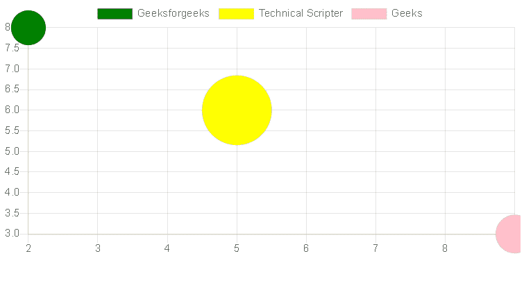

# 如何在 react bootstrap 中绘制气泡图？

> 原文:[https://www . geesforgeks . org/如何绘制反应中的气泡图-bootstrap/](https://www.geeksforgeeks.org/how-to-draw-a-bubble-chart-in-react-bootstrap/)

气泡图是一种显示三维数据的图表。每个实体及其相关数据的三元组(x，y，r)被绘制为一个圆盘，通过圆盘的 xy 位置表示两个 xy 值，通过其大小表示第三个 xy 值。

**创建反应应用程序并安装模块:**

*   **步骤 1:** 使用以下命令

    ```jsx
    npx create-react-app foldername
    ```

    创建一个反应应用程序
*   **步骤 2:** 创建项目文件夹(即文件夹名)后，使用以下命令移动到该文件夹。

    ```jsx
    cd foldername
    ```

*   **步骤 3:** 创建 ReactJS 应用程序后，使用以下命令安装所需的模块。

    ```jsx
    npm install --save mdbreact react-chartjs-2
    ```

*   **第四步:**将 Bootstrap CSS 和 fontawesome CSS 添加到 index.js.

    ```jsx
    import '@fortawesome/fontawesome-free/css/all.min.css';  
    import 'bootstrap-css-only/css/bootstrap.min.css';  
    import 'mdbreact/dist/css/mdb.css';
    ```

**项目结构:**如下图。


项目结构

**示例:**现在在 App.js 文件中写下以下代码。在这里，App 是我们编写代码的默认组件。

## App.js

```jsx
import React from "react";
import { MDBContainer } from "mdbreact";
import { Bubble } from "react-chartjs-2";

const App = () => {

// Sample data
const data = {
      datasets: [
        {
          label: 'Geeksforgeeks',
          data: [
            {
              x: 2,
              y: 8,
              r: 20,
            }
          ],
          backgroundColor: 'green',
        },
        {
          label: 'Technical Scripter',
          data: [
            {
              x: 5,
              y: 6,
              r: 40,
            }
          ],
          backgroundColor: 'yellow',
        },
        {
          label: 'Geeks',
          data: [
            {
              x: 9,
              y: 3,
              r: 22,
            }
          ],
          backgroundColor: 'pink',
        }
      ]
    }

return (
    <MDBContainer>
    <Bubble data={data} />
    </MDBContainer>
);
}

export default App;
```

**运行应用程序的步骤:**从项目的根目录使用以下命令运行应用程序:

```jsx
npm start
```

**输出:**现在打开浏览器，转到***http://localhost:3000/***，会看到如下输出:



原创