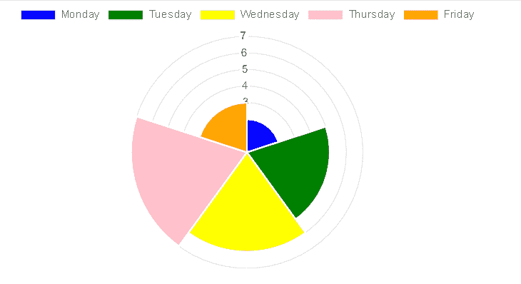

# 如何在 react bootstrap 中绘制极坐标面积图？

> 原文:[https://www . geeksforgeeks . org/如何绘制极区反应图-bootstrap/](https://www.geeksforgeeks.org/how-to-draw-a-polar-area-chart-in-react-bootstrap/)

极坐标面积图使用极坐标系统，其 x 轴看起来像一个以原点为中心的圆，每个点由与固定点的距离和与固定方向的角度决定。

**创建反应应用程序并安装模块:**

*   **步骤 1:** 使用以下命令

    ```
    npx create-react-app foldername
    ```

    创建一个反应应用程序
*   **步骤 2:** 创建项目文件夹(即文件夹名)后，使用以下命令移动到该文件夹。

    ```
    cd foldername
    ```

*   **步骤 3:** 创建 ReactJS 应用程序后，使用以下命令安装所需的模块。

    ```
    npm install --save mdbreact react-chartjs-2
    ```

*   **第四步:**将 Bootstrap CSS 和 fontawesome CSS 添加到 index.js.

    ```
    import '@fortawesome/fontawesome-free/css/all.min.css';  
    import 'bootstrap-css-only/css/bootstrap.min.css';  
    import 'mdbreact/dist/css/mdb.css';
    ```

**项目结构:**如下图。


项目结构

**示例:**现在在 App.js 文件中写下以下代码。在这里，App 是我们编写代码的默认组件。

## App.js

```
import React from "react";
import { MDBContainer } from "mdbreact";
import { Polar } from "react-chartjs-2";

const App = () => {

  // Sample data
  const data = {
    labels: ["Monday", "Tuesday", "Wednesday", "Thursday", "Friday"],
      datasets: [
        {
          label: "Hours Studied in Geeksforgeeks",
          data: [2, 5, 6, 7, 3],
          backgroundColor: ["blue", "green", "yellow", "pink", "orange"],
        }
      ]
  }

  return (
    <MDBContainer>
      <Polar data={data} />
    </MDBContainer>
  );
}

export default App;
```

**运行应用程序的步骤:**从项目的根目录使用以下命令运行应用程序:

```
npm start
```

**输出:**现在打开浏览器，转到***http://localhost:3000/***，会看到如下输出:



输出