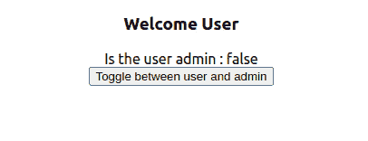

# 如何基于 React.js 中的 If 语句启用 Button？

> 原文:[https://www . geesforgeks . org/how-to-enable-button-based-on-if-statement-in-react-js/](https://www.geeksforgeeks.org/how-to-enable-button-based-on-if-statement-in-react-js/)

为了使用 if 和 else 语句有条件地显示按钮，我们可以在 react.js 中使用 state .在构造函数方法中声明状态，因为它在加载组件时首先加载。为了在用户和管理员之间切换，我们需要使用一个事件处理程序。使用这个事件处理程序，我们可以切换用户的状态。下面是显示它的代码的实现。

**示例:**

*   演示。js:t1]

    ## java 描述语言

    ```jsx
    import React, {Component} from 'react'

    class DemoUser extends Component {

       constructor(){
         super()
         this.state = {
          isAdmin: true
         }

         this.toggleState = this.toggleState.bind(this);
       }

       toggleState() {
       this.setState ({
        isAdmin:!this.state.isAdmin }
       )
      } 

       render(){
        if(this.state.isAdmin){
          return(
          <div>
          <h3> Welcome Admin </h3><span > 
          Is the user admin : 
          {this.state.isAdmin.toString()}</span>
           <br/>
          <button  onClick={this.toggleState}>
            Toggle between user and admin
          </button>    
          </div>
          )
          }
        else{
          return(
          <div>
          <h3> Welcome User </h3><span >
           Is the user admin : 
           {this.state.isAdmin.toString()}</span>
           <br/>
          <button  onClick={this.toggleState}>
            Toggle between user and admin
          </button>    
          </div>
          )          
        }       
      }
     }

     export default DemoUser
    ```

*   **index.js:**

    ## java 描述语言

    ```jsx
    import React from 'react';
    import ReactDOM from 'react-dom';
    import './index.css';
    import App from './App';
    import * as serviceWorker from './serviceWorker';
    import DemoUser from './demo'

    ReactDOM.render(
      <React.StrictMode>
        <DemoUser />
      </React.StrictMode>,
      document.getElementById('root')
    );

    serviceWorker.unregister();
    ```

**输出:**

