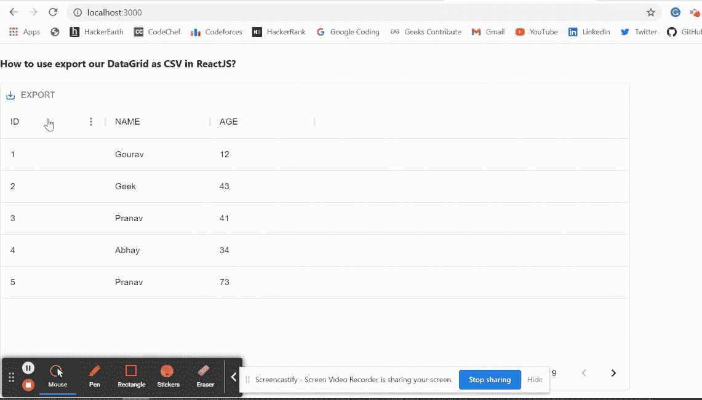

# 如何在 ReactJS 中将我们的数据网格导出为 CSV？

> 原文:[https://www . geeksforgeeks . org/如何导出我们的数据网格 as-csv-in-reactjs/](https://www.geeksforgeeks.org/how-to-export-our-datagrid-as-csv-in-reactjs/)

GridToolbarExport 组件允许用户通过额外的 API 调用将显示的数据导出到 CSV。【React 的 Material UI 有这个组件可供我们使用，非常容易集成。我们可以在 reatjs 中使用以下方法将我们的数据网格导出为 reatjs 中的 CSV。

**方法:**遵循这些简单的步骤，以便在 ReactJS 中将我们的数据网格导出为 CSV。我们使用了来自*数据网格*模块的*网格工具导出*组件，该组件提供了允许用户以 CSV 格式下载数据网格数据的功能。我们必须将这个组件包装在其名为 *GridToolbarContainer* 的容器中。然后，我们使用*组件*属性将这些值传递给主数据网格组件，如下例所示。

**创建反应应用程序并安装模块:**

*   **步骤 1:** 使用以下命令创建一个反应应用程序:

    ```
    npx create-react-app foldername
    ```

*   **步骤 2:** 创建项目文件夹(即文件夹名**)后，使用以下命令移动到该文件夹中:**

    ```
    cd foldername
    ```

*   **步骤 3:** 创建 ReactJS 应用程序后，使用以下命令安装 **material-ui** 模块:

    ```
    npm install @material-ui/data-grid
    ```

**项目结构:**如下图。


项目结构

**示例:**现在在 **App.js** 文件中写下以下代码。在这里，App 是我们编写代码的默认组件。

## App.js

```
import * as React from 'react';
import { DataGrid, GridToolbarExport,
GridToolbarContainer } from '@material-ui/data-grid';

const columns = [
  { field: 'id', headerName: 'ID', width: 170 },
  { field: 'name', headerName: 'NAME', width: 170 },
  { field: 'age', headerName: 'AGE', width: 170 },
];

const rows = [
  { id: 1, name: 'Gourav', age: 12 },
  { id: 2, name: 'Geek', age: 43 },
  { id: 3, name: 'Pranav', age: 41 },
  { id: 4, name: 'Abhay', age: 34 },
  { id: 5, name: 'Pranav', age: 73 },
  { id: 6, name: 'Disha', age: 61 },
  { id: 7, name: 'Raghav', age: 72 },
  { id: 8, name: 'Amit', age: 24 },
  { id: 9, name: 'Anuj', age: 48 },
];

function MyExportButton() {
  return (
    <GridToolbarContainer>
      <GridToolbarExport />
    </GridToolbarContainer>
  );
}

export default function App() {

  return (
    <div style={{ height: 500, width: '80%' }}>
      <h4>
       How to use export our DataGrid
       as CSV in ReactJS?
      </h4>
      <DataGrid rows={rows} columns={columns} 
        pageSize={5} 
        components={{
          Toolbar: MyExportButton,
        }}
      />
    </div>
  );
}
```

**运行应用程序的步骤:**从项目的根目录使用以下命令运行应用程序:

```
npm start
```

**输出:**现在打开浏览器，转到***http://localhost:3000/***，会看到如下输出:



**参考:**T2】https://material-ui.com/components/data-grid/export/