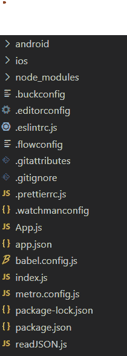
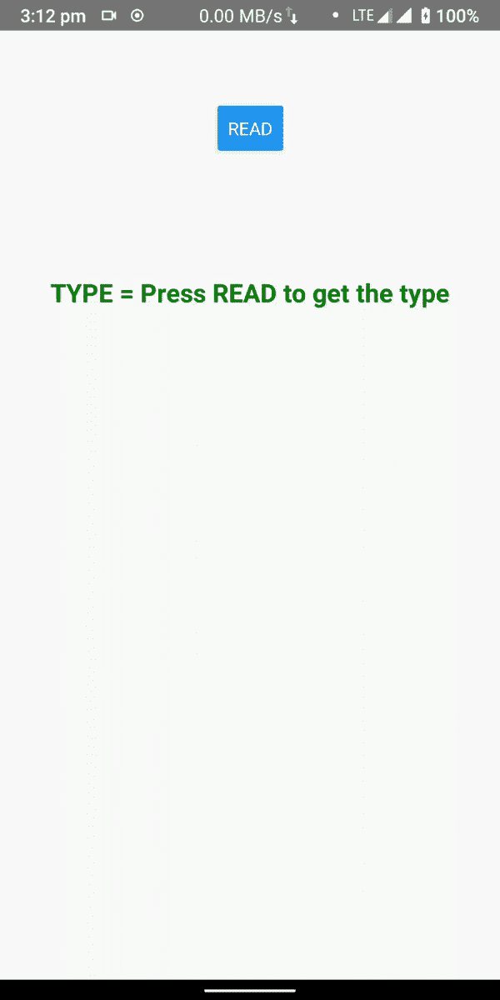

# 如何在 React Native 中从本地 JSON 文件中获取数据？

> 原文:[https://www . geesforgeks . org/如何从本地获取数据-json-file-in-react-native/](https://www.geeksforgeeks.org/how-to-fetch-data-from-a-local-json-file-in-react-native/)

从本地(如 IOS/Android 存储)获取 **React Native** 中的 **JSON (JavaScript 对象符号)**数据不同于从服务器获取 JSON 数据(使用 **Fetch** 或 **Axios** )。它需要应用程序的**存储权限**和一个库来提供**本地文件系统访问**。

**实现:**现在让我们从实现开始:

*   **步骤 1:** 打开终端，通过以下命令安装 expo-cli。

    ```
    npm install -g expo-cli
    ```

*   **步骤 2:** 现在通过以下命令创建一个项目。

    ```
    expo init jsonDemo
    ```

*   **步骤 3:** 现在进入你的项目文件夹，即 jsonDemo

    ```
    cd jsonDemo
    ```

**项目结构:**如下图。



目录结构

**示例:**从 React Native 中的本地 JSON 文件中获取数据。

**步骤 1:** 使用以下命令安装 **react-native-fs** :

```
npm install react-native-fs
```

**注意:**如果你得到类似 ***的错误试图得到空数组的长度*** 那么在安卓**清单**文件中添加以下代码。

## 可扩展标记语言

```
<manifest ...>
    <uses-permission android:name="android.permission.READ_EXTERNAL_STORAGE" />
    <uses-permission android:name="android.permission.WRITE_EXTERNAL_STORAGE" />
    <application
      android:requestLegacyExternalStorage="true"
      ...>
      ...
    </application>
</manifest>
```

**第二步:**创建一个名为 **data.json** 的 JSON 文件，并将其放入安卓的**"/存储/仿真/0/"** 目录中，该目录是安卓的默认**externalsduderirectorypath**。您也可以更改 **JSON** 文件的位置，但请确保存储读取文件时所需的路径。

在 **react-native-fs** 文档中提到了所有可能可以访问的目录。

```
{
   "type":"Fruits",
   "example":[
       {"name":"banana"},
       {"name":"apple"},
       {"name":"orange"},
       {"name":"mango"},
       {"name":"grape"}
   ]
}
```

**第三步:**在 **App.js** 文件中，我们将导入 **react-native-fs** 并调用名为 **readFile** 的函数，该函数接受文件路径和编码作为参数并返回文件内容。在**"/存储/仿真/0/"** 里面我创建了一个名为 **DATA** 的文件夹，里面是 JSON 文件。

**示例:**

## App.js

```
import { mapValuesSeries } from 'async';
import React, { Component } from 'react';
import { Text, View, Button } from 'react-native';
import * as RNFS from 'react-native-fs';

export class App extends Component {
  constructor(props) {
    super(props);
    this.state = {
      content: null,
      fruitType: null,
    };
  }

  readFile = () => {
    RNFS.readFile('/storage/emulated/0/DATA/data.json', 'ascii')
      .then((res) => {
        console.log(res);
        const d = JSON.parse(res);
        this.setState({ content: res, fruitType: d.type });
      })
      .catch((err) => {
        console.log(err.message, err.code);
      });
  };

  render() {
    return (
      <View style={{ alignItems: 'center' }}>
        <View style={{ marginVertical: '15%' }}>
          <Button title="READ" onPress={() => this.readFile()} />
        </View>
        <Text> {this.state.content} </Text>
        <Text
          style={{
            marginVertical: '5%',
            fontSize: 20,
            color: 'green',
            fontWeight: 'bold',
          }}>
          TYPE ={' '}
          {this.state.fruitType === null ? 
          'Press READ to get the type' : this.state.fruitType}
        </Text>
      </View>
    );
  }
}

export default App;
```

使用以下命令启动服务器。

```
npx react-native run-android
```

**输出:**



要获取目录(例如**externalstorsederirectory**)文件路径，我们将使用函数 **readDir** ，该函数接受目录(对于所有可用的目录类型，请参考 **react-native-fs** 类型的文档)作为参数，并返回包含文件路径和信息的对象数组。

## App.js

```
import { mapValuesSeries } from 'async';
import React, { Component } from 'react';
import { Text, View, Button } from 'react-native';
import * as RNFS from 'react-native-fs';

export class App extends Component {
  constructor(props) {
    super(props);
    this.state = {
      content: null,
      fruitType: null,
    };
  }

  readFile = () => {

    // On Android, use "RNFS.DocumentDirectoryPath"
    // (MainBundlePath is not defined)
    RNFS.readDir(RNFS.ExternalStorageDirectoryPath)
      .then((result) => {
        for (let i = 0; i < result.length; i++) {

          // Print the result
          console.log('GOT RESULT', result[i]);
        }

        // Stat the first file
        return Promise.all([RNFS.stat(result[0].path), result[0].path]);
      })
      .then((statResult) => {
        if (statResult[0].isFile()) {

          // If we have a file, read it
          return RNFS.readFile(statResult[1], 'utf8');
        }
        return 'no file';
      })
      .then((contents) => {

        // Print the file contents
        console.log(contents);
      })
      .catch((err) => {
        console.log(err.message, err.code);
      });
  };

  render() {
    return (
      <View style={{ alignItems: 'center' }}>
        <Text>Text</Text>
      </View>
    );
  }
}

export default App;
```

**参考:**T2】https://github.com/itinance/react-native-fs