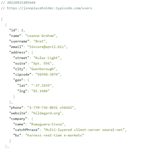
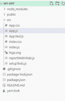
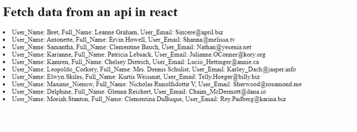

# 如何从 ReactJS 中的 API 获取数据？

> 原文:[https://www . geeksforgeeks . org/如何从 API in-reactjs/](https://www.geeksforgeeks.org/how-to-fetch-data-from-an-api-in-reactjs/)获取数据

[**ReactJS:**](https://www.geeksforgeeks.org/react-js-introduction-working/) ReactJS 是一个用于构建用户界面的声明式、高效且灵活的 JavaScript 库。是 MVC 中的‘V’。ReactJS 是一个开源的、基于组件的前端库，只负责应用程序的视图层。它由脸书维护。

[**API:**](https://www.geeksforgeeks.org/introduction-to-apis/) API 是应用编程接口(Application Programming Interface)的缩写，是各种程序用来相互通信的通信协议和子程序的集合。程序员可以利用各种应用编程接口工具使其程序变得更加容易和简单。此外，应用编程接口为程序员开发软件程序提供了一种有效的方法。

**方法:**在本文中，我们将了解如何从 API(应用程序编程接口)获取数据。对于数据，我们使用了来自[http://jsonplaceholder.typicode.com/users](http://jsonplaceholder.typicode.com/users)的 API 端点。我们在 App.js 中创建了组件，并在 App.css 中对组件进行了样式化。从 API 中，我们有目标“id”、“名称”、“用户名”、“电子邮件”，并从 API 端点获取数据。下面是我们如何在 react 中从 API 获取数据的分步实现。我们将使用 fetch 函数从 API 获取数据。

在 react 中从 api 获取数据的分步实现。

*   **步骤 1:** 创建反应项目

    ```
    npm create-react-app MY-APP 
    ```

*   **步骤 2:** 更改您的目录并输入您的主文件夹图表如下

    ```
    cd MY-APP
    ```

*   **步骤 3:** 原料药终点

    ```
    https://jsonplaceholder.typicode.com/users
    ```

    

    API

*   **第四步:**在 App.js 中写代码从 API 中取数据，我们用的是 fetch 函数。

**项目结构:**如下图。



**项目结构**

**示例:**

## App.js

```
import React from "react";
import './App.css';
class App extends React.Component {

    // Constructor 
    constructor(props) {
        super(props);

        this.state = {
            items: [],
            DataisLoaded: false
        };
    }

    // ComponentDidMount is used to
    // execute the code 
    componentDidMount() {
        fetch(
"https://jsonplaceholder.typicode.com/users")
            .then((res) => res.json())
            .then((json) => {
                this.setState({
                    items: json,
                    DataisLoaded: true
                });
            })
    }
    render() {
        const { DataisLoaded, items } = this.state;
        if (!DataisLoaded) return <div>
            <h1> Pleses wait some time.... </h1> </div> ;

        return (
        <div className = "App">
            <h1> Fetch data from an api in react </h1>  {
                items.map((item) => ( 
                <ol key = { item.id } >
                    User_Name: { item.username }, 
                    Full_Name: { item.name }, 
                    User_Email: { item.email } 
                    </ol>
                ))
            }
        </div>
    );
}
}

export default App;
```

在 App.css 中编写代码来设置 app.js 文件的样式。

## App.css 文件

```
.App {
    text-align: center;
    color: Green;
}
.App-header {
    background-color: #282c34;
    min-height: 100vh;
    display: flex;
    flex-direction: column;
    align-items: center;
    justify-content: center;
    font-size: calc(10px + 2vmin);
    color: white;
}
.App-link {
    color: #61dafb;
}

@keyframes App-logo-spin {
    from {
        transform: rotate(0deg);
    }
    to {
        transform: rotate(360deg);
    }
}
```

**运行应用程序的步骤:**打开终端，键入以下命令。

```
npm start
```

**输出:**打开浏览器，我们的项目显示在 URL[**http://localhost:3000/**](http://localhost:3000/)

