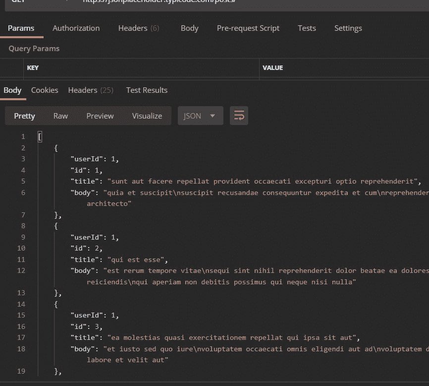
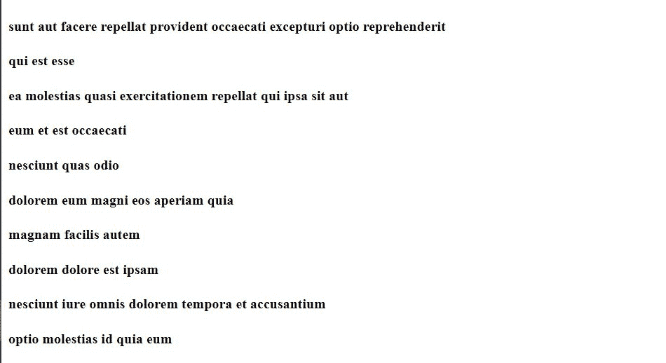

# 如何在 ReactJS 中使用异步等待从 API 中获取数据？

> 原文:[https://www . geeksforgeeks . org/如何从 API 获取数据-使用异步-等待-in-reactjs/](https://www.geeksforgeeks.org/how-to-fetch-data-from-apis-using-asynchronous-await-in-reactjs/)

在本文中，我们将使用 ReactJS 向您想要的任何 API 发出 API 请求，并使用异步等待获取数据。这里我们使用了一个叫做 Axios 的东西，它是 ReactJS 中的一个库。

**API:**API 基本上是一种以 JSON (JavaScript 对象符号)和 XML(可扩展标记语言)格式存储数据的应用程序类型。它使任何设备都可以相互对话。

**异步等待:**异步确保函数返回一个承诺，并在其中包装非承诺。还有另一个词“等待”，它只在异步函数中起作用。

**等待语法:**

```jsx
const Value = await promise;
```

**创建反应应用程序并安装模块:**

*   **步骤 1:** 使用以下命令创建一个反应应用程序:

    ```jsx
    npx create-react-app foldername
    ```

*   **步骤 2:** 创建项目文件夹(即文件夹名)后，使用以下命令移动到该文件夹:

    ```jsx
    cd foldername
    ```

*   **步骤 3:** 创建 ReactJS 应用程序后，使用以下命令安装所需的****模块:****

    ```jsx
    **npm install axios**
    ```

******项目结构:**如下图。****

****

项目结构**** 

******示例:******

## ****App.js****

```jsx
**import React, { useState, useEffect } from 'react'
import axios from 'axios';

function App() {

    const [loading, setLoading] = useState(false);
    const [posts, setPosts] = useState([]);

    useEffect(() => {
        const loadPost = async () => {

            // Till the data is fetch using API 
            // the Loading page will show.
            setLoading(true);

            // Await make wait until that 
            // promise settles and return its reult
            const response = await axios.get(
            "https://jsonplaceholder.typicode.com/posts/");

            // After fetching data stored it in posts state.
            setPosts(response.data);

            // Closed the loading page
            setLoading(false);
        }

        // Call the function
        loadPost();
    }, []);

    return (
        <>
            <div className="App">
                {loading ? (
                    <h4>Loading...</h4>) :
                    (posts.map((item) =>
                        // Presently we only fetch 
                        // title from the API 
                        <h4>{item.title}</h4>)
                    )
                }
            </div>
        </>
    );
}

export default App;**
```

******注意:**作为一个例子，我们将使用 API***【https://jsonplaceholder.typicode.com/posts/】***给我们随机数据。在这里，我们的目标是看看这些数据中呈现了什么。您可以用您的应用编程接口替换它，并在 div 应用程序中进行更改。如果我们在 postman 上运行***【https://jsonplaceholder.typicode.com/posts/】***API，它会以 JSON 格式显示数据，如下图所示:****

********

******运行应用程序的步骤:**从项目的根目录使用以下命令运行应用程序:****

```jsx
**npm start**
```

******输出:**现在打开浏览器，转到***http://localhost:3000/***，会看到如下输出:****

********