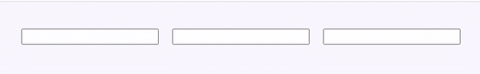

# 如何在 ReactJS 中关注下一个字段输入？

> 原文:[https://www . geeksforgeeks . org/如何关注下一个字段-输入 in-reactjs/](https://www.geeksforgeeks.org/how-to-focus-on-the-next-field-input-in-reactjs/)

如果我们想在当前输入字段达到其最大字符容量时关注文本输入字段，我们必须找到下一个输入 HTML 元素并使其成为焦点。每次用户在当前文本字段中键入时，我们都必须检查该字段是否有指定的最大字符数。如果是，那么我们就要关注文本输入字段。我们可以使用 focus()函数来聚焦特定的输入字段。

**创建反应应用程序:**

**步骤 1:** 使用以下命令创建一个反应应用程序:

```
npx create-react-app foldername
```

**步骤 2:** 创建项目文件夹(即 foldername)后，使用以下命令移动到该文件夹:

```
cd foldername
```

**项目结构:**如下图。


**示例:**我们在代码中可以看到，每当我们在输入字段中键入时，都会调用 handleChange 函数，它会根据当前输入字段中键入的字符数来决定下一个字段是否应该是焦点。如果它达到最大字符，那么它会找到下一个字段，并使其成为焦点。这是当前输入字段达到最大字符数限制时下一个输入字段的聚焦方式。

## App.js

```
import React from "react";

class App extends React.Component {
  render() {
    return (
      <div>
        <InputFields></InputFields>
      </div>
    );
  }
}

class InputFields extends React.Component {
  handleChange = (e) => {
    const { maxLength, value, name } = e.target;
    const [fieldName, fieldIndex] = name.split("-");

    let fieldIntIndex = parseInt(fieldIndex, 10);

    // Check if no of char in field == maxlength
    if (value.length >= maxLength) {

      // It should not be last input field
      if (fieldIntIndex < 3) {

        // Get the next input field using it's name
        const nextfield = document.querySelector(
          `input[name=field-${fieldIntIndex + 1}]`
        );

        // If found, focus the next field
        if (nextfield !== null) {
          nextfield.focus();
        }
      }
    }
  };

  render() {
    return (
      <div style={{ padding: 30 }}>
        <InputFild name="field-1" length="3" 
                   handleChange={this.handleChange} />
        <InputFild name="field-2" length="4" 
                   handleChange={this.handleChange} />
        <InputFild name="field-3" length="3" 
                   handleChange={this.handleChange} />
      </div>
    );
  }
}
class InputFild extends React.Component {
  render() {
    return (
      <input
        style={{ margin: 10 }}
        type="text"
        name={this.props.name}
        maxLength={this.props.length}
        onChange={this.props.handleChange}
      ></input>
    );
  }
}

export default App;
```

**输出:**

