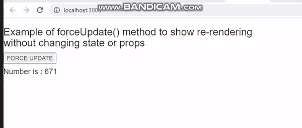

# 如何在每次 setState 调用时强制 ReactJS 重新渲染？

> 原文:[https://www . geeksforgeeks . org/how-force-reactjs-to-re-render-on-even-setstate-call/](https://www.geeksforgeeks.org/how-to-force-reactjs-to-re-render-on-every-setstate-call/)

当“反应”组件的状态或道具发生变化时，该组件将立即重新渲染。当从代码的某个地方更新状态时，许多用户界面组件会立即重新呈现。

如果我们想在不做任何更改的情况下呈现组件，我们可以使用 foceUpdate()方法。当我们调用 forceUpdate()时，它将重新呈现组件并跳过 shouldComponentUpdate()方法。

如果没有重新呈现的理由，则应该组件更新()方法允许您的组件退出更新生命周期。

**语法:**

```
this.forceUpdate()
```

**创建反应应用程序:**

*   **步骤 1:** 使用以下命令创建一个反应应用程序:

    ```
    npx create-react-app foldername
    ```

*   **步骤 2:** 创建项目文件夹(即文件夹名)后，使用以下命令移动到该文件夹:

    ```
    cd foldername
    ```

**项目结构:**如下图。


**App.js:** 现在在 **App.js** 文件中写下以下代码。在这里，App 是我们编写代码的默认组件。

## App.js

```
import React from 'react';
class App extends React.Component {

  handleForceUpdate = () => {
    this.forceUpdate();
  };

  render() {
    return (
      <div>
        <h3>
         Example of forceUpdate() method to 
         show re-rendering <br></br>
         without changing state or props
        </strong>
        <button onClick={this.handleForceUpdate} >
          FORCE UPDATE
        </button>
        <h4>Number is : 
           {Math.floor(Math.random() * (100000 - 1 + 1)) + 1}
        </h4>
      </div>
    );
  }
}

export default App;
```

**运行应用程序的步骤:**从项目的根目录使用以下命令运行应用程序:

```
npm start
```

**输出:**现在打开浏览器，转到***http://localhost:3000/***，会看到如下输出:



**解释:**从上面的例子中我们可以看到，由于 forceUpdate()方法的调用，组件在不改变道具或状态的情况下被重新渲染。当组件被重新渲染时，随机数被重新生成。