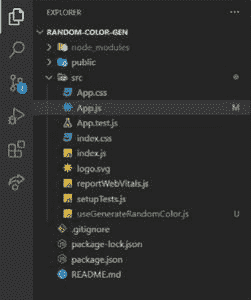

# 如何使用 React 钩子生成随机颜色？

> 原文:[https://www . geeksforgeeks . org/如何使用反应挂钩生成随机颜色/](https://www.geeksforgeeks.org/how-to-generate-random-colors-by-using-react-hooks/)

我们将制作一个 react 自定义钩子来生成随机颜色。

**先决条件:**

*   [React.js](https://www.geeksforgeeks.org/react-js-introduction-working/)
*   [反作用钩](https://www.geeksforgeeks.org/introduction-to-react-hooks/)

**方法:**基本上，如果我们熟悉 react，那么我们都已经使用过 React 自定义钩子(比如 [useState](https://www.geeksforgeeks.org/reactjs-usestate-hook/) 、 [useEffect](https://www.geeksforgeeks.org/reactjs-useeffect-hook/) 、useContext 等)。).我们还可以制作定制的反应挂钩，可以在任何地方使用。这里有一个生成随机颜色的小代码。这里我们将制作一个随机的颜色生成器自定义钩子(在我们的自定义钩子文件中)，这里我们将制作一个用于改变颜色的函数名为(generateColor)，我们将传递颜色并生成颜色作为返回。然后，我们将在 App.js 中通过析构来使用它，并将生成的颜色用作按钮的 onClick 事件函数，通过该函数我们将更改窗口的颜色。

**创建反应应用程序:**

**第一步:**进入你的命令提示符，写下下面的命令，创建一个 react app。

```jsx
npx create-react-app <YOUR_APP_NAME>
```

**步骤 2:** 然后通过键入以下命令进入您的应用程序文件夹

```jsx
cd <YOUR_APP_NAME>
```

**项目结构:**我们的文件夹结构应该是这样的。



文件夹结构

**步骤 3:** 在您的 **src** 文件夹中创建一个单独的文件**usegeneraterandomcolor . js**，并使用以下代码:

## 使用 usegeneraterandomcolor . js

```jsx
import {useState} from 'react';

const useGenerateRandomColor = () => {
    const [color,setColor] = useState("")
    const generateColor = () =>{
        setColor(Math.random().toString(16).substr(-6));
    };
    return {color,generateColor};

};
export default useGenerateRandomColor;
```

**第 4 步:**现在转到 src/ **App.js** 并粘贴下面的代码以使用我们的随机颜色生成器自定义钩子。

## App.js

```jsx
import "./App.css";
import useGenerateRandomColor 
    from "./useGenerateRandomColor";

function App() {
  const { color, generateColor } 
            = useGenerateRandomColor();
  return (
    <div
      style={{
        height: "100vh",
        width: "100vw",
        backgroundColor: "#" + color,
        display: "flex",
        justifyContent: "center",
        alignItems: "center",
      }}
    >
      <button
        style={{
          padding: "40px",
          borderRadius: "10px",
          backgroundImage: 
"linear-gradient(to top, #a8edea 0%, #fed6e3 100%)",
          fontSize: "larger",
        }}
        onClick={generateColor}
      >
        Generate random color
      </button>
    </div>
  );
}

export default App;
```

现在我们可以使用我们的 react 应用程序了。

**运行应用程序的步骤:**运行以下命令，在本地主机中启动您的应用程序:3000。

```jsx
npm start
```

**输出:**

