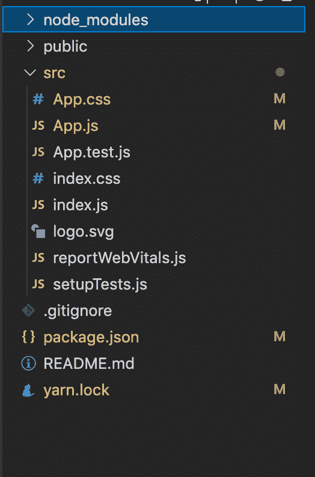
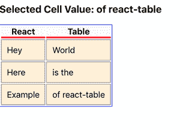

# 如何获取反应表上的单元格值？

> 原文:[https://www . geeksforgeeks . org/如何在反应表上获取单元格值/](https://www.geeksforgeeks.org/how-to-get-cell-value-on-react-table/)

**React Table** 是一个帮助我们创建表格的库，它为我们提供了许多可以在表格上执行的功能。

**反应表的一些特征:**

*   重量轻(5kb-14kb+取决于所使用的功能和摇树)。
*   无头(100%可定制，自带用户界面)。
*   自动开箱即用，完全可控的应用编程接口。
*   分类(多重和稳定)
*   过滤器。
*   旋转和聚合。
*   可虚拟化。
*   可调整大小的

**获取单元格值:**我们可以通过将 onClick 事件添加到< td >标签来获取表格的单元格/列值。

```
getCellValue function : onClick={()=> setCellValue(cell.value)}
```

**创建反应应用程序并安装模块:**

**步骤 1:** 使用以下命令创建一个 React 应用程序。

```
npx create-react-app foldername
```

**步骤 2:** 创建项目文件夹(即文件夹名)后，使用以下命令移动到该文件夹。

```
cd foldername
```

**步骤 3:** 创建 ReactJS 应用程序后，使用以下命令安装 react-table。

```
npm i react-table
```

**项目结构**:如下图。



项目结构

**示例:**现在在 **App.js** 文件中写下以下代码。在这里，App 是我们编写代码的默认组件。

## java 描述语言

```
import React, { useState } from 'react';
import { useTable } from 'react-table';

const  App = () => {

  // Define state
  const [cellValue, setCellValue] = useState('');

  // Add data here to show in table
  const data = React.useMemo(
    () => [
      {
        reactCol1: 'Hey',
        reactCol2: 'World',
      },
      {
        reactCol1: 'Here',
        reactCol2: 'is the',
      },
      {
        reactCol1: 'Example',
        reactCol2: 'of react-table',
      },
    ],
    []
  )

  // Define column of the table
  const columns = React.useMemo(
    () => [
      {
        Header: 'React',

        // Accessor is the "key" in the data
        accessor: 'reactCol1',
      },
      {
        Header: 'Table',
        accessor: 'reactCol2',
      },
    ],
    []
  )

  // Function to get cell value
  const getCellValue = (cell) =>{
    setCellValue(cell.value)
  }

  // Create the instance of table by
  // using hooks of react-table
  const {
    getTableProps,
    getTableBodyProps,
    headerGroups,
    rows,
    prepareRow,
  } = useTable({ columns, data })

  return (
    <>
    {/* Showing cell value */}
    <h3>Selected Cell Value: {cellValue}</h3>
    <table {...getTableProps()}
      style={{ border: 'solid 1px blue' }}>

      <thead>
        {headerGroups.map(headerGroup => (
          <tr {...headerGroup.getHeaderGroupProps()}>
            {headerGroup.headers.map(column => (
              <th
                {...column.getHeaderProps()}
                style={{
                  borderBottom: 'solid 3px red',
                  background: 'aliceblue',
                  color: 'black',
                  fontWeight: 'bold',
                }}
              >
                {column.render('Header')}
              </th>
            ))}
          </tr>
        ))}
      </thead>
      <tbody {...getTableBodyProps()}>
        {rows.map(row => {
          prepareRow(row)
          return (
            <tr {...row.getRowProps()}>
              {row.cells.map(cell => {
                return (
                  <>
                  {/* Here added onClick function to get cell value */}
                  <td
                  onClick={()=> getCellValue(cell)}
                    {...cell.getCellProps()}
                    style={{
                      padding: '10px',
                      border: 'solid 1px gray',
                      background: 'papayawhip',
                    }}
                  >
                    {cell.render('Cell')}
                  </td>
                  </>
                )
              })}
            </tr>
          )
        })}
      </tbody>
    </table>
    </>
  )
}

export default App;
```

**运行应用程序的步骤:**从项目的根目录使用以下命令运行应用程序。

```
npm start
```

**输出:**现在打开浏览器，转到***http://localhost:3000/***，点击 react-table 单元格的 ***会看到如下输出***



输出

**参考:**T2】https://www.npmjs.com/package/react-table