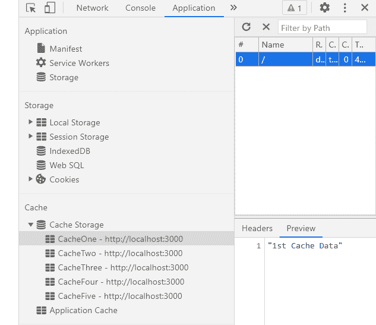

# 如何在 ReactJS 中获取完整的缓存数据？

> 原文:[https://www . geeksforgeeks . org/如何获取完整的缓存数据 in-reactjs/](https://www.geeksforgeeks.org/how-to-get-complete-cache-data-in-reactjs/)

我们可以在 ReactJS 中使用以下方法来获取所有缓存数据。我们可以从浏览器中获取所有缓存数据，并在需要时在我们的应用程序中使用它。缓存是一种技术帮助我们将给定资源的副本存储到我们的浏览器中，并在请求时提供给我们。

**方法:**按照以下简单步骤依次  获取ReactJS 中所有缓存数据。我们已经创建了 *getAllCacheData* 函数，该函数从浏览器缓存中获取所有数据。当我们点击按钮时，该函数被触发，数据从缓存中获取。在下面的示例中，我们尝试从浏览器中获取所有缓存数据，该浏览器有五个缓存，命名为缓存一、缓存二、缓存三、缓存四和缓存五，如下所示:



**创建反应应用程序:**

*   **步骤 1:** 使用以下命令创建一个反应应用程序:

    ```
    npx create-react-app foldername
    ```

*   **步骤 2:** 创建项目文件夹(即文件夹名**)后，使用以下命令移动到该文件夹中:**

    ```
    cd foldername
    ```

**项目结构:**如下图。


项目结构

**App.js:** 现在在 **App.js** 文件中写下以下代码。在这里，App 是我们编写代码的默认组件。

## java 描述语言

```
import * as React from 'react';

export default function App() {

  // Our state to store fetched cache data
  const [cacheData, setCacheData] = React.useState();

  // Function to get all cache data
  const getAllCacheData = async () => {
    var url = 'https://localhost:300'

    // List of all caches present in browser
    var names = await caches.keys()

    var cacheDataArray = []

    // Iterating over the list of caches
    names.forEach(async(name) => {

      // Opening that particular cache
      const cacheStorage = await caches.open(name);

      // Fetching that particular cache data
      const cachedResponse = await cacheStorage.match(url);
      var data = await cachedResponse.json()

      // Pushing fetched data into our cacheDataArray
      cacheDataArray.push(data)
      setCacheData(cacheDataArray.join(', '))
    })
  };

  return (
    <div style={{ height: 500, width: '80%' }}>
      <h4>How to get all cache data in ReactJS?</h4>
      <button onClick={() => getAllCacheData()} >
        Get All Cache Data</button>  <br />
      <h6>All Cache Data is: {cacheData}</h6>
    </div>
  );
}
```

**运行应用程序的步骤:**从项目的根目录使用以下命令运行应用程序:

```
npm start
```

**输出:**现在打开浏览器，转到***http://localhost:3000/***，会看到如下输出:

