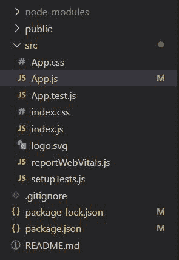
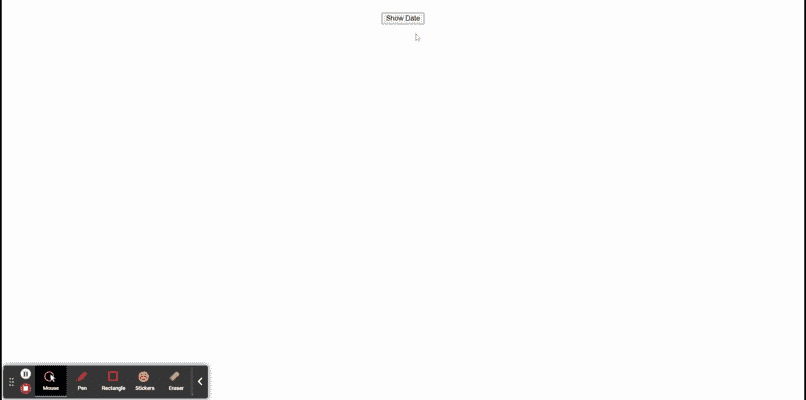

# 如何使用 ReactJS 获取 firebase 中的当前日期和时间？

> 原文:[https://www . geeksforgeeks . org/如何获取当前使用 firebase-reactjs 的日期和时间/](https://www.geeksforgeeks.org/how-to-get-current-date-and-time-in-firebase-using-reactjs/)

下面的方法介绍了如何使用 react 获取 firebase 中的当前日期和时间。我们使用了 firebase 模块来实现这一点。

**创建反应应用程序并安装模块:**

*   **步骤 1:** 使用以下命令创建一个反应应用程序:

    ```jsx
    npx create-react-app myapp
    ```

*   **步骤 2:** 创建项目文件夹(即 myapp)后，使用以下命令移动到该文件夹:

    ```jsx
    cd myapp
    ```

*   **步骤 3:** 创建 ReactJS 应用程序后，使用以下命令安装 firebase 模块:

    ```jsx
    npm install firebase@8.3.1 --save
    ```

**项目结构:**我们的项目结构会是这样的。



**示例:**现在实现时间和日期部分。这里，我们将使用一个名为 Timestamp 的方法，它可以帮助我们获得当前的日期和时间。

## App.js

```jsx
import React from 'react';
import firebase from 'firebase';
import {useState} from 'react';

function App() {
  // Current state
  const [curr , setCurr] = useState('');

  // Function to get time and date
  const getDate = () => {
      const a = firebase.firestore
          .Timestamp.now().toDate().toString();
      setCurr(a);
  }

  return (
    <div>
      <center>
        <h1>{curr}</h1>
        <button onClick={getDate}>Show Date</button>
      </center>
    </div>
  );
}

export default App;
```

**运行应用程序的步骤:**从项目的根目录使用以下命令运行应用程序:

```jsx
npm start
```

**输出:**现在打开浏览器，转到 **http://localhost:3000/** ，会看到如下输出:

