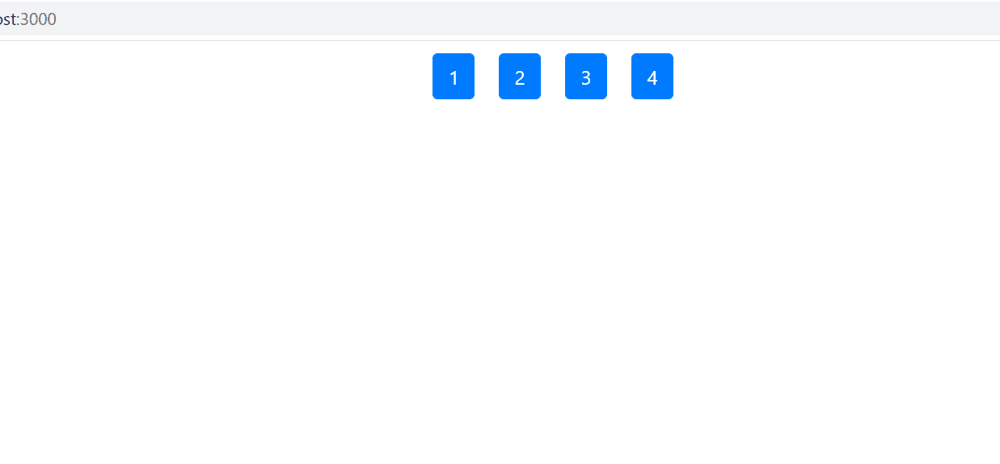

# 如何使用 ReactJS 从数组中获取前 N 个元素？

> 原文:[https://www . geeksforgeeks . org/如何从数组中获取第一个 n 个元素-使用-reactjs/](https://www.geeksforgeeks.org/how-to-get-first-n-number-of-elements-from-an-array-using-reactjs/)

我们可以使用 slice()方法从数组中获取前 N 个元素。

**语法:**

```
array.slice(0, n);
```

**示例:**

```
var num = [1, 2, 3, 4, 5];
var myBest = num.slice(0, 3);
```

**输出:**

```
[1,2,3]
```

**注意:**数组上的 slice 函数返回数组的浅拷贝，不修改原数组。如果 N 大于数组的大小，那么它不会通过任何错误返回整个数组本身。

**创建反应应用程序:**

**步骤 1:** 使用以下命令创建一个反应应用程序:

```
npx create-react-app foldername
```

**步骤 2:** 创建项目文件夹(即文件夹名)后，使用以下命令移动到该文件夹:

```
cd foldername
```

**项目结构:**如下图。


项目结构

**App.js:** 现在在 App.js 文件中写下以下代码。在这里，App 是我们编写代码的默认组件。

## java 描述语言

```
import { React, Component } from "react";
class App extends Component {

  render() {
    // Numbers list
    const list = [1, 2, 3, 4, 5, 6, 7]

    // Defining our N
    var n = 4;

    // Slice function call
    var items = list.slice(0, n).map(i => {
      return <button style={{ margin: 10 }}
        type="button" class="btn btn-primary">{i}</button>
    })

    return (
      <div>{items}</div>
    )
  }
}

export default App
```

**注意:**可以将自己的造型应用到应用中。这里我们已经使用了 bootstrap CSS，要将其包含在您的项目中，只需将下面的 ***<链接>*** 添加到我们的***index.html***文件中即可。

> <link>rel = " style sheet "
> href = " https://maxcdn . bootstrap cdn . com/bootstrap cdn/4 . 5 . 0/CSS/bootstrap . min . CSS "
> 完整性= " sha 384-9 ait 2 nrpc 12uk 9gs 9 badl 411 nqapfmc 26 ewaoh 8 wgzl 5 myyxffc+ncpb 1 dkg7sk "
> cross origin = " anonymous "]

**运行应用程序的步骤:**从项目的根目录使用以下命令运行应用程序:

```
npm start
```

**输出:**由于 n 的值为 4，因此将创建四按钮。如果增加 n 的值，按钮的数量将增加，反之亦然。

