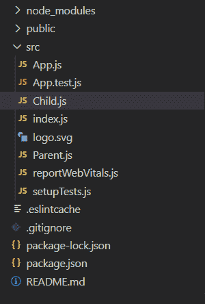
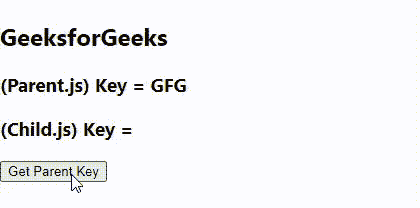

# 如何在 ReactJS 中点击按钮获取父 div 的关键属性？

> 原文:[https://www . geeksforgeeks . org/如何在重新点击按钮时获取父 div 的键属性/](https://www.geeksforgeeks.org/how-to-get-key-attribute-of-parent-div-when-button-is-clicked-in-reactjs/)

在 ReactJs 中，我们可以从父组件传递子组件的属性。因此，我们也将这样做，并将父组件的键作为属性传递给子组件。

**创建反应应用程序并安装模块:**

*   **步骤 1:** 使用以下命令创建一个反应应用程序:

    ```
    npx create-react-app foldername
    ```

*   **步骤 2:** 创建项目文件夹(即文件夹名**)后，使用以下命令移动到该文件夹中:**

    ```
    cd foldername
    ```

**步骤 3:** 创建父. js 和子. js 组件。

**项目结构:**如下图。



**示例:**现在在 **App.js** 文件中写下以下代码。在这里，App 是我们编写代码的默认组件。

## App.js

```
import React, { Component }  from 'react';

import Parent from './Parent';

class App extends Component {

  state = {
    key: "GFG",
  }

  render() {
    return (
      <div>
        <h2>GeeksforGeeks</h2>
        <Parent key={this.state.key} keyValue={this.state.key}/>
      </div>
    );
  }
}

export default App;
```

## Parent.js

```
import React, { Component }  from 'react';

import Child from './Child';

class Parent extends Component {

  render() {
    return (
        // Passing key in child
        <div>
            <h3>(Parent.js) Key = {this.props.keyValue}</h3>
            <Child keyValue={this.props.keyValue}/>
        </div>
    );
  }
}

export default Parent;
```

## Child.js

```
import React, { Component }  from 'react';

class Child extends Component {

  state = {
    key: "",
  }

  handleClick = () => {
    this.setState({key: this.props.keyValue});
  }

  render() {
    return (
      <div>
        <h3>(Child.js) Key = {this.state.key}</h3>
        <button onClick={this.handleClick}>
            Get Parent Key
        </button>
      </div>
    );
  }

}

export default Child;
```

**运行应用程序的步骤:**从项目的根目录使用以下命令运行应用程序:

```
npm start
```

**输出:**现在打开浏览器，转到***http://localhost:3000/***，会看到如下输出。

