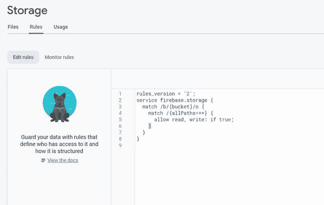
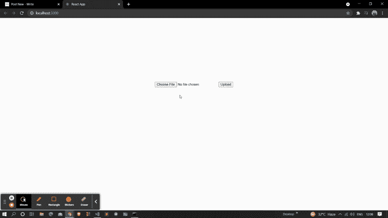

# 如何使用 ReactJS 获取 firebase 存储中文件的元数据？

> 原文:[https://www . geeksforgeeks . org/如何获取文件元数据-in-firebase-storage-use-reactjs/](https://www.geeksforgeeks.org/how-to-get-meta-data-of-files-in-firebase-storage-using-reactjs/)

下面的方法介绍了如何使用 react 获取 firebase 存储中文件的元数据。元数据是关于文件的基本信息。我们使用了 firebase 模块来实现这一点。

**创建反应应用程序并安装模块:**

*   **步骤 1:** 使用以下命令创建一个反应应用程序:

    ```
    npx create-react-app myapp
    ```

*   **步骤 2:** 创建项目文件夹(即 myapp)后，使用以下命令移动到该文件夹:

    ```
    cd myapp
    ```

**项目结构:**我们的项目结构会是这样的。


**步骤 3:** 创建 ReactJS 应用程序后，使用以下命令安装 firebase 模块:

```
npm install firebase@8.3.1 --save
```

**第 4 步:**转到你的 firebase 仪表盘，创建一个新项目并复制你的凭证。

```
const firebaseConfig = {
      apiKey: "your api key",
      authDomain: "your credentials",
      projectId: "your credentials",
      storageBucket: "your credentials",
      messagingSenderId: "your credentials",
      appId: "your credentials"
};
```

**第 5 步:**通过用下面的代码创建 *firebase.js* 文件，将 Firebase 初始化到您的项目中。

## 火库. js

```
import firebase from 'firebase';

const firebaseConfig = {
    // Your Credentials
};

firebase.initializeApp(firebaseConfig);
var storage = firebase.storage();

export default storage;
```

**步骤 6:** 现在转到 firebase 项目中的存储部分，更新您的安全规则。这里我们处于测试模式，所以我们允许真实的读写。更新下面显示的代码后，单击发布。



**步骤 7:** 现在实现元数据部分。在这里，我们将使用一种叫做*获取元数据*的方法来帮助我们获取 firebase 存储中文件的元数据。

## App.js

```
import { useState } from 'react';
import storage from './firebase';

function App() {

  const [image, setImage] = useState('');
  const [show, setShow] = useState(false);
  const [value, setValue] = useState('');

  const upload = () => {

    if (image == null)
      return;

    // Sending File to Firebase Storage
    storage.ref(`/images/${image.name}`).put(image)
      .on("state_changed", alert("success"), alert, () => {
        // Getting Meta Data Of File
        storage.ref("images").child(image.name).getMetadata()
          .then((data) => {
            setValue(data);
            setShow(true);
          })
      });
  }

  return (
    <div className="App" style={{ marginTop: 250 }}>
      <center>
        <input type="file" onChange={(e) => { setImage(e.target.files[0]) }} />
        <button onClick={upload}>Upload</button>
        <br /><br /><br /><br />
        {
          show ?
            <div>
              <h2>Name : {value.name}</h2>
              <h2>Size : {value.size}</h2>
              <h2>Path : {value.fullpath}</h2>
              <h2>Time : {value.timeCreated}</h2>
            </div>
            :
            <div></div>
        }
      </center>
    </div>
  );
}

export default App;
```

**运行应用程序的步骤:**从项目的根目录使用以下命令运行应用程序:

```
npm start
```

**输出:**现在打开浏览器，转到***http://localhost:3000/***，会看到如下输出:

