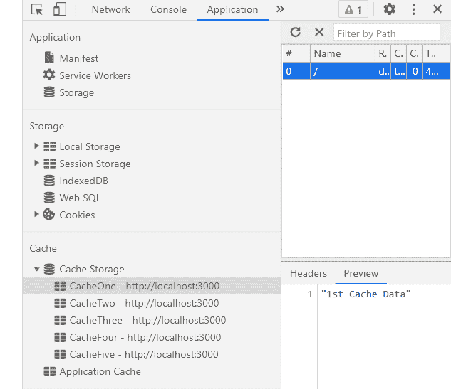

# 如何在 ReactJS 中获取多个缓存数据？

> 原文:[https://www . geeksforgeeks . org/如何获取多重缓存数据 in-reactjs/](https://www.geeksforgeeks.org/how-to-get-multiple-cache-data-in-reactjs/)

我们可以在 ReactJS 中使用以下方法来获取多个缓存数据。我们可以从浏览器中获取多个缓存数据，并在需要时在我们的应用程序中使用它们。缓存是一种技术帮助我们将给定资源的副本存储到我们的浏览器中，并在请求时提供给我们。

**方法:**按照这些简单的步骤依次  在 ReactJS 中获取  多个缓存数据。我们已经创建了我们的 *getMultipleCacheData* 函数，该函数采用缓存名称并从浏览器缓存中获取其数据。当我们点击按钮时，该函数被触发，数据从缓存中获取。在下面的示例中，我们试图从浏览器中获取多个名为缓存一和缓存四的缓存数据，该浏览器有五个名为缓存一、缓存二、缓存三、缓存四和缓存五的缓存，如下所示:



**创建反应应用程序:**

*   **步骤 1:** 使用以下命令创建一个反应应用程序:

    ```jsx
    npx create-react-app foldername
    ```

*   **步骤 2:** 创建项目文件夹(即文件夹名**)后，使用以下命令移动到该文件夹中:**

    ```jsx
    cd foldername
    ```

**项目结构:**如下图。


项目结构

**App.js:** 现在在 **App.js** 文件中写下以下代码。在这里，App 是我们编写代码的默认组件。

## java 描述语言

```jsx
import * as React from 'react';

export default function App() {

  // Our state to store fetched cache data
  const [cacheData, setCacheData] = React.useState();

  // Function to get multiple cache data
  const getMultipleCacheData = async (cacheNames) => {
    if (typeof caches === 'undefined') return false;

    var cacheDataArray = []
    for (var i = 0; i < cacheNames.length; i++) {

      const cacheStorage = await caches.open(cacheNames[i].cacheName);
      const cachedResponse = await cacheStorage.match(cacheNames[i].url);

      // If no cache exists
      if (!cachedResponse || !cachedResponse.ok) {
        cacheDataArray[i] = `Unable to fetch ${cacheNames[i].cacheName}`
      } else {
        var data = await cachedResponse.json()
        cacheDataArray[i] = data
      }
    }

    // Putting commas in between caches data
    // to display properly
    setCacheData(cacheDataArray.join(', '))
  };

  // Caches names which has to be fetched from browser 
  const cachesToFetch = [
    { cacheName: 'CacheOne', url: 'https://localhost:300' },
    { cacheName: 'CacheFour', url: 'https://localhost:300' }
  ]

  return (
    <div style={{ height: 500, width: '80%' }}>
      <h4>How to get multiple cache data in ReactJS?</h4>
      <button onClick={() => getMultipleCacheData(cachesToFetch)} >
        Get Multiple Cache Data</button>  <br />
      <h6>Multiple Cache Data is: {cacheData}</h6>
    </div>
  );
}
```

**运行应用程序的步骤:**从项目的根目录使用以下命令运行应用程序:

```jsx
npm start
```

**输出:**现在打开浏览器，转到***http://localhost:3000/***，会看到如下输出:

