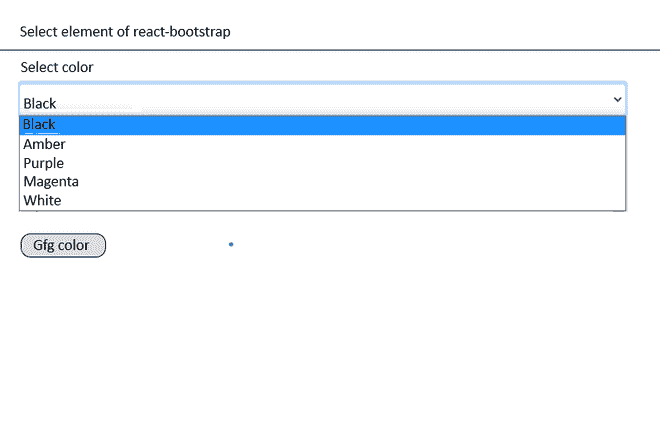

# 如何在 react-bootstrap 中获取选择元素的值？

> 原文:[https://www . geesforgeks . org/如何获取-选择-元素-反应中的值-引导/](https://www.geeksforgeeks.org/how-to-get-select-elements-value-in-react-bootstrap/)

有几种方法可以在 react-bootstrap 中获取元素的值。其中一些将在下面讨论:

**使用 Ref:** 获取元素更新值的第一种方法是使用 Ref。使用 ref，我们可以获得元素的引用，并且可以通过现有的组件访问它的值。

```
import React, { Component } from "react";
import { Form } from "react-bootstrap";

class GeeksForGeeks extends Component {
    constructor() {
        super();
        this.myRef = React.createRef();
    }
    onButtonClick() {
        console.log(this.myRef.current.value);
    }

    render() {
        return (
            <div>
                Select element of react-bootstrap
                <hr />
            Select color
                <Form.Control
                    as="select"
                    custom
                    ref={this.myRef}
                >
                    <option value="black">Black</option>
                    <option value="amber">Amber</option>
                    <option value="purple">Purple</option>
                    <option value="magenta">Magenta</option>
                    <option value="white">White</option>
                </Form.Control>
                <button onClick={this.onButtonClick}>
                    Gfg color
                </button>
            </div>
        );
    }
}

export default GeeksForGeeks;
```

**Explanation:**

*   第一步是在反应组件

    ```
    constructor() {
        super();
        this.myRef = React.createRef();
    }
    ```

    中创建参考*   接下来，使用添加的 ref 属性实现 react-bootstrap select 元素，后跟之前创建的引用的名称。

    ```
    render() {
            return (
              <div>
                Select element of react-bootstrap
                <hr />
                Select color
                <Form.Control
                  as="select"
                  custom
                  ref={this.myRef}
                >
                  <option value="black">Black</option>
                  <option value="amber">Amber</option>
                  <option value="purple">Purple</option>
                  <option value="magenta">Magenta</option>
            <option value="white">White</option>
                </Form.Control>
                <button onClick={this.onButtonClick}>Gfg color</button>
              </div>
        );
      }

    ```

    *   This statement access the selected option from the select element by extracting the current referenced element from the DOM, then it fetches value.

    ```
    onButtonClick() {
        console.log(this.myRef.current.value);
    }

    ```

    **使用表单控件:**当选择元素是表单元素的一部分时，也可以使用表单元素，通过使用附加到选择元素的事件处理程序来获取选择元素的值。

    ```
    import React, { Component } from "react";
    import { Form } from "react-bootstrap";

    class GeeksForGeeks extends Component {
        onFormSubmit(event) {
            event.preventDefault();
            console.log("Color value is :", this.state.color);
        }
        onChangeColor() {
            this.setState({ color: event.target.value })
        }
        render() {
            return (
                <div>
                    Select element of react-bootstrap
                    <hr />
                    <Form onSubmit=
                        {this.onFormSubmit.bind(this)} role="form">
                        <Form.Group controlId="exampleForm.SelectCustom">
                            <Form.Label>Select Color : </Form.Label>
                            <Form.Control as="select"
                                custom onChange=
                                {this.onChangeColor.bind(this)}>
                                <option value="black">Black</option>
                                <option value="amber">Amber</option>
                                <option value="purple">Purple</option>
                                <option value="magenta">Magenta</option>
                                <option value="white">White</option>
                            </Form.Control>
                        </Form.Group>
                        <Button type="submit">Gfg color</Button>
                    </Form>
                </div>
            );
        }
    }
    export default GeeksForGeeks;
    ```

    **Explanation:**

    *   this.onSubmitForm()方法用于在用户单击提交按钮时提交表单。

    ```
    onFormSubmit(event) {
        event.preventDefault();
        console.log("Color value is :", this.state.color);
    }

    ```

    *   this.onChangeColor()用于检查选择元素的更改事件

    ```
    onChangeColor() {
        this.setState({ color: event.target.value })
    }

    ```

    当用户更改选择元素值时，它会更新为组件状态。

    这种方法被广泛使用，因为每个表单元素都保持其状态，一旦表单被提交，就可以从状态中获取更新的值。

    **输出:**以下是上述代码示例的输出:

    
    **进一步处理:**一旦用户更改了 select 元素值，就会更新到组件状态，同样的状态值值会将数据发送到数据库进行处理。