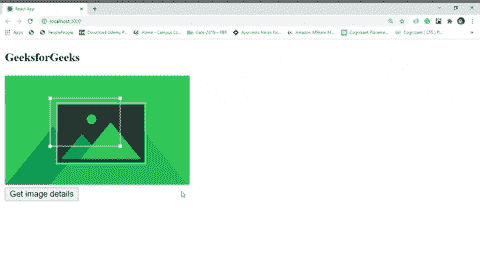
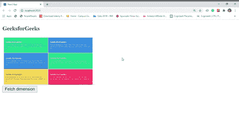

# 如何使用 ReactJS 获取图像的高度和宽度？

> 原文:[https://www . geeksforgeeks . org/如何使用 reactjs 获得图像的高度和宽度/](https://www.geeksforgeeks.org/how-to-get-the-height-and-width-of-an-image-using-reactjs/)

在反应中，我们写的看起来像超文本标记语言的东西实际上并不是纯超文本标记语言。所有看起来像 HTML 的东西都是 JSX 的，在场景后面，它们被转换成了使用巴别塔的普通 JavaScript。这些都以这种方式让开发者的生活更轻松。因为 JSX 不是超文本标记语言，这就是为什么我们可以直接引用超文本标记语言元素，这就是为什么我们不能直接获取任何超文本标记语言元素的属性。为了获取元素的属性，React 给出了一个叫做“ref”的东西。使用 ref，我们可以创建对任何 HTML 元素的直接引用，并控制 HTML 元素的属性。这里我们使用“参考”系统来获取图像的高度和宽度。

**示例 1:** 这个示例说明了如何获取图像的当前高度和宽度。

*   **index.js:**

    ## java 描述语言

    ```
    import React from 'react'
    import ReactDOM from 'react-dom'
    import App from './App'

    ReactDOM.render(<App />, document.querySelector('#root'))
    ```

*   **App.js:**

    ## java 描述语言

    ```
    import React, { Component } from 'react'
    class App extends Component{
      constructor(props){ 
        super(props) 

        // Initialize count state 
        this.state = {show : false}
        // Bind context of 'this'
        this.handleClick = this.handleClick.bind(this)
        // Create reference of DOM object
        this.imgRef = React.createRef()
      } 

      renderDetails() {
        return this.state.show ? 
          // Accessing image details using imgRef
          <div>

    <p><strong>Height : </strong> 
            {this.imgRef.current.clientHeight}px</p>

    <p><strong>Width : </strong> 
            {this.imgRef.current.clientWidth}px</p>

          </div> : null
      }

      handleClick(){

        // Update state value
        this.setState({
          show : true
        })
      }

      render(){
        return( 
          <div> 
            <h3>GeeksforGeeks</h3>
            {/* Assign reference to DOM element     */}
            
            <div>
              <button onClick={this.handleClick}>Get image details</button>
            </div>
            {this.renderDetails()}
          </div>    
        )  
      } 
    }
    export default App
    ```

**输出:**



**例 2:**

*   **index.js:**

    ## java 描述语言

    ```
    import React from 'react'
    import ReactDOM from 'react-dom'
    import App from './App'

    ReactDOM.render(<App />, document.querySelector('#root'))
    ```

*   **App.js:**

    ## java 描述语言

    ```
    import React, { Component } from 'react'
    class App extends Component{
      constructor(props){ 
        super(props) 

        // Initialize count state 
        this.state = {height:null, width:null, isIncrease:false}

        // Bind context of 'this'
        this.handleClick = this.handleClick.bind(this)

        // Create reference of DOM object
        this.imgRef = React.createRef()
      } 

      handleClick(){

        // Fetching current height and width
        const height = this.imgRef.current.clientHeight
        const width = this.imgRef.current.clientWidth
        alert(`
          Height : ${height}
          Width : ${width}
        `)
      }

      render(){
        return( 
          <div> 
            <h3>GeeksforGeeks</h3>
            {/* Assign reference to DOM element     */}
            
            <div>
              <button onClick={this.handleClick}>
                Fetch dimension
              </button>
            </div>
          </div>    
        )  
      } 
    }
    export default App
    ```

**输出:**

