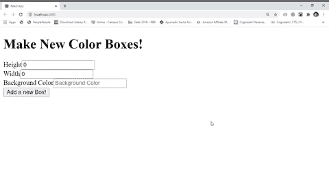

# 如何用单个函数处理 react 形式的多个输入字段？

> 原文:[https://www . geeksforgeeks . org/如何用单个函数处理多输入多输出表单域/](https://www.geeksforgeeks.org/how-to-handle-multiple-input-field-in-react-form-with-a-single-function/)

有两种形式，一种是不受控制的形式，另一种是受控制的形式。在不受控制的形式中，输入字段的值存储在 DOM 中，每当我们想要使用这些值时，我们必须到达 DOM 并取出每个输入字段的值。现在在控制中，我们不允许将值存储在 DOM 中，但是值存储为 react 组件的状态，并随着用户交互动态更新。为此，我们使用事件处理程序 **onChange** 并执行一个回调来更新状态值。现在对于单个输入字段，我们使用一个 handleChange 回调，但是如果输入字段是多个，那么我们必须创建多个 handleChange 回调来更新每个输入字段的状态。幸运的是，事实并非如此。JavaScript 为我们提供了 ES2015 现代语法，以简单的方式执行这种复杂的工作。

S2015 引入了基于被称为**计算属性名**的 JavaScript 表达式创建具有动态键的对象的能力。我们使用计算属性名来根据输入的名称属性更新所有输入字段的状态。

**语法:**

```
const obj = {
   : value
}

```

**示例 1:** 本示例展示了如何使用单个 handleChange 函数处理多个表单输入字段。

*   **index.js:**

    ## java 描述语言

    ```
    import React from 'react'
    import ReactDOM from 'react-dom'
    import App from './App'

    ReactDOM.render(<App />, document.querySelector('#root'))
    ```

*   **App.js :** App 组件仅呈现单个表单组件

    ## java 描述语言

    ```
    import React from 'react'
    import Form from './Form'

    //Functional component
    const App = () => {
      //render single App component
      return(
        <Form />
      )
    }

    export default App
    ```

*   **Form.js:** Form 组件呈现一个表单，并包含使其成为受控表单和提交表单的所有逻辑。

    ## java 描述语言

    ```
    import React,{ Component } from 'react'

    class Form extends Component{
      constructor(props){
        super(props)
        this.state = { email:'',name:'', age:null, address:'',phoneNo:''}
        this.handleChange = this.handleChange.bind(this)
        this.handleSubmit = this.handleSubmit.bind(this)
      }

      // Form submitting logic, prevent default page refresh 
      handleSubmit(event){
        const { email, name, age, address, phoneNo } = this.state
        event.preventDefault()
        alert(`
          ____Your Details____\n
          Email : ${email}
          Name : ${name}
          Age : ${age}
          Address : ${address}
          Phone No : ${phoneNo}
        `)
      }

      // Method causes to store all the values of the 
      // input field in react state single method handle 
      // input changes of all the input field using ES6 
      // javascript feature computed property names
      handleChange(event){
        this.setState({
          // Computed property names
          // keys of the objects are computed dynamically
          [event.target.name] : event.target.value
        })
      }

      // Return a controlled form i.e. values of the 
      // input field not stored in DOM values are exist 
      // in react component itself as state
      render(){
        return(
          <form onSubmit={this.handleSubmit}>
            <div>
              <label htmlFor='email'>Email</label>
              <input 
                name='email'
                placeholder='Email' 
                value = {this.state.email}
                onChange={this.handleChange}
              />
            </div>
            <div>
              <label htmlFor='name'>Name</label>
              <input
                name='name' 
                placeholder='Name'
                value={this.state.name}
                onChange={this.handleChange}
              />
            </div>
            <div>
              <label htmlFor='age'>Age</label>
              <input
                name='age' 
                placeholder='Age'
                value={this.state.age}
                onChange={this.handleChange}
              />
            </div>
            <div>
              <label htmlFor='address'>Address</label>
              <input
                name='address' 
                placeholder='Address'
                value={this.state.address}
                onChange={this.handleChange}
              />
            </div>
            <div>
              <label htmlFor='phoneNo'>Phone Number</label>
              <input
                name='phoneNo' 
                placeholder='Phone No'
                value={this.state.phoneNo}
                onChange={this.handleChange}
              />
            </div>
            <div>
              <button>Create Account</button>
            </div>
          </form>
        )
      }
    }

    export default Form
    ```

**输出:**


**例 2 :**

*   **index.js:**

    ## java 描述语言

    ```
    import React from 'react'
    import ReactDOM from 'react-dom'
    import App from './App'

    ReactDOM.render(<App />, document.querySelector('#root'))
    ```

*   **App.js:** App 组件仅呈现单个 BoxList 组件

    ## java 描述语言

    ```
    import React from 'react';
    import BoxList from './BoxList'

    const App = () => {
      //App renders single BoxList component
      return(
        <BoxList />
      )
    }

    export default App
    ```

*   **BoxList.js:** 它包含了逻辑背后的所有东西。它是一个有状态的组件。有一个状态包含一组框。我们映射每一个状态框，并为每个框渲染一个框组件。BoxList 组件还包含 create 方法，该方法负责基于给定的属性创建 box。BoxComponent 还呈现“NewBoxForm”，该表单向用户显示一个表单，以输入他们想要创建的框的高度、宽度和背景颜色。BoxList 组件将 NewBoxForm 组件的 create a 方法作为道具传递给每个“Box”组件作为道具。然后根据用户与应用程序的交互，在适当的时候调用这些组件。

    ## java 描述语言

    ```
    import React, { Component } from 'react'
    import { v4 as uuid } from 'uuid'
    import NewBoxForm from './NewBoxForm'
    import Box from './Box'

    class BoxList extends Component{
      constructor(props){
        super(props)
        // Single state boxes initialized with empty array
        // it contains all the created boxes and their properties
        this.state = { boxes : [] }
        this.createBox = this.createBox.bind(this)
      }

      // create new box and added it to boxes state
      createBox(attrs){
        const newBox = { ...attrs, id : uuid()}
        this.setState({
          boxes : [...this.state.boxes, newBox]
        })
      }

      // Map over each box in boxes state and render a 
      // Box component for each passing its property as
      // props and method is also passed as props which gets 
      // called by the handler callback of Box component
      renderBoxes(){
        return this.state.boxes.map(box => (
          <Box key={box.id} attrs={box} />
        ))
      }

      render(){
        return(
          <div>
            <h1>Make New Color Boxes!</h1>
            {/* component to create form  
                and passes create method as */}
            <NewBoxForm create={this.createBox}/>
            {this.renderBoxes()}
          </div>
        )
      }
    }

    export default BoxList
    ```

*   **NewBoxForm.js:** 该组件负责向用户显示表单，以输入他们想要创建的框的属性。该表单是一个受控表单，即它以状态存储输入字段的值，并根据用户与表单输入字段的交互实时更新该值。它在提交表单后调用句柄提交回调，作为回报，调用 BoxList 组件的创建方法，传递表单值来创建框。

    ## java 描述语言

    ```
    import React,{ Component } from 'react'

    class NewBoxForm extends Component{
      constructor(props){
        super(props)
        this.state = { height : 0, width : 0, bc : ''}
        this.handleChange = this.handleChange.bind(this)
        this.handleSubmit = this.handleSubmit.bind(this)
      }

      // Form submitting logic, prevent default page 
      // refresh and call create method of BoxList
      // component to create new box
      handleSubmit(event){
        event.preventDefault()
        this.props.create(this.state)
        this.setState({ height : 0, width : 0, bc : ''})
      }

      // Method causes to store all the values of the 
      // input field in react state using single method 
      // handleChanges of all the input field
      // using ES6 javascript feature computed property names
      handleChange(event){
        this.setState({
          [event.target.name] : event.target.value
        })
      }

      // return a form using which we add box properties 
      // to create Boxes. It is controlled form i.e. values 
      // of the input field not stored in DOM values are exist
      // in react component itself as state

      render(){
        return(
          <form onSubmit={this.handleSubmit}>
            <div>
              <label htmlFor='height'>Height</label>
              <input 
                name='height'
                placeholder='Height' 
                value = {this.state.height}
                onChange={this.handleChange}
              />
            </div>
            <div>
              <label htmlFor='width'>Width</label>
              <input
                name='width' 
                placeholder='Width'
                value={this.state.width}
                onChange={this.handleChange}
              />
            </div>
            <div>
              <label htmlFor='bc'>Background Color</label>
              <input
                name='bc' 
                placeholder='Background Color'
                value={this.state.bc}
                onChange={this.handleChange}
              />
            </div>
            <div>
              <button>Add a new Box!</button>
            </div>
          </form>
        )
      }
    }

    export default NewBoxForm
    ```

*   **Box.js:** 负责在背景中设置合适的高度、宽度、颜色来展示每个盒子。

    ## java 描述语言

    ```
    import React, { Component } from 'react'

    class Box extends Component {
      render(){
        const { height, width, bc } = this.props.attrs
        const style = { width: `${width}em`, height:`${height}em`, backgroundColor:bc}
        return(
          <div style={style} />
        )
      }
    }

    export default Box
    ```

**输出:**

