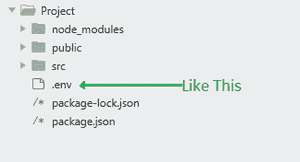

# 如何在 ReactJS 中对公众隐藏自己的 API 密钥？

> 原文:[https://www . geeksforgeeks . org/how-hide-your-API-key-from-public-in-reactjs/](https://www.geeksforgeeks.org/how-to-hide-your-api-keys-from-public-in-reactjs/)

**API(应用程序编程接口)**密钥是用于验证用户、开发人员或调用程序对 API 的身份的唯一标识符。但是，它们通常用于使用 API 而不是人类用户来验证项目。

而在多次使用在线服务时，这些钥匙落入坏人之手，这对原主人来说可能非常危险。因此，保持应用编程接口密钥的安全对于防止它出现在错误的地方非常重要。

使用 ReactJS 时保护 API 密钥的最常见做法之一是使用 **env** 变量隐藏 API 密钥。创造一个**。env** 文件，并使用前缀 **REACT_APP** 创建一个 **env** 变量。例如，如下所示:

```
REACT_APP_KEY = hello_world
```

**注意:**声明要准确，中间不能有空格。

现在，您可以通过将文件导入您的 App.js 文件来使用 ****process.env**** 对象。在将代码推送到 GitHub 或 Heroku 之前，删除**。env** 归档并使用平台的密钥管理系统。

**保护应用编程接口密钥安全的步骤:**

1.  **创造。env 文件:**只需创建一个 ****。env**** 在你的 React 项目根目录下命名文件如下所示:
    
2.  **Creating env variables in .env file:** Using the prefix **REACT_APP,** create your own **env** variables and assign the key as shown below:

    **文件名:。env**

    ```
    REACT_APP_API_KEY = Your_api_key

    // Example
    REACT_APP_API_KEY = 6341454121
    ```

    **注意:**确保中间不要有任何空隙，因为这可能会导致错误。

3.  **添加。env 文件到您的。gitignore 文件:**这样可以防止 Github 推**。env** 文件到远程存储库。避免在公共存储库中推送应用编程接口密钥。
    **文件名:。gitignore**

    ```
    # API keys
    .env

    # Bower dependency directory (https://bower.io/)
    bower_components

    # node-waf configuration
    .lock-wscript
    ...
    ```

4.  **Accessing the API key:** The API key can be accessed easily using the ****process.env**** object. Just simply import the file to your main file and access it using **process.env.your_key_name.**

    **文件名:App.js**

    ```
    import React, { Component } from 'react';
    import './App.css';

    // Accessing your defined KEYS in .env file
    console.log(process.env.REACT_API_KEY)

    // Rest of your program
    function App()
    { ... }
    ```

现在，您可以使用在线服务器推送您的代码，而不用担心您的密钥被公开。