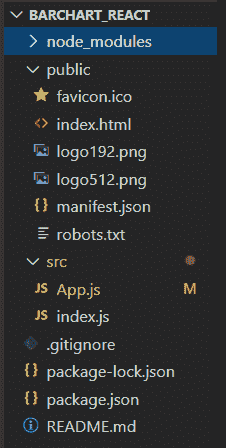
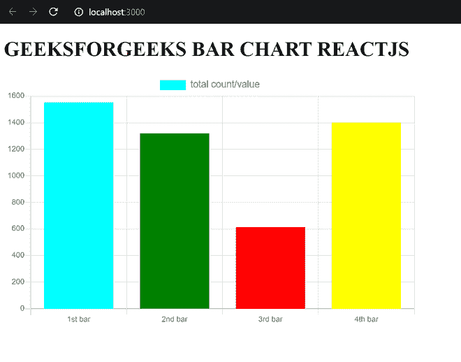

# 如何在 ReactJS 中实现条形图？

> 原文:[https://www . geeksforgeeks . org/如何实现-barchart-in-reactjs/](https://www.geeksforgeeks.org/how-to-implement-barchart-in-reactjs/)

在我们的反应应用程序中，有时我们希望显示特定数据的条形图表示。我们可以使用 ReactJS 中的 ***react-chartjs-2*** 和 ***chart.js*** 模块以条形图格式显示信息。下面是一些简单的步骤:

**步骤 1:** 使用以下命令创建一个 React 应用程序。

```
npx create-react-app BARCHART_REACT
```

**第 2 步:**创建项目文件夹，即 *BARCHART_REACT* 后，使用以下命令移动到该文件夹。

```
cd BARCHART_REACT
```

**步骤 3:** 创建 ReactJS 应用程序后，使用以下命令安装 ***react-chartjs-2*** 和***chartjs***模块。

```
npm install --save react-chartjs-2 chart.js
```

**项目结构:**



**示例:**现在在 App.js 文件中写下以下代码。在这里，App 是我们编写代码的默认组件。

## App.js

```
import { Bar } from "react-chartjs-2";

function App() {
  return (
    <div className="App">
      <h1>GEEKSFORGEEKS BAR CHART REACTJS</h1>
      <div style={{ maxWidth: "650px" }}>
        <Bar
          data={{
            // Name of the variables on x-axies for each bar
            labels: ["1st bar", "2nd bar", "3rd bar", "4th bar"],
            datasets: [
              {
                // Label for bars
                label: "total count/value",
                // Data or value of your each variable
                data: [1552, 1319, 613, 1400],
                // Color of each bar
                backgroundColor: ["aqua", "green", "red", "yellow"],
                // Border color of each bar
                borderColor: ["aqua", "green", "red", "yellow"],
                borderWidth: 0.5,
              },
            ],
          }}
          // Height of graph
          height={400}
          options={{
            maintainAspectRatio: false,
            scales: {
              yAxes: [
                {
                  ticks: {
                    // The y-axis value will start from zero
                    beginAtZero: true,
                  },
                },
              ],
            },
            legend: {
              labels: {
                fontSize: 15,
              },
            },
          }}
        />
      </div>
    </div>
  );
}

export default App;
```

**运行应用程序的步骤:**从项目的根目录使用以下命令运行应用程序:

```
npm start
```

**输出:**现在打开浏览器，转到 **http://localhost:3000/** ，会看到如下输出:

