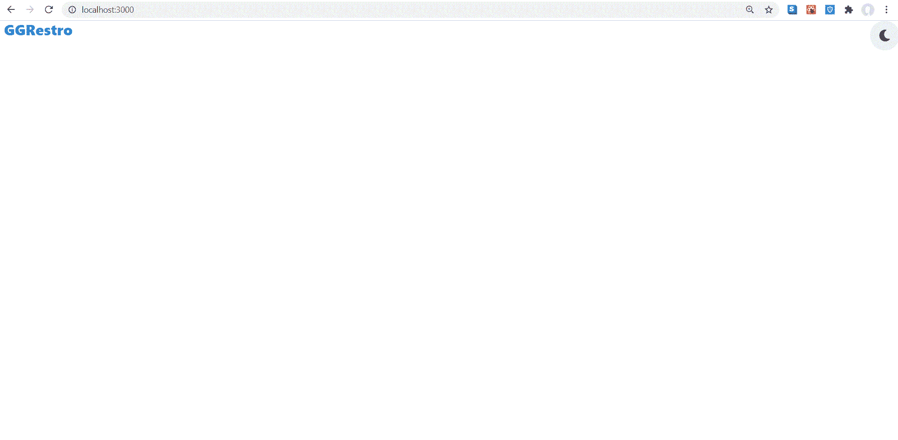

# 如何在 ReactJS 中实现查克拉 UI？

> 原文:[https://www . geeksforgeeks . org/如何实现-chakra-ui-in-reactjs/](https://www.geeksforgeeks.org/how-to-implement-chakra-ui-in-reactjs/)

**Chakra UI** 是一个强大的 React 组件库，由 Segun Adebayo 设计开发，用于构建前端应用。查克拉用户界面附带了简单但易于理解的文档，为我们提供了如何构建可重用组件的指南，从而减少了构建过程所需的时间，同时专注于应用程序的其他方面。

查克拉-用户界面 GitHub 存储库有 18.6 千颗星，已经分叉了 1.5 千次。在本文中，我们将学习如何在点击 React.js 中的按钮时实现 Chakra-UI 黑暗模式

**查克拉-UI 的关键特性是:**

*   简约的
*   风格系统
*   复用性
*   响应性

**创建反应应用程序并安装模块:**

*   **步骤 1:** 使用以下命令创建一个反应应用程序:

    ```jsx
    npx create-react-app foldername
    ```

*   **步骤 2:** 在创建项目文件夹(即文件夹名**)后，使用以下命令将**移动到该文件夹:

    ```jsx
    cd foldername
    ```

*   **步骤 3:** 创建 ReactJS 应用程序后，使用以下命令安装所需的****模块。在这个例子中，我们将安装反应图标以及第三方库。****

    > ****NPM I @ chakra-ui/react @emotion/react@^11 @emotion/styled@^11 framer-motion@^4
    > NPM I react-图标****

******项目结构:**如下图。****

****

项目结构**** 

******实现暗模式切换功能:******

****在 *App.js* 文件中，通过导入 **Flex** 、**垫片**、 **VStack** 和**标题**组件来创建基本布局。****

*   ******VStack:** 它是一个堆栈组件，用于在垂直方向的 Heading 和 IconButton 元素之间创建空间。****
*   ******Flex 和 Spacer:** 用于创建响应布局，其中子元素占据 100%的宽度，保持它们之间的间距相等。****
*   ******标题:**用于渲染标题。****

****为了实现黑暗模式切换，查克拉用户界面提供了一个名为 useColorMode 的反应钩子，让我们可以访问颜色模式和切换颜色模式。该钩子将颜色模式存储在本地存储中，并在加载页面时使用该值。为了确保启用我们的颜色模式，我们需要将颜色模式脚本添加到 *index.js* 文件中。ColorModeScript 的值设置为“浅”。****

## ****App.js****

```jsx
**import { IconButton } from "@chakra-ui/button";
import { useColorMode } from "@chakra-ui/color-mode";
import { Flex, VStack, Heading, Spacer } from "@chakra-ui/layout";
import { FaSun, FaMoon } from "react-icons/fa";

function App() {

  const { colorMode, toggleColorMode } = useColorMode(); 
  const isDark = colorMode === "dark";
  return (
    <VStack>
      <Flex w="100%">
        <Heading ml="2" size="md" fontWeight='extrabold' 
        color='blue.500' >GGRestro</Heading>
        <Spacer></Spacer>
       <IconButton ml={9} icon={isDark ? <FaSun /> : <FaMoon />} 
       isRound="true" onClick={toggleColorMode}></IconButton>
      </Flex>
    </VStack>
  );
}

export default App;**
```

## ****index.js****

```jsx
**import { ChakraProvider, ColorModeScript } from '@chakra-ui/react';
import React from 'react';
import ReactDOM from 'react-dom';
import App from './App';

 ReactDOM.render(
  <React.StrictMode>
   <ChakraProvider>
     <ColorModeScript initialColorMode="light"></ColorModeScript>
   <App />
   </ChakraProvider>
  </React.StrictMode>,
  document.getElementById('root')
);**
```

******运行应用程序的步骤:**从项目的根目录使用以下命令运行应用程序:****

```jsx
**npm start**
```

******输出:**现在打开浏览器，转到***http://localhost:3000/***，会看到如下输出:****

********