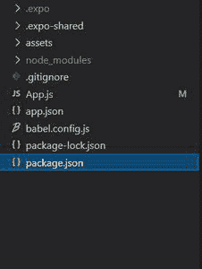

# 如何在 React Native 中实现刷卡刷新？

> 原文:[https://www . geeksforgeeks . org/如何实现-滑动-刷新-反应-原生/](https://www.geeksforgeeks.org/how-to-implement-swipe-to-refresh-in-react-native/)

在本文中，我们将了解如何在 React Native 中使用向下滑动刷新功能。在向用户显示实时数据的应用程序中，如食品订购应用程序中的加密值或食品的可用性，用户可以在应用程序上垂直向下滑动，从服务器手动刷新数据。

我们将在滚动视图中使用 ***刷新控制*** 组件来添加拉取刷新功能。

**创建 React 原生应用并安装模块:**

*   **步骤 1:** 打开终端，通过以下命令安装 expo-cli。

    ```jsx
    npm install -g expo-cli
    ```

*   **步骤 2:** 现在通过以下命令创建一个项目。

    ```jsx
    expo init demo-app
    ```

*   **第三步:**现在进入你的项目文件夹，即演示应用程序

    ```jsx
    cd demo-app
    ```

**项目结构:**如下图。



**实现:**在本例中，我们将在 ScrollView 中创建一个文本组件，当用户在应用程序上向下滑动时，该组件将改变其颜色。当用户向下滑动时，调用**刷新**功能，将刷新控制道具变为 ***真*** 。因此，用户现在可以看到加载图标，并且在 2000 ms 之后，即 2 秒，按钮的颜色变为绿色，并且刷新控制道具变为 ***假*** 。这将阻止加载图标在函数执行后消失。

**文件名:App.js**

## App.js

```jsx
import React, {useState} from 'react';
import {ScrollView, StyleSheet, Text, 
   View, RefreshControl} from 'react-native';

const App = () => {
  const [color, changeColor] = useState('red');
  const [refreshing, setRefreshing] = React.useState(false);

  const onRefresh = () => {
    setRefreshing(true);
    setTimeout(() => {
      changeColor('green');
      setRefreshing(false);
    }, 2000);
  };
  return (
    <ScrollView
      refreshControl={
        <RefreshControl refreshing={refreshing} 
          onRefresh={onRefresh} />
      }
      style={styles.container}>
      <View
        style={{
          marginTop: 200,
          alignSelf: 'center',
          padding: 20,
          backgroundColor: color,
        }}>
        <Text style={{color: 'white'}}>
          Swipe Down to Change Color !
        </Text>
      </View>
    </ScrollView>
  );
};

const styles = StyleSheet.create({
  container: {
    flex: 1,
  },
});

export default App;
```

使用以下命令启动**服务器**。

```jsx
npm run android
```

**输出:**如果你的模拟器没有自动打开，那么你需要手动打开。首先，去你的安卓工作室运行模拟器。现在再次启动服务器。

