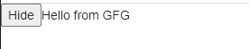

# 如何使用 ReactJS 实现 toggle？

> 原文:[https://www . geeksforgeeks . org/如何实现-切换-使用-reactjs/](https://www.geeksforgeeks.org/how-to-implement-toggle-using-reactjs/)

如果我们想对一个按钮实现切换功能，那么我们可以在我们的**组件**中设置**状态**，该状态要么为真要么为假，根据状态的值，我们可以实现切换功能。当我们点击按钮，状态的当前值为真时，我们将其更改为假，反之亦然。当我们改变状态时，组件将**重新渲染**，并根据状态值显示内容。

**创建反应应用程序:**

**步骤 1:** 使用以下命令创建一个反应应用程序:

```jsx
npx create-react-app foldername
```

**步骤 2:** 创建项目文件夹，即*文件夹*后，使用以下命令移动到该文件夹:

```jsx
cd *foldername*
```

**项目结构:**


**示例:**这里我们将创建一个按钮组件来进行切换，我们也将使用 JavaScript [这个](https://www.geeksforgeeks.org/this-in-javascript/)关键字。

## App.js

```jsx
import React from 'react'

class Counter extends React.Component {

    render() {
        return(
            <div>
                <Button text = "Hello from GFG"> </Button>
            </div>
        )
    }
}

class Button extends React.Component{
    state = {
        textflag: false,
    }

    ToggleButton() {
        this.setState(
            {textflag : !this.state.textflag}
        );
    }

    render() {
        return(
            <div>
                <button onClick={() => this.ToggleButton()}>
                  { this.state.textflag === false ? "Hide":"Show" }
                </button>
                {!this.state.textflag && this.props.text}
            </div>
        )
    }
}

export default Counter;
```

**输出:**

