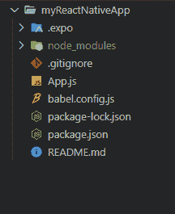

# 如何导入 React Native 中的组件？

> 原文:[https://www . geesforgeks . org/如何导入组件-in-react-native/](https://www.geeksforgeeks.org/how-to-import-components-in-react-native/)

[React Native](https://www.geeksforgeeks.org/introduction-react-native/) 是脸书开发的一个框架，用于在一种通用语言(即 JavaScript)下为 Android & iOS 创建本地风格的应用程序。最初，脸书只开发了 React Native 来支持 iOS。然而，随着最近对安卓操作系统的支持，该库现在可以为两个平台渲染移动用户界面。

**组件:**基本上我们知道 React Applications 是交互组件的集合，有了 React Native，你可以使用类或者函数来制作组件。最初，类组件是唯一可以有状态的组件。但是自从引入 React Hooks API 后，您可以向函数组件添加状态和更多内容。组件是 React Native 中的构造块，它类似于收集所有用户界面元素的容器，有助于在安卓或 iOS 设备上将前台细节呈现为本机用户界面。React 附带多个内置组件，如文本、视图、图像、滚动视图、文本输入等。

**导入组件:**JavaScript 的世界一直在移动，最新的 ECMAScript 之一现在提供了更高级的模块导入模式。在以前的版本中，开发人员必须使用**模块。}** ，但是现在每个模块都可以有一个默认的导出，或者可以导出任意数量的命名参数，如果可以导出的话，当然也可以导入。因此，在最近的 ECMAScript 版本中，每个模块都可以导入默认导出或几个命名参数，甚至是一个有效的组合。

**方法:** React Native 使用与上面提到的相同的特性，您可以将每个 React 组件视为一个模块本身。因此，可以导入 React Native Components，这是要执行的基本操作之一。在 React 中，我们使用关键字*从*导入和*来导入特定模块或命名参数。让我们看看在 React Native Application 中使用导入操作的不同方式。*

1.  **导入默认导出**:reactions native 中的每个模块至少需要一个默认导出。为了从文件导入默认导出，我们可以使用文件的位置，并在它之前使用关键字 import，或者我们可以给导入指定一个特定的名称，即 COMP_NAME，这样语法如下。

    ```jsx
    import COMP_NAME from LOCATION
    ```

2.  **导入命名值:**每个模块都可以没有命名参数，如果我们需要导入一个，我们应该使用如下语法。

    ```jsx
    import { COMP_NAME } from LOCATION
    ```

    同样，对于多个导入，我们可以使用逗号(**、**)分隔符来分隔花括号内的双参数名称。如下图所示。

    ```jsx
    import { COMP_NAME1, COMP_NAME2, ... , COMP_NAMEn } from LOCATION
    ```

3.  **导入默认导出和命名值的组合:**标题明确了我们需要看到的是相同的语法。为了导入组合，我们应该使用以下语法。

    ```jsx
    import GIVEN_NAME, { PARA_NAME, ... } from ADDRESS
    ```

**现在让我们从实现开始:**首先，我们需要在我们的系统中创建 react 原生应用程序，对于 react 原生应用程序的创建，我们需要遵循以下步骤。

**先决条件:**我们需要在系统中安装 Node.js 来运行 Node Package Manager (npm)命令。

*   [在 Windows 上安装 node . js](https://www.geeksforgeeks.org/installation-of-node-js-on-windows/)
*   [在 Linux 上安装 node . js](https://www.geeksforgeeks.org/installation-of-node-js-on-linux/)

*   **步骤 1:** 安装 React 原生 App。

    ```jsx
    npm install -g create-react-native-app
    ```

*   **步骤 2:** 创建反应原生项目。

    ```jsx
    create-react-native-app myReactNativeApp
    ```

*   **步骤 3:** 使用以下命令启动服务器。

    ```jsx
    npm run android
    ```

**项目结构:**上面的命令将在系统指定的位置创建一个名为**的 myreactnationeapp**的 react 原生应用程序文件夹。如下图所示。



**示例 1:** 在本例中，我们从 *react-native 库中导入 React Native 的两个基本内置组件*文本*和*视图*。*

## App.js

```jsx
import * as React from "react";

// Importing components from react-native library.
import { View, Text } from "react-native";

export default function App() {
  return (

    // Using react-natives built in components.
    <View
      style={{
        flex: 0.5,
        justifyContent: "center",
        alignItems: "center",
        backgroundColor: "green",
      }}
    >
      <Text
        style={{
          color: "white",
        }}>
        GeeksForGeeks
      </Text>
    </View>
  );
}
```

**运行应用程序的步骤:**使用以下命令启动服务器。

```jsx
npm run android
```

**输出:**


**示例 2:** 在本例中，我们将使用反应原生按钮组件创建一个显示警报组件的响应按钮。

## App.js

```jsx
import * as React from "react";

// Importing components from react-native library.
import { Alert, View, StyleSheet, Button } from "react-native";

export default function App() {

  const onPressButton = () => {
    Alert.alert('Welcome To GeeksForGeeks..')
  }

  const styles = StyleSheet.create({
    container: {
      flex: 0.5,
      justifyContent: 'center',
      alignItems: 'center',

    }
  })

  return (

    // Using react-natives built in components.
    <View style={styles.container}>

      <Button onPress={onPressButton} 
              title="Press Me" color="green" />

    </View>
  );
}
```

**运行应用程序的步骤:**使用以下命令启动服务器。

```jsx
npm run android
```

**输出:**

