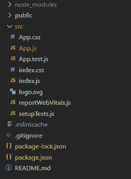
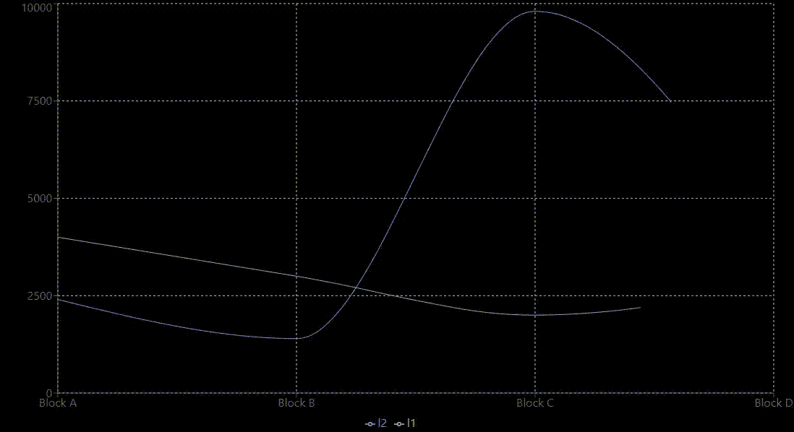

# 如何将 recharts.js 库导入 ReactJS 文件？

> 原文:[https://www . geesforgeks . org/how-import-recharts-js-library-to-reactjs-file/](https://www.geeksforgeeks.org/how-to-import-recharts-js-library-to-reactjs-file/)

recharts.js 是一个重新定义的图表库，由 React 和 D3 构建。它有助于创建交互式折线图、条形图、饼图等。它的主要原则之一是它的所有组件都是独立的、轻量级的，并且可以轻松部署。

**创建反应应用程序并安装模块**

*   **步骤 1** :使用以下命令创建一个反应应用程序:

    ```
    npx create-react-app foldername
    ```

*   **步骤 2** :创建项目文件夹即文件夹名称后，使用以下命令移动到该文件夹:

    ```
    cd foldername
    ```

*   **步骤 3:** 现在转到命令行，安装 rechart.js 库

    ```
    npm install recharts
    ```

**项目结构**:如下图。



**示例:**现在在 App.js 文件中写下以下代码。在这里，App 是我们编写代码的默认组件。我们将使用库的组件和 JS 数据，使用基类组件生成一个简单的折线图

## App.js

```
import React from "react";
import {
  LineChart,
  Line,
  XAxis,
  YAxis,
  CartesianGrid,
  Tooltip,
  Legend,
  ResponsiveContainer,
} from "recharts";

const data = [
  {
    name: "Block A",
    l1: 4000,
    l2: 2400,
    amt: 2400,
  },
  {
    name: "Block B",
    l1: 3000,
    l2: 1398,
    amt: 2210,
  },
  {
    name: "Block C",
    l1: 2000,
    l2: 9800,
    amt: 2290,
  },
  {
    name: "Block D",
    l1: 2780,
    l2: 3908,
    amt: 2000,
  },
];

export default function App() {
  return (
    <div style={{ width: "1100px", 
                  height: "600px",
                  backgroundColor: "black" }}>
      <ResponsiveContainer width="100%" 
                           height="100%">
        <LineChart
          width={500}
          height={300}
          data={data}
          margin={{
            top: 5,
            right: 30,
            left: 20,
            bottom: 5,
          }}
        >
          <CartesianGrid strokeDasharray="3 3" />
          <XAxis dataKey="name" />
          <YAxis />
          <Tooltip />
          <Legend />
          <Line
            type="monotone"
            dataKey="l2"
            stroke="#8884d8"
            activeDot={{ r: 8 }}
          />
          <Line type="monotone" 
                dataKey="l1" 
                stroke="#82ca9d" />
        </LineChart>
      </ResponsiveContainer>
    </div>
  );
}
```

**运行应用程序的步骤:**从项目的根目录使用以下命令运行应用程序:

```
npm start
```

**输出:**现在打开浏览器，转到 **http://localhost:3000/** ，会看到如下输出。

