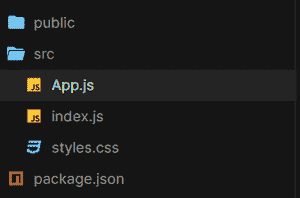
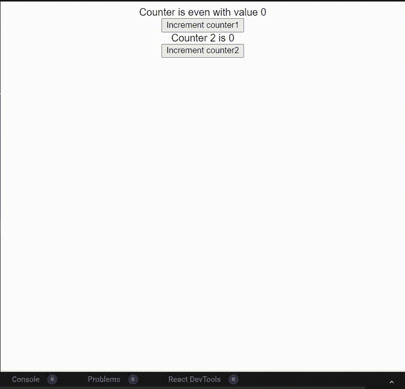
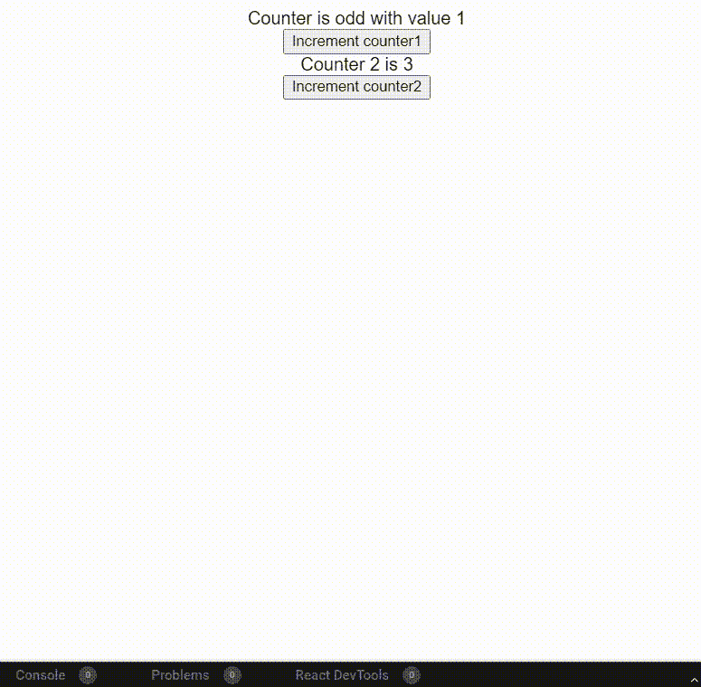

# 如何改善 React 慢应用渲染？

> 原文:[https://www . geeksforgeeks . org/如何改进-反应缓慢-应用程序呈现/](https://www.geeksforgeeks.org/how-to-improve-slow-react-application-rendering/)

[ReactJS](https://www.geeksforgeeks.org/react-js-introduction-working/) 是一个用于构建用户界面的 JavaScript 库。它是一个声明性的、高效的、灵活的 JavaScript 库，而是由脸书维护的。

**什么是渲染？**

React 使用[虚拟 DOM](https://www.geeksforgeeks.org/reactjs-virtual-dom/) 的概念。React 中的所有元素都是使用渲染方法渲染的，在这种方法中，我们必须提供要渲染的元素(主要是 div)的 *id* 。React 中的每个元素都是不可变的。因此，为了更新元素，我们必须再次调用 Render 方法。详情请参考此处。

**什么是慢反应应用渲染？**

Slow React 应用程序渲染顾名思义，就是渲染元素时的小延迟或大延迟。这可能有多种原因。这应该避免。

**改善慢反应应用渲染的方法:**

在下面的方法中，我们将看到如何有效地使用钩子来避免缓慢的渲染。钩子可以在减少重渲染的数量方面发挥重要作用。请记住，每当状态组件发生变化时，都会重新呈现。它导致呈现方法再次调用，然后通过比较虚拟 DOM 的副本，只更新需要更新的部分。

下面是一个例子，说明如果一个函数中有一些大的计算，那么*如何使用 Memo* 钩子来拯救。

**创建反应应用程序**

*   **步骤 1:** 使用以下命令创建一个反应应用程序:

    ```jsx
    npx create-react-app useMemo 
    ```

*   **第 2 步:**创建项目文件夹后，即使用备忘录**，**使用以下命令移动到该文件夹:

    ```jsx
    cd useMemo
    ```

**项目结构:**如下图。



**示例 1:** 不使用*使用备忘录*挂钩

## App.js

```jsx
import { useState } from "react";
import "./App.css";

export default function App() {

  // 1st counter state
  const [counter1, setCounter1] = useState(0);

  // 2nd counter state
  const [counter2, setCounter2] = useState(0);

  // Sample Heavy Calculation Function
  const heavyCalculation = () => {
    let i = 0;
    for (let outer = 0; outer < 10000; outer++) {
      for (let temp = 0; temp < 10000; temp++) {
        while (i < 10000) i++;
      }
    }
    return counter1 % 2 === 0 ? true : false;
  };

  return (
    <div className="App">
      {heavyCalculation()
        ? `Counter is even with value ${counter1}`
        : `Counter is odd with value ${counter1}`}
      <br />
      <button
        onClick={() => {
          setCounter1(counter1 + 1);
        }}
      >
        Increment counter1
      </button>
      <br />
      Counter 2 is {counter2}
      <br />
      <button
        onClick={() => {
          setCounter2(counter2 + 1);
        }}
      >
        Increment counter2
      </button>
    </div>
  );
}
```

**运行应用程序的步骤:**从项目的根目录使用以下命令运行应用程序:

```jsx
npm start
```

**输出:**现在打开浏览器，转到***http://localhost:3000/***，会看到如下输出:



**解释:**在上面的输出中，渲染上调用了一个重函数。现在，即使它被用于第一个计数器，但它仍然导致渲染由于计数器 2 缓慢。

**示例 2:** 使用*使用备忘录*钩子

## App.js

```jsx
import { useState, useMemo } from "react";
import "./App.css";

export default function App() {

  // 1st counter state
  const [counter1, setCounter1] = useState(0);

  // 2nd counter state
  const [counter2, setCounter2] = useState(0);

  // Our custom useMemo Function
  const useMemoFunction = useMemo(() => {
    let i = 0;
    for (let outer = 0; outer < 10000; outer++) {
      for (let temp = 0; temp < 10000; temp++) {
        while (i < 10000) i++;
      }
    }
    return counter1 % 2 === 0 ? true : false;
  }, [counter1]);

  return (
    <div className="App">
      {useMemoFunction
        ? `Counter is even with value ${counter1}`
        : `Counter is odd with value ${counter1}`}
      <br />
      <button
        onClick={() => {
          setCounter1(counter1 + 1);
        }}
      >
        Increment counter1
      </button>
      <br />
      Counter 2 is {counter2}
      <br />
      <button
        onClick={() => {
          setCounter2(counter2 + 1);
        }}
      >
        Increment counter2
      </button>
    </div>
  );
}
```

**运行应用程序的步骤:**从项目的根目录使用以下命令运行应用程序:

```jsx
npm start
```

**输出:**现在打开浏览器，转到***http://localhost:3000/***，会看到如下输出:



**解释:**在这种情况下，*使用包含 counter1 的 Memo* 钩子作为依赖项。因此，计数器 1 仍然显示延迟，但不影响计数器 2 的性能。