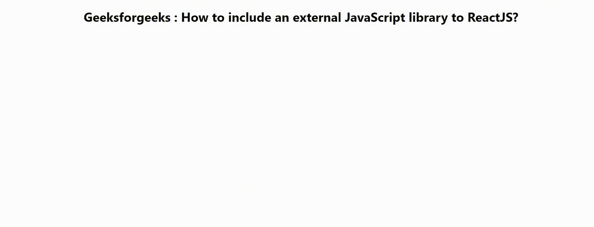

# 如何包含一个外部的 JavaScript 库来 ReactJS？

> 原文:[https://www . geeksforgeeks . org/如何包含外部 javascript 库到 reactjs/](https://www.geeksforgeeks.org/how-to-include-an-external-javascript-library-to-reactjs/)

JavaScript 库是一个预先编写的 JavaScript 文件，其中包含一些非常有用的代码片段、对象和函数，这样我们就可以重用这些函数、对象和代码片段来执行一项常见的任务。ReactJS 本身就是一个 JavaScript 库的例子。但是 ReactJS 中的文件结构和编码语法与普通的 JavaScript 有一点不同。因此，在本文中，我们将学习如何向 ReactJS 项目添加外部 JavaScript 库。

我们将创建一个 react 应用程序，并包含一个外部 JavaScript 库，以三种方式来 ReactJS。这些是:

1.  使用反应脚本标记包。
2.  使用反应头盔包。
3.  使用 JavaScript DOM 方法。

**创建反应应用程序:**

*   **步骤 1:** 在终端或命令提示符下使用以下命令创建一个 React 应用程序:

    ```
    npx create-react-app name_of_the_app
    ```

*   **步骤 2:** 创建 react 应用程序后，使用以下命令根据您的应用程序名称移动到目录:

    ```
    cd name_of_the_app
    ```

**项目结构:**我们的项目结构会是这样的。


现在根据以下任何一种方法修改源代码目录中的默认 **App.js** 文件。

**方法 1:使用反应脚本标签包**

这是第一种方法，也是复杂度最低的方法。 *react-script-tag* 是一个提供支持通用渲染的<脚本>标签的包。借助这个库，我们可以直接将<脚本>标签附加到我们的文档中。在脚本标签的**‘src’**属性中，我们可以包含外部 JavaScript 库的 URL。

**安装:**在你的 ReactJS 项目文件夹里面打开一个终端，写下面的代码安装 *react-script-tag* 包。

```
npm install --save react-script-tag
```

**导入‘script tag’组件:**从我们要添加脚本标签的文件顶部的 *react-script-tag* 库中导入内置的‘script tag’组件。

```
import ScriptTag from 'react-script-tag';
```

**调用我们 App.js** 中的<脚本标签>组件

*   现在在我们的应用组件中调用<scripttag>组件。这是一个自动关闭的 JSX 组件。</scripttag>
*   现在借助**‘src’**属性解析我们想要的库的 URL。
*   水合属性接受布尔输入。如果客户端正在为服务器渲染补水，则将其设为 **true** 。默认值为假。

## App.js

```
import React from 'react';
import './App.css';
import ScriptTag from 'react-script-tag';

function App() {

  return (
    <div className='App'>
      <h1>Geeksforgeeks : How to include an external 
      JavaScript library to ReactJS?</h1>
      <ScriptTag isHydrating={true} type="text/javascript" 
      src=
"https://ajax.googleapis.com/ajax/libs/jquery/3.5.1/jquery.min.js" />
    </div>
  );
}

export default App;
```

**运行应用程序:**打开终端，在终端中写下以下命令。

```
npm start
```

**输出:**检查输出，检查我们的库添加是否正确。


**方法二:使用反应头盔包**

*反应头盔*也是一个众所周知的 npm 包，主要用于在反应文档的头部添加元素。我们可以使用这个包在文档的头部添加一个脚本标签。将库的 CDN 解析为脚本标记的来源，最终会将这个脚本添加到我们的文档中。

**安装:**打开 ReactJS 项目文件夹内的终端，编写以下代码安装*react-头盔*包。

```
npm install --save react-helmet
```

**导入‘头盔’组件:**从源代码文件顶部的*react-头盔*包导入‘头盔’组件。

```
import {Helmet} from "react-helmet";
```

**调用我们 App.js 文件里面的<头盔>组件:**

*   头盔是一种非自动关闭部件。基本上是用来在文档的里面添加 HTML 代码的。它获取希望保留在中的 HTML 标签并输出它们。
*   头盔包支持服务器端和客户端渲染。
*   在名为**【应用】**的 JSX 组件中调用这个组件，并在其中创建一个基本的 HTML <脚本>标签。在<脚本>标签中添加带有‘src’属性的 jQuery 库的网址。

## App.js

```
import React from 'react';
import './App.css';
import {Helmet} from "react-helmet";

function App() {

  return (
    <div className='App'>
    <h1>Geeksforgeeks : How to include an external 
    JavaScript library to ReactJS?</h1>
    <Helmet>
    <script src=
"https://ajax.googleapis.com/ajax/libs/jquery/3.5.1/jquery.min.js" 
    type="text/javascript" />
    </Helmet>
    </div>
  );
}

export default App;
```

**运行应用:**打开终端，在你的终端写下以下命令。

```
npm start
```

**输出:**检查输出，检查我们的库添加是否正确。


**方法三:使用 JavaScript DOM 方法**

安装这么多软件包会使我们的应用程序变得又重又慢。所以使用 JavaScript DOM 方法是最好的。在这种方法中，我们不需要安装任何外部软件包。该方法的步骤是:

**创建功能:**

*   创建一个函数，将所需库的网址作为参数。
*   使用***document . createelement*****方法创建一个空的脚本标记。**
*   **将其' **src** '属性设置为我们库的解析后的 URL。**
*   **将“ **async** ”设置为 true，这样就允许程序立即执行，同步代码将阻止剩余代码的进一步执行，直到它完成当前代码。**
*   **使用***document . body . appendchild***方法追加创建的脚本标记。**
*   **导出该函数，并在我们想要在 JSX 代码中添加自定义库时调用它。**

****调用函数:**调用 App 组件内部的函数，将其封装在花括号内。将我们想要的库的网址作为字符串传递。**

## **App.js**

```
import React from 'react';
import './App.css';

// Create the function
export function AddLibrary(urlOfTheLibrary) {
  const script = document.createElement('script');
  script.src = urlOfTheLibrary;
  script.async = true;
  document.body.appendChild(script);
}

function App() {
  return (
    <div className="App">
      <h1>Geeksforgeeks : How to include an external 
      JavaScript library to ReactJS?</h1>

  {/* Call the function to add a library */}
  {AddLibrary(
  'https://ajax.googleapis.com/ajax/libs/jquery/3.5.1/jquery.min.js')}
    </div>
  );
}

export default App;
```

****运行应用程序:**打开终端，在终端中写下以下命令。**

```
npm start
```

****输出:**检查输出，检查我们的库添加是否正确。**

****