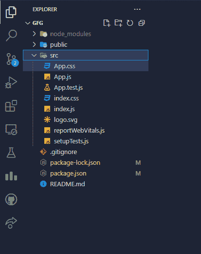
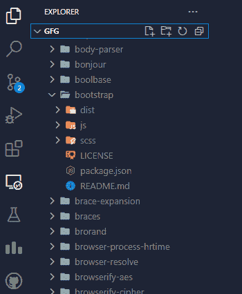
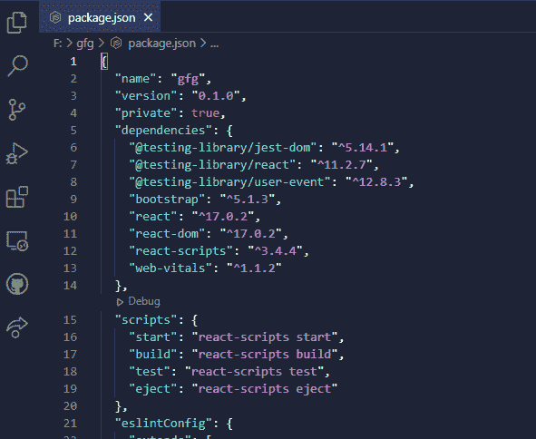
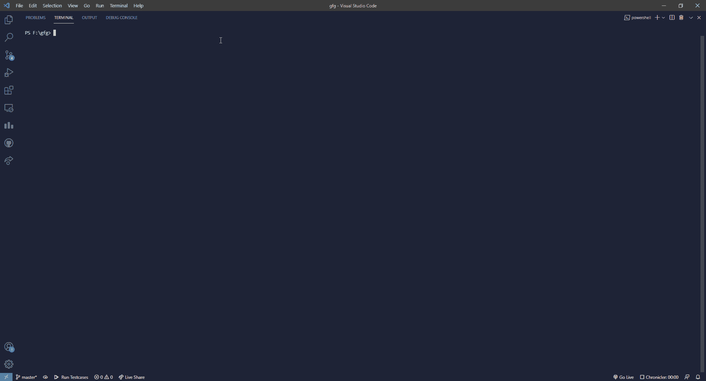

# 如何在 React.js 中安装引导程序？

> 原文:[https://www . geesforgeks . org/how-install-bootstrap-in-react-js/](https://www.geeksforgeeks.org/how-to-install-bootstrap-in-react-js/)

Bootstrap 是最流行的前端开源工具包之一，用于在网络上开发响应迅速、移动优先的前端项目。它包含基于 CSS 和 JavaScript 的各种类型的设计模板。它有各种预先构建的组件，如手风琴、警报、转盘、按钮、卡片、面包屑等。不用从头开始编写代码，可以使用引导模板使工作变得更加容易。有多种方法可以在本地项目中使用 Bootstrap，例如使用 Bootstrap CDN 或在 React JS 中安装 Bootstrap。

但是，使用 Bootstrap CDN 是将 Bootstrap 添加到项目中的更简单的方法。不需要安装或下载任何软件包。你可以简单地在文件的部分放一个<link>或者反应应用程序来添加。但是今天我们要讨论如何在 React JS 中安装 Bootstrap。

以下是安装引导数据库的一些步骤:-

*   创建反应应用程序
*   打开终端并将目录更改为当前项目的路径
*   运行 npm(节点包管理器)安装命令，后跟包的名称和版本(可选)。

安装后，只需在您的 React JS 文件中导入引导依赖关系，就可以使用引导。在导入 bootstrap 精简 CSS 作为依赖项后，我们可以在 React App 组件中使用内置的 Bootstrap 类。但是为了在我们的 React App 中使用 Bootstrap 的 JavaScript 组件，我们必须使用 npm install 类似地安装 jquery 和 popper.js。

**创建反应应用程序:**

**步骤 1:** 使用以下命令创建一个反应应用程序。在终端内写下以下命令，然后按回车键。(您可以使用自己选择的文件夹名来代替 gfg。)

```jsx
npx create-react-app gfg
```

**步骤 2:** 通过输入以下命令将目录更改为项目文件夹。

```jsx
cd gfg
```

**项目结构:**现在我们在我们的项目目录中。由于我们成功地创建了 ReactJS，所以让我们安装所需的包。创建反应应用程序后，我们的项目结构看起来类似于下面。



项目 _ 结构

**第三步:**在终端运行以下命令。一定要检查你是否在 React App 目录中。为了方便起见，我把 *F:\gfg* 作为我当前的工作目录，也就是我的 React App( *gfg)的目录。*

```jsx
npm install bootstrap
```

如果您在上面的命令中观察到，我没有提到引导的版本。默认情况下，它将安装最新版本的引导。但是如果您正在学习一些教程、课程或者想要在特定的引导版本中构建您的 React JS 应用程序，您可以通过在*引导*之后传递*“@ version”*来实现，即 *npm 安装引导@4.1* ，其中 4.1 是版本的名称。

我们目前的工作目录是 **F:/gfg。**引导程序现已成功安装，您可以通过搜索**节点 _ 模块**文件夹中的引导程序文件夹进行验证。



节点模块内的引导文件夹

您还可以观察到您的包中的一些变化。json 文件是在安装 bootstrap 之后，在 package.json 的 dependencies 部分中添加了一个条目，类似于**“bootstrap”:“version”。**

**package.json**



安装后引导内部依赖关系

**第 4 步:**到目前为止，引导程序已经成功安装在 React 应用程序中，但是要使用它，我们必须将其导入 React 文件中。我正在导入 *Bootstrap 精简 CSS 文件*和 *Bootstrap JavaScript 精简捆绑文件*在 ***index.js*** 里面，它在 ***F:\gfg\src** 里面。*

```jsx
import 'bootstrap/dist/css/bootstrap.min.css';
import 'bootstrap/dist/js/bootstrap.bundle.min';
```

在我们的 **index.js** 中需要上面的两个语句来导入 React 文件中的依赖项，以便在我们的 React 应用程序组件中使用引导类。

**文件名:index.js**

## java 描述语言

```jsx
import 'bootstrap/dist/css/bootstrap.min.css';
import 'bootstrap/dist/js/bootstrap.bundle.min';
import React from 'react';
import ReactDOM from 'react-dom';
import './index.css';
import App from './App';
import reportWebVitals from './reportWebVitals';

ReactDOM.render(
  <React.StrictMode>
    <App />
  </React.StrictMode>,
  document.getElementById('root')
);
```

**解释:**上面的代码可能看起来像 index.js，除了第 1 行和第 2 行，在创建 React App 时，默认情况下，引导不会作为 index.js 内部的依赖项导入。在第 1 行和第 2 行，我们有**导入的 bootstrap minified css** 和**bootstrap JavaScript minified bundle**。现在，我们可以在 React 应用程序组件中使用引导类。

**第五步:**我们都设置使用内置的 Bootstrap 类，但是要在 react app 中使用 Bootstrap 的 JavaScript 组件，我们必须安装 ***popper.js*** 和***jquery。*** 以防还没有安装。要安装 **jquery** 和 **popper.js** 在终端中写下下面一行，然后点击回车。

```jsx
npm install jquery popper.js
```

安装之后，同样地在您的 React JS 文件中导入这两个依赖项在这种情况下***index.js*** 下面是导入这两个依赖项的语句。

```jsx
import $ from 'jquery';
import Popper from 'popper.js';
```

完成所有这些额外的更改后，您的 **index.js** 文件应该如下所示

**文件名:index.js**

## java 描述语言

```jsx
import 'bootstrap/dist/css/bootstrap.min.css';
import 'bootstrap/dist/js/bootstrap.bundle.min';
import $ from 'jquery';
import Popper from 'popper.js';
import React from 'react';
import ReactDOM from 'react-dom';
import './index.css';
import App from './App';
import reportWebVitals from './reportWebVitals';

ReactDOM.render(
  <React.StrictMode>
    <App />
  </React.StrictMode>,
  document.getElementById('root')
);

// If you want to start measuring performance
// in your app, pass a function to log results
// (for example: reportWebVitals(console.log))
// or send to an analytics endpoint.
reportWebVitals();
```

**第六步:**让我们在 React App 中使用简单的引导按钮。为此，我们必须在我们的 index.js 文件中导入 bootstrap minified css 和 bootstrap JavaScript minified bundle 作为依赖项。并在我们的默认 index.js 文件中添加一个按钮。就像我们已经做的那样。之后，我们必须在我们的应用程序中添加一个按钮，在 **App.js** 中添加以下代码。

**文件名:App.js**

## java 描述语言

```jsx
import logo from './logo.svg';
import './App.css';

function App() {
  return (
    <div className="App">
      <header className="App-header">
        

<p>
          Edit <code>src/App.js</code> and save to reload.
        </p>

        <a
          className="App-link"
          href="https://reactjs.org"
          target="_blank"
          rel="noopener noreferrer"
        >
          Learn React
        </a>
        <a className="btn btn-primary"
             data-bs-toggle="collapse"
             href="#collapseExample"
             role="button"
             aria-expanded="false"
             aria-controls="collapseExample">
        Bootstrap button
        </a>
    </header>
    </div>
  );
}

export default App;
```

**运行应用程序的步骤:**通过在终端输入以下命令，保存您的文件并运行 npm 服务器。

```jsx
npm start
```

**输出:**运行服务器后，您的输出将如下所示



输出