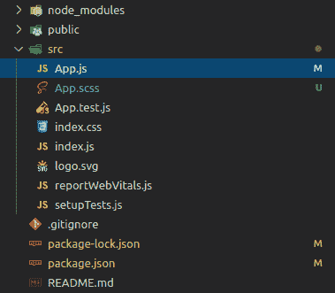

# 如何安装 node-sass to React 项目？

> 原文:[https://www . geesforgeks . org/如何安装-节点-sass-反应-项目/](https://www.geeksforgeeks.org/how-to-install-node-sass-to-react-project/)

Sass 是一种脚本语言，被编译成[级联样式表(CSS)](https://www.geeksforgeeks.org/types-of-css-cascading-style-sheet/) 。它是一种预处理器语言。它最初由汉普顿·卡特林设计，然后由娜塔莉·韦森鲍姆开发。在最初的版本之后，威岑鲍姆和克里斯·爱普斯坦继续用 SassScript 扩展 SASS。它支持四种数据类型，它们是数字、字符串、颜色和布尔值。嵌套也适用于这种语言。

**先决条件:**

*   [基础知识 ReactJS](https://www.geeksforgeeks.org/react-js-introduction-working/)

**安装过程:**

*   **使用 npm 添加 sass:**

    ```
    npm install node-sass --save
    ```

*   **使用纱线添加 sass:**

    ```
    yarn add node-sass
    ```

**注意:**现在可以将 App.css 重命名为 app . SCS，将 App.js 更新为导入 app . SCS，如果以扩展名导入，这个文件和其他任何文件都会自动编译。scss 或. sass.



**示例:**一旦您按照上述步骤操作，则意味着您已经成功安装了 sass，并且可以开始使用它。

*   **app. sass:** It can be observed in the code of sass file that we can use variables or perform arithmetic operations in sass file. This is the advantage of using sass.

    ## HTML

    ```
    $bg:rgb(88, 235, 88);
    $border-color : black;

    .main-block{

      background-color: $bg;
      height: 4px / 100px  * 100% ;
      border: 1px solid $border-color;
      text-align: center;

    }
    ```

*   **app . js**

    ## Javascript

    ```
    import logo from './logo.svg';
    import './App.scss';

    function App() {
      return (
        <div className="App">
          <header className="App-header">
            

    <p>
              Edit <code>src/App.js</code> and save to reload.
            </p>

            <a
              className="App-link"
              href="https://reactjs.org"
              target="_blank"
              rel="noopener noreferrer"
            >
              Learn React
            </a>
          </header>
        </div>
      );
    }

    export default App;
    ```

*   **输出:**