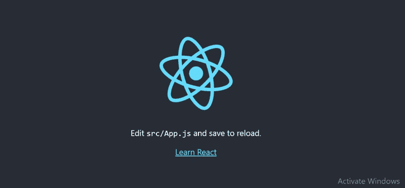

# 如何在 Windows 上安装 ReactJS？

> 原文:[https://www . geeksforgeeks . org/how-install-reactjs-on-windows/](https://www.geeksforgeeks.org/how-to-install-reactjs-on-windows/)

**React JS** -React 是一个开源的基于组件的前端 JavaScript 库。它用于为网络和移动应用程序创建快速的交互式用户界面。在 React 中创建动态应用程序很容易，因为它需要更少的编码并提供更多的功能。大型跨国公司和新成立的公司都在使用它

### **反应特性:**

1.  **可重用组件**:一个单独的 React 应用程序由许多组件组成，每个组件都有自己的逻辑和代码，但是我们可以多次轻松地重用组件，从而减少开发人员的时间并提高工作效率
2.  **调试** : React app 可以使用“React 开发者工具”轻松调试。这是一个浏览器扩展，可以用于 chrome 和 Firefox。

### **Windows 上的安装反应:**

**第一步**:安装 windows 的 Node.js 安装程序。点击此[链接](https://nodejs.org/en/)。在这里安装 LTS 版本(左边的版本)。下载后，在不干扰其他设置的情况下打开 NodeJS，点击**下一步**按钮，直到完全安装。


安装 14.18.1 LTS

**第二步**:打开命令提示符，检查是否安装完毕，输入命令–>

```
node -v
```


节点版本是 v14.15.3

如果安装顺利，它会给你你已经安装的版本

**步骤 3** :现在在终端运行以下命令:

```
npm install -g create -react -app  
```


安装需要几秒钟

它将在全球范围内为您安装 react app。要检查一切是否顺利，请运行命令

```
create -react -app -v
```


版本 4.0.3

如果一切顺利，它会给你反应应用的安装版本

**第 4 步:**现在使用以下命令创建一个新文件夹，您想在其中让您的应用程序做出反应:

```
mkdir newfolder
```

**注意:**上面命令中的 *newfolder* 是文件夹的名称，可以是任何东西。


使用以下命令在同一文件夹中移动:

```
cd newfolder (your folder name)
```


**第 5 步**:现在在这个文件夹中运行命令–>

```
create -react -app  reactfirst YOUR_APP_NAME
```


安装所需的依赖项需要一些时间

**第 6 步**:现在打开你选择的 IDE，比如 Visual studio 代码，打开你已经安装了 react app **newolder** 的文件夹(在上面的例子中)在文件夹里面你会看到你的 app 的名字 **reactapp** (在我们的例子中)。使用终端并进入你的应用程序名称文件夹。使用命令**CD react tapp**(您的应用名称)


**第 7 步:**要启动您的应用程序，请运行以下命令:

```
npm start  
```


运行上述命令后，浏览器中将打开一个新的选项卡，显示 React 徽标，如下所示:



祝贺您成功安装了 react-app，并准备好构建出色的网站和应用程序