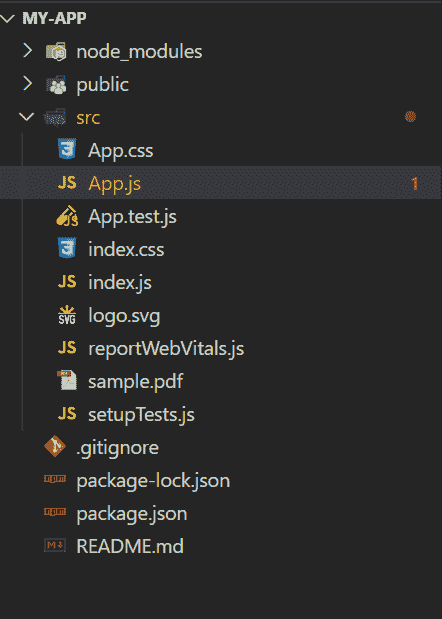
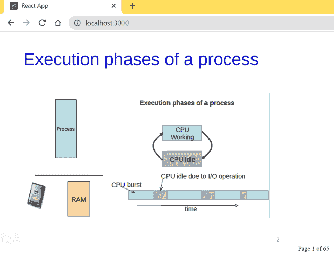

# React js 中如何集成 React-PDF？

> 原文:[https://www . geeksforgeeks . org/如何集成-反应-pdf-in-reactjs/](https://www.geeksforgeeks.org/how-to-integrate-react-pdf-in-reactjs/)

反应-PDF 是一个包，帮助用户在他们的反应应用程序中显示 PDF 文件。通过使用 *react-pdf* 包，我们可以在我们的 react 应用程序中添加 pdf 文件，就像它们是图像一样。要使用最新版本的 *react-pdf* 包，我们的项目应该使用 React 16.3 或更高版本。我们可以使用以下方法集成 *react-pdf* 。

**创建反应应用程序并安装模块:**

*   **步骤 1:** 使用以下命令创建一个 React 应用程序。

    ```
    npx create-react-app my-app
    ```

*   **步骤 2:** 创建项目文件夹(即 my-app)后，使用以下命令移动到该文件夹。

    ```
    cd my-app
    ```

*   **步骤 3:** 创建 React 应用程序后，使用以下命令安装 ***react-pdf*** 包。

```
npm install react-pdf
```

*   **第四步:**将*sample.pdf*文件添加到您想要显示的 *my-app/src* 文件夹中。

**项目结构:**



项目结构

**示例:**在 App.js 文件中添加以下代码。在这里，App 是我们编写代码的默认组件。

## java 描述语言

```
import React from 'react';
import { Document,Page } from 'react-pdf/dist/esm/entry.webpack';
import pdfFile from './sample.pdf'

function App() {

  return (
    <div>
      <Document file={pdfFile}>
        <Page pageNumber={1} />
      </Document>
    </div>
  );
}

export default App;
```

**注意:**我们没有直接导入/要求 *react-pdf* ，而是使用了 *react-pdf* 提供的入口点，因为入口点启用了对性能至关重要的 PDF.js worker。这确保了 PDF 文件将在不同的线程中呈现，而不会影响页面的性能。

**运行应用程序的步骤:**从项目的根目录使用以下命令运行应用程序。

```
npm start
```

**输出:**现在打开浏览器，转到***http://localhost:3000/***，会看到如下输出。



**参考:**T2】https://www.npmjs.com/package/react-pdf