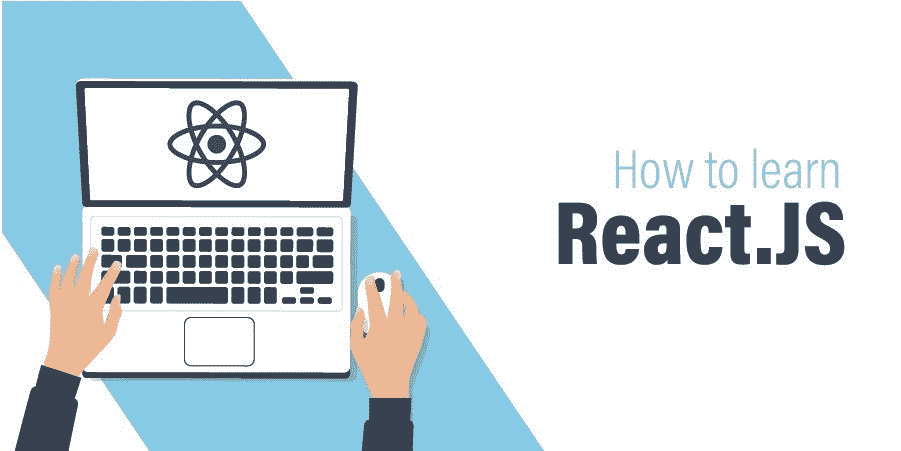

# 如何学习 ReactJS:初学者完全指南

> 原文:[https://www . geesforgeks . org/how-learning-reactjs-a-complete-guide-for-初学者/](https://www.geeksforgeeks.org/how-to-learn-reactjs-a-complete-guide-for-beginners/)

每个前端开发人员和 web 开发人员都知道在多个地方编写相同的代码是多么令人沮丧和痛苦。如果他们需要在多个页面上添加一个按钮，他们将被迫执行大量代码。使用其他框架的开发人员面临着修改大部分代码的挑战，即使是在设计经常变化的组件时。开发人员想要一个框架或库，允许他们分解复杂的组件并重用代码来更快地完成他们的项目。这里 React 进来解决了这个问题。



React 是构建用户界面最流行的 javascript 库。它快速、灵活，并且每次都有强大的社区在线帮助您。React 最酷的地方是它基于**组件**，你把复杂的代码分解成独立的部分，即组件，这有助于开发人员以更好的方式组织他们的代码。许多公司正在转向 React，这也是大多数初学者和有经验的开发人员也在扩展他们的知识来学习这个库的原因。
学习这个图书馆是一项艰巨的任务。你看了很多教程，你试图获得最好的材料来学习这个库，但是如果你不知道学习它的正确路径或一步一步的过程，它会变得势不可挡。我们将讨论开始“反应”的路线图，以及进入“反应”的基本先决条件(清单)。让我们开始吧…

### 清单/先决条件

1.  HTML、CSS 和 JavaScript 的基本知识。
2.  Javascript 的一些 ES6 特性，比如
    *   Let 和 Const
    *   箭头函数
    *   类和“this”关键字
3.  node.js 代码编辑器的基础

### 1\. HTML、CSS、JavaScript

*如果你是一个有经验的开发人员，那么跳过这一部分，对于初学者来说这里是*一个*快速介绍..*

*   每个前端开发人员都从这三件事开始他们的旅程。这些是前端 web 开发基础的基本基础，它们一起工作来创建一个功能齐全的 web 应用程序/网站。
*   将人体视为网站或网络应用程序。
*   [**HTML**](https://www.geeksforgeeks.org/html-tutorials/) 可以被认为是身体的结构或“骨架”，它告诉我们什么必须来到哪里。
*   [**CSS**](https://www.geeksforgeeks.org/css-tutorials/) 定义了“皮肤，肉”的样式，告诉你一个特定的片段应该是什么样子，它的颜色，高度，宽度等等。,
*   [](https://www.geeksforgeeks.org/javascript-tutorial/)**定义了“大脑”中告诉每个部分做什么的功能。**

### **2.Javascript 的 ES6 特性**

**ES6 是 JavaScript 的版本，ES6 有很多特性。要开始使用 React，您需要了解*箭头函数、Let 和 Const、Class* 、*和‘this’*关键字。**

**[**箭头功能**](https://www.geeksforgeeks.org/arrow-functions-in-javascript/) **:** 箭头功能允许您为函数编写较短的语法。它使你的代码更加清晰易读。检查下面的代码片段…**

## **java 描述语言**

```jsx
// Old method
function greet()
{
    console.log('GeeksforGeeks');
}
var greet1 = function(){
    console.log('GeeksforGeeks');
}
//ES6 method
var greet2 = () => {
    console.log('GeeksforGeeks');
}
```

**[**Let**](https://www.geeksforgeeks.org/javascript-let/) **和**[**Const**](https://www.geeksforgeeks.org/javascript-const/)**:**您将使用‘Let’和‘Const’代替‘var’关键字。两者都不同于 var，简单来说…**

*   ****让**定义一个*局部变量*，将它们的范围限制在声明它们的块中。**
*   ****常量**定义一个*常量变量*，其值不能改变。**

****类和“this”关键词:**你必须学习面向对象编程的概念，比如 ES6 中的类、方法、对象。您可能已经在其他语言中学习过这些概念，如 [C++](https://www.geeksforgeeks.org/c-plus-plus/) 或 [Java](https://www.geeksforgeeks.org/java/) 。从 [ES6 |类](https://www.geeksforgeeks.org/es6-classes/)中了解到这一点，并跟随本[视频教程](https://www.youtube.com/watch?v=XPw7nQSmMqU)了解这一点。
如果我们谈论‘this’关键字，那么它代表当前正在执行的对象。请确保您清楚“this”关键字的概念，这对于许多开发人员来说是非常混乱的。随后学习什么是[调用、应用和**绑定**方法](https://blog.bitsrc.io/understanding-call-bind-and-apply-methods-in-javascript-33dbf3217be)(用于将“this”关键字绑定/连接到对象)。**

### **3.基本原理和代码编辑器**

**理解 NodeJS 的基本原理对于研究 ReactJS 很重要。简单来说，NodeJS 是一个 javascript 的执行环境。很多人认为这是一种不真实的编程语言。每个浏览器都有嵌入浏览器的 JavaScript 引擎，比如 Chrome 有 V8 引擎，Mozilla Firefox 有 SpiderMonkey。您不能在浏览器之外执行任何操作，如文件操作、操作系统操作、网络操作等。节点就是在这里出现的。节点允许您在浏览器之外执行所有这些操作。它嵌入了 chrome 的 V8 引擎。
现在你可能已经非常熟悉 NodeJs 了，所以让我们来讨论一下 Node 的所有*特性，你必须知道这些特性才能学习 React* 。**

*   ****NPM(节点包管理器):** NPM 是一个包管理器，可以像 python 的 PIP 一样给你的项目安装节点模块和包。**
*   ****IMPORT 和 EXPORT 关键字。**

    *   **导入:**一旦您将在项目中使用 NPM 安装节点模块，您就必须使用“导入”关键字来使用该模块。
    *   **导出:**创建模块/组件时使用这个关键字，只需要返回一部分，不需要返回所有的方法和变量。** 

**阅读文章 [ReactJS |导入和导出](https://www.geeksforgeeks.org/reactjs-importing-exporting/)以获得关于此主题的更多帮助。您可以使用任何代码编辑器来处理 React。许多网络开发人员更喜欢 Visual Studio 代码——VS Code——(强烈推荐)、崇高文本或 Atom。**

### **学习反应**

****基本面:**以上我们讨论的都是 ReactJS 的前提。现在，一旦你学会了以上所有的事情，是时候进入反应了。先了解 React 的基本概念。我们将在这里给你一个概述。
React 是脸书开发的一个 Javascript 库，用于构建交互式用户界面。它遵循基于组件的体系结构，这意味着您将把您的整个用户界面部分分成可重用的组件，所有这些组件都是单独制作的，最后装配到父组件中，然后呈现出来。以下是在 ReactJS 中要学习的一些重要主题…**

*   **组件架构(已经讨论过)。**
*   ****状态:**基本上‘状态’持有同步变量。如果您更改了状态变量的值，则该更改会立即反映在使用该特定变量的所有地方。**
*   ****道具:**就像在函数或方法中传递的参数。在 React 中，道具(参数)作为输入参数被传递到一个 HTML 标记中。**
*   **功能组件、类组件。**
*   **反应中的样式。**
*   **了解如何使用 React 应用程序连接到 API。**

**阅读教程 [ReactJS | GeeksforGeeks](https://www.geeksforgeeks.org/reactjs/) 、 [React 官方教程](https://reactjs.org/tutorial/tutorial.html)，观看视频 [ReactJS 教程](https://www.youtube.com/watch?v=QFaFIcGhPoM&t=2s)。一旦你对 React 有了基本的了解，你就可以开始构建一些基本的项目，比如…**

*   **简单的全应用程序**
*   **简单计算器应用**
*   **制作购物车**
*   **使用 GitHub API 显示 GitHub 的用户统计数据**

****React Router:** React 路由将帮助您了解路由在 React 应用程序中的工作方式。如何加载特定页面的内容或如何使用 React Router 重定向到特定页面。例如，要从“主页”页面重定向到“博客”页面，您必须设置路由，以便它只能显示“博客”页面的内容。从视频[初学者反应路由器](https://www.youtube.com/watch?v=Law7wfdg_ls&t=154s)和[反应路由器](https://reacttraining.com/react-router/web/example/basic)中了解到这一点。一旦你对 React Router 有了了解，你就可以制作一些项目，比如**一个简单的 CURD 应用程序**或者**黑客新闻克隆****

****Webpack:** Webpack 是 Javascript 中的一个模块捆绑器，它可以帮助您将依赖关系作为项目的静态文件进行维护，这样开发人员就不必这样做了。Webpack 还附带了加载器。加载程序有助于围绕项目运行特定任务。观看视频[网络包教程](https://www.youtube.com/watch?v=9kJVYpOqcVU)并在[网络包官方文档上阅读。](https://webpack.js.org/concepts/)**

****服务器渲染:**学习这个概念将有助于您在服务器中创建组件，并在浏览器中将其渲染为 HTML，当所有 JavaScript 模块都在浏览器中下载时，React 就占据了舞台。这是 React 最酷的功能之一，可以与任何后端技术一起使用。从泰勒·麦金尼斯的链接 [React 服务器渲染中理解这个概念。](https://tylermcginnis.com/react-router-server-rendering/)**

****Redux:** 在复杂的应用程序中，您将必须跨组件管理状态。Redux 是一个 javascript 库，它解决了这个问题，并帮助您维护应用程序状态。在 Redux 中，您可以将所有状态存储在一个源中。从链接[React-Redux 简介](https://www.geeksforgeeks.org/introduction-to-react-redux/)和 [React Redux 初学者教程](https://dev.to/valentinogagliardi/react-redux-tutorial-for-beginners-learning-redux-in-2018-13hj)中更好的理解这个概念。**

**这就是从一开始就学习反应的路线图。我们希望这是有益的！！！**