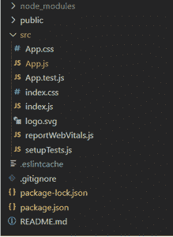

# 如何在 ReactJS 中本地管理组件的状态？

> 原文:[https://www . geeksforgeeks . org/如何在本地管理组件-状态-in-reactjs/](https://www.geeksforgeeks.org/how-to-locally-manage-components-state-in-reactjs/)

**组件的本地状态:**任何组件都是 ReactJS 主要依靠它的道具和状态来管理数据。组件的状态对它来说是私有的，并且在它的整个生命周期中负责管理它的行为。状态只不过是记录 react 应用程序中任何数据更改的结构。它可以用于存储值、表单输入、来自应用编程接口的数据等。组件内的这种本地状态管理不会受到其他组件的影响。

**方法:**为了在基于类的组件中本地管理组件的状态，我们实例化了一个本地状态对象，它包含了我们需要在组件中使用的所有状态变量。这些局部状态变量可以使用 setState 函数进行更新。仅使用 setState 函数更改本地状态非常重要，因为只有这样，React 才会触发组件重新呈现，这对于更新应用程序状态至关重要。

**创建新的反应应用程序:**

*   **步骤 1:** 使用以下命令创建一个反应应用程序:

    ```jsx
    npx create-react-app react-local-state
    ```

*   **步骤 2:** 创建项目文件夹(即反应-本地-状态)后，使用以下命令移动到该文件夹:

    ```jsx
    cd react-local-state
    ```

**项目结构:**如下图。



**示例:**我们来看一个示例，了解如何在本地管理组件的状态。在我们的示例中，我们将考虑一个初始化为 0 的值。我们可以通过递增(增加 1)或递减(减少 1)来更新这个“值”状态。现在，为了增加或减少这个值，我们将使用 setState 函数来触发组件重新渲染，以确保我们的状态(值)的任何更新都将反映在屏幕上。

## App.js

```jsx
import React, { Component } from "react";
import "./App.css";
class App extends Component {
  constructor(props) {
    super(props);
    this.state = { value: 0 };
  }

  incrementValue = () => {
    this.setState((state) => ({
      value: state.value + 1,
    }));
  };

  decrementValue = () => {
    this.setState((state) => ({
      value: state.value - 1,
    }));
  };

  render() {
    return (
      <div className="App">
        <header className="App-header">
          <h3>Local State in ReactJS</h3>
          <h5>The value managed locally is: {this.state.value}</h5>
          <div>
            <button onClick={this.incrementValue}>
               Increment!
            </button>{" "}
            <button onClick={this.decrementValue}>
               Decrement!
            </button>
          </div>
        </header>
      </div>
    );
  }
}

export default App;
```

**运行应用程序的步骤:**从项目的根目录使用以下命令运行应用程序:

```jsx
npm start
```

**输出:**现在打开浏览器，转到 http://localhost:3000/，会看到如下输出:

