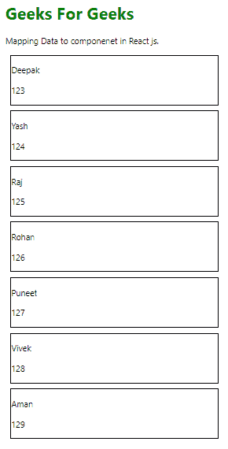

# 如何使用 ReactJS 将数据映射到组件中？

> 原文:[https://www . geeksforgeeks . org/如何使用-reactjs/](https://www.geeksforgeeks.org/how-to-map-data-into-components-using-reactjs/) 将数据映射到组件中

将所有单独的自定义数据映射到自定义组件。

**比如:**而不是用不同的道具一遍又一遍的写自定义组件。我将创建一个包含所有道具的数组，并使用 map()函数在单个组件调用中将数组元素与自定义组件进行映射。

映射是一种数据收集类型，其中数据以键值对的形式存储。存储在映射中的值必须映射到键。映射是一个可以在任何数组上调用的 JavaScript 函数。使用 map 函数，我们在一行代码中将数组的每个元素映射到自定义组件。这意味着不需要一次又一次地将组件及其道具称为数组元素。

**语法:**

```
var array = [1,2,3,4,5]
var PlusOne= array.map((e)=>{
   return (e+1);
 });
 // All array element value will increase by one.   
```

**list.js:** 以键值对的形式包含一个带有用户名和滚动号的数组。

## java 描述语言

```
const Users=[
  {
    name:"Deepak",
    rollNo:"123"
  },
  {
    name:"Yash",
    rollNo:"124"
  },
  {
    name:"Raj",
    rollNo:"125"
  },{
    name:"Rohan",
    rollNo:"126"
  },
  {
    name:"Puneet",
    rollNo:"127"

  },
  {
    name:"Vivek",
    rollNo:"128"
  },
  {
    name:"Aman",
    rollNo:"129"
  },
]
export default Users;
```

**Info.js:** 在 Info 组件中作为道具的用户名和辊号。

## java 描述语言

```
import React from 'react';

function Info (props){
  return (
    <div style={{border:'1px solid black',
                 margin:'10px',width:'20%'}}>

<p> {props.name} </p>

<p> {props.rollNo}</p>

     </div>

  )
}
export default Info;
```

**示例:**使用 map 函数将 list.js 文件中的数据映射到自定义 Info 组件。

**App.js:** 导入 App.js 文件中的用户数组和 Info 组件。使用映射功能将用户数组的每个元素映射到信息组件。

## java 描述语言

```
import React from 'react';
import './App.css';
import Users from './list';
import Info from './Info';

function App() {

  return (
    <div style={{margin:'40px'}} >
     <h1 style={{color:'green'}}> Geeks For Geeks </h1>

<p> Mapping Data to component in React js. </p>

     {Users.map((e)=>{
       return (
       <Info name={e.name} rollNo={e.rollNo}/>
     );})}
    </div>
  );
}
export default App;
```

**输出:**



**示例 2:** 不使用映射功能，将 list.js 文件中的数据映射到 Info 组件。

**App.js 文件:**

## java 描述语言

```
import React from 'react';
import './App.css';
import Users from './list';
import Info from './Info';

function App() {

  return (
    <div style={{margin:'40px'}} >
     <h1 style={{color:'green'}}> Geeks For Geeks </h1>

<p> Mapping Data to component in React js. </p>

       <Info name={Users[0].name} rollNo={Users[0].rollNo}/>
       <Info name={Users[1].name} rollNo={Users[1].rollNo}/>
       <Info name={Users[2].name} rollNo={Users[2].rollNo}/>
       <Info name={Users[3].name} rollNo={Users[3].rollNo}/>
       <Info name={Users[4].name} rollNo={Users[4].rollNo}/>
       <Info name={Users[5].name} rollNo={Users[5].rollNo}/>
       <Info name={Users[6].name} rollNo={Users[6].rollNo}/>

    </div>
  );
}
export default App;
```

**输出:**


从上面的两个例子中，我们得到了相同的输出，但是可以观察到，通过使用 App.js 文件中的 map 函数，将数组数据映射到组件变得更加容易，并且需要更少的代码。