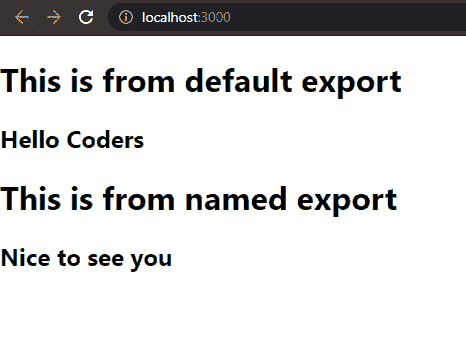

# ReactJS 中如何模块化代码？

> 原文:[https://www . geeksforgeeks . org/如何模块化代码中的 reactjs/](https://www.geeksforgeeks.org/how-to-modularize-code-in-reactjs/)

模块化的代码被分成片段或模块，其中每个文件负责一个特性或特定的功能。使用组件结构可以很容易地将 React 代码模块化。方法是将每个组件定义到不同的文件中。随着每个组件被分成不同的文件，我们所要做的就是找出如何在另一个文件中访问一个文件中定义的代码。要将一个文件访问到另一个文件中，React 提供了导入和导出文件的功能。

**导入和导出:**它使我们能够在项目中使用从一个文件到其他位置的代码，随着我们构建更大的应用程序，这变得越来越重要。

**导出:**导出一个组件或模块的代码，允许我们在其他文件中调用该导出，并在其他模块中使用嵌入的代码。

有两种方法可以导出 react 中的代码:

*   **导出默认:**我们可以使用导出默认语法。
*   **命名出口:**我们可以明确命名我们的出口。

**导出默认值:**我们每个文件只能使用一次导出默认值。该语法允许我们在想要导入给定模块时给出任何名称。

**语法:**

```
export default COMPONENT_NAME
```

**命名导出:**有了命名导出，我们可以从单个文件中导出多段代码，允许我们在导入时显式调用它们。对于多个这样的导出，我们可以使用逗号来分隔花括号中的双参数名称。

**语法:**

```
export {CODE1, CODE2}
```

**Import:**Import 关键字使我们能够调用已经导出的模块，并在整个应用程序的其他文件中使用它们。在 React 中导入模块的方法有很多，我们使用的方法取决于我们是如何导出的。

**导入默认导出:**为了从文件导入默认导出，我们可以只使用地址，并在它之前使用关键字 import，或者我们可以给导入赋予任何名称。

**语法:**

```
import ANY_NAME from ADDRESS
```

**导入命名导出:**命名导出代码可以通过在花括号内给出该模块的名称，后跟包含该模块的文件的地址来导入。对于多个模块，我们可以使用逗号来分隔花括号内的双参数名称。

**语法:**

```
import {Code1, Code2} from ADDRESS
```

**示例:**让我们在下面的示例中看到它，其中我们将以几种方式使用导入和导出操作。假设有三个文件， **index.js** 、 **DefaultExport.js** 、**T7】和 **NamedExport.js** 。让我们看看如何实施导入和导出操作。**

**文件名:index.js**

## java 描述语言

```
import React from "react";
import ReactDOM from "react-dom";

// Importing CSS
import "./index.css";

// Importing default export
import File from "./DefaultExport";

// Importing named exports
import { NamedExport } from "./NamedExport";
ReactDOM.render(
  <React.StrictMode>
    <File />
    <NamedExport />
  </React.StrictMode>,
  document.getElementById("root")
);
```

**档案名称:DefaultExport.js**

## java 描述语言

```
import React from "react";

const DefaultExport = () => {
  return (
    <div>
      <h1>This is from default export</h1>
      <h2>Hello Coders</h2>
    </div>
  );
};

// Default export
export default DefaultExport;
```

**档案名称:NamedExport.js**

## java 描述语言

```
import React from "react";

const NamedExport = () => {
  return (
    <div>
      <h1>This is from named export</h1>
      <h2>Nice to see you</h2>
    </div>
  );
};

// Named Export
export { NamedExport };
```

**输出:**

