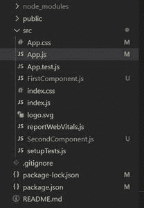
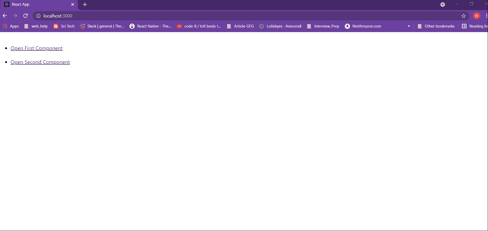

# 如何在 ReactJS 中的新选项卡中打开组件？

> 原文:[https://www . geeksforgeeks . org/如何在新标签中打开组件/reactjs/](https://www.geeksforgeeks.org/how-to-open-a-component-in-a-new-tab-in-reactjs/)

反应路由器是反应中路由的标准库。它支持在一个反应应用程序的不同组件的视图之间导航，允许改变浏览器的网址，并保持用户界面与网址同步。在本教程中，您将了解如何在主应用程序中打开另一个选项卡中的新组件。为了演示，我们将创建两个组件:第一个组件和第二个组件。我们将使用交换机、反应路由器、链接在新的选项卡中打开这两个组件。

**方法:**我们将创建两个简单的组件，命名为‘第一组件’和‘第二组件’。在我们的主要组件，即 App.js 中，我们将提供两个带有链接的按钮来打开第一个和第二个组件。然后，我们将应用该逻辑在具有不同路线的新选项卡中打开第一个和第二个组件。

### 创建反应应用程序和安装模块:

**步骤 1:** 使用以下命令创建一个反应应用程序:

```jsx
npx create-react-app foldername
```

**步骤 2:** 创建项目文件夹(即文件夹名称)后，使用以下命令移动到该文件夹:

```jsx
cd foldername
```

**步骤 3:** 安装软件包。反应路由器可以通过 npm 安装在您的反应应用程序中。要安装反应路由器，请使用以下命令:

```jsx
npm install react-router-dom 
```

**项目结构:**默认文件结构如下:


项目结构

安装 react-router-dom 后，将其组件添加到您的 react 应用程序中。要了解更多关于 react-router 的信息，请参考本文:[https://www.geeksforgeeks.org/reactjs-router/](https://www.geeksforgeeks.org/reactjs-router/)

**更改项目结构:**在您的项目目录中，在 src 文件夹中创建两个名为 FirstComponent.js 和 SecondComponent.js 的文件。现在，您的新项目结构将如下所示:



新项目结构

**示例:**我们通过示例来了解一下实现。

**FirstComponent.js:** 这是我们将用于在新选项卡中显示的组件。当用户试图点击打开第一个组件时，我们将尝试打开这个组件。该组件包含一个应用了一些 CSS 样式的标题。

## FirstComponent.js

```jsx
import React from "react";

// First simple component with heading tag
function FirstComponent() {
  return (
    <div>
      <h1
        style={{ // Applying some styles to the heading
          display: "flex",
          justifyContent: "center",
          padding: "15px",
          border: "13px solid #b4f0b4",
          color: "rgb(11, 167, 11)",
        }}
      >
        ????Geeks For Geeks First Component in New Tab????
      </h1>
    </div>
  );
}
export default FirstComponent;
```

**SecondComponent.js:** 这是我们将用于在新选项卡中显示的第二个组件。当用户试图点击打开第二个组件时，我们将尝试打开这个组件。该组件包含一个应用了一些 CSS 样式的标题。

## second component . js-第二个元件. js

```jsx
import React from "react";

// Second simple component with heading tag
function SecondComponent() {
  return (
    <div>
      <h1
        style={{ // Applying some styles to the heading
          display: "flex",
          justifyContent: "center",
          padding: "15px",
          border: "13px solid #6A0DAD",
          color: "#7F00FF",
        }}
      >
        ????Geeks For Geeks Second Component in New Tab
      </h1>
    </div>
  );
}
export default SecondComponent;
```

**Route:** Route 组件将帮助我们建立组件的 UI 和 URL 之间的链接。要包含应用程序的路由，请将下面给出的代码添加到您的 app.js 中。

**App.js:** App.js 是我们的默认组件，其中已经编写了一些默认代码。现在在 App.js 文件中导入我们的新组件。在应用程序中包含反应路由器组件。当用户点击“打开第一个组件”按钮时，我们将尝试打开第一个组件。为此，我们提供了打开第一个组件路径的链接，即“极客/第一”。因此，第一个组件将在“http://localhost:3000/geeks/first”位置的新选项卡中打开。同样，当用户单击“打开第二个组件”按钮时，我们将尝试打开第二个组件。为此，我们提供了打开第二个组件路径的链接，即“/极客/秒”。因此，SecondComponent 将在“http://localhost:3000/geeks/second”位置的新选项卡中打开。

## App.js

```jsx
import React from "react";
import { BrowserRouter as Router, Route, Link, Switch } 
       from "react-router-dom";

// Importing newly created components
import SecondComponent from "./SecondComponent";
import FirstComponent from "./FirstComponent";

function App() {
  return (

    // BrowserRouter to wrap all
    // the other components
    <Router>

      {/*switch used to render only the first
       route that matches the location rather 
       than rendering all matching routes. */}
      <Switch>
        <Route exact path="/geeks/second" 
            component={SecondComponent}>
        </Route>
        <Route exact path="/geeks/first" 
            component={FirstComponent}>
        </Route>
        <ul>
          <br />
          <li>

            {/* Link component uses the to prop 
            to describe the location where the 
            links should navigate to. */}
            <Link to="/geeks/first" target="_blank">
              Open First Component
            </Link>
          </li>
          <br />
          <li>
            <Link to="/geeks/second" target="_blank">
              Open Second Component
            </Link>
          </li>
        </ul>
      </Switch>
    </Router>
  );
}
export default App;
```

**运行应用程序的步骤:**从项目的根目录使用以下命令运行应用程序:

```jsx
npm start
```

**输出:**你的 web 应用将在“http://localhost:3000”上直播。现在，点击你创建的链接。



**说明:**您会注意到两个组件都将在一个新的选项卡中打开，其中包含它们特定的路线。您的第一个组件将在“http://localhost:3000/geeks/first”位置的新选项卡中打开。您的 SecondComponent 将在“http://localhost:3000/geeks/second”位置的新选项卡中打开。