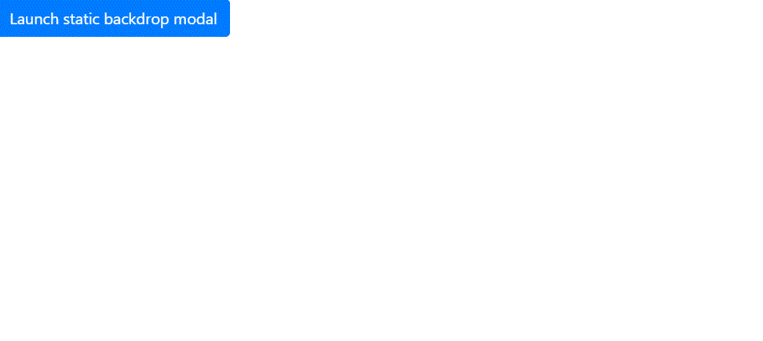

# 如何按语法打开或关闭 react-bootstrap 模态？

> 原文:[https://www . geesforgeks . org/how-open-or-close-react-bootstrap-modal-pro-grammary/](https://www.geeksforgeeks.org/how-to-open-or-close-react-bootstrap-modal-pro-grammatically/)

模态是放置在当前页面上的弹出窗口或对话框，用于显示需要阅读的消息。使用 react-bootstrap 用户界面库，我们将使用功能组件中的钩子对模式进行编程。

我们可以使用 **useState()** 钩子来打开/关闭反应引导模式。 **useState 函数**是一个内置的钩子，允许我们在不切换到类组件的情况下向功能组件添加状态。
**语法:**

```
const [state, setState] = useState(initialState);

```

第一个值状态表示当前状态，而第二个值用于更新函数的状态。 **useState 函数**将一个参数作为默认值。在继续之前，有一个先决条件。

**先决条件:**

*   **已安装反作用自举:**

```
npm install react-bootstrap bootstrap
```

*   **导入 bootstrap.min.css:**

```
import 'bootstrap/dist/css/bootstrap.min.css';
```

*   **导入内置钩子使用状态:**

```
import React, {useState} from "react";
```

*   **导入按钮、模态等单个组件**

```
import Button from 'react-bootstrap/Button';
```

**App.js:**

## java 描述语言

```
import React, {useState} from "react";
import Button from 'react-bootstrap/Button';
import Modal from 'react-bootstrap/Modal';

function Example() {
  const [show, setShow] = useState(false);

  const handleClose = () => setShow(false);
  const handleShow = () => setShow(true);

  return (
    <>
      <Button variant="primary" onClick={handleShow}>
        Launch static backdrop modal
      </Button>

      <Modal
        show={show}
        onHide={handleClose}
        backdrop="static"
        keyboard={false}
      >
        <Modal.Header closeButton>
          <Modal.Title>Modal title</Modal.Title>
        </Modal.Header>
        <Modal.Body>
          I will not close if you click outside me.
          Don't even try to press
          escape key.
        </Modal.Body>
        <Modal.Footer>
          <Button variant="primary" onClick={handleClose}>
            Close
          </Button>

        </Modal.Footer>
      </Modal>
    </>
  );
}

export default Example;
```

**index.js:**

## java 描述语言

```
import React from "react";
import ReactDOM from "react-dom";
import 'bootstrap/dist/css/bootstrap.min.css';
import App from "./App";

const rootElement = document.getElementById("root");
ReactDOM.render(
  <React.StrictMode>
    <App />
  </React.StrictMode>,
  rootElement
);
```

**输出:**

