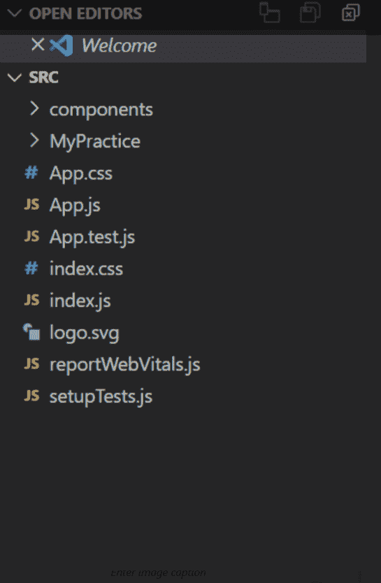
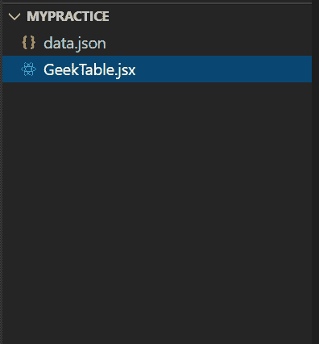
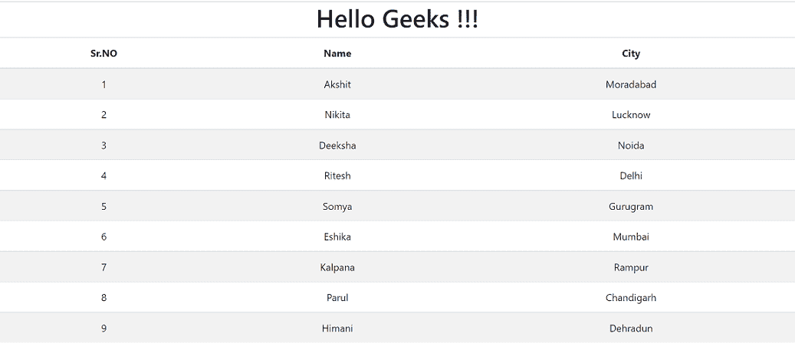

# 如何将 JSON 数据解析成 React Table 组件？

> 原文:[https://www . geesforgeks . org/how-parse-JSON-data-in-react-table-component/](https://www.geeksforgeeks.org/how-to-parse-json-data-into-react-table-component/)

React JS 是一个用于构建 UI 组件的前端库。在本文中，我们将学习如何将 JSON 数据解析成反应表组件。

**方法:**我们将解析一个由 id、名称和城市唯一关联的对象组成的 Json 文件。现在，我们将解析这些数据，并将其显示在由 react 创建的表中。我们会用。map()函数解析 JSON 文件的每个对象，以 JSON 对象为表数据返回< tr >组件。

下面是上述方法的逐步实现。

**第一步:**打开终端，创建 react app。

```jsx
npx create-react-app my-first-app
```

**步骤 2:** 通过执行命令将目录更改为该文件夹。

```jsx
cd my-first-app
```

**项目结构:**如下图。



*   在 src 中创建一个名为 ***【我的练习】**的文件夹*



**第三步:**在这里创建一个 JSON 对象文件，保存为 ***data.json.** 在这个文件中，我们将创建多个 id 为、名称为*、*和城市的对象。*

***文件名** : **数据***

```jsx
[

    {
        "id":1,
        "name":"Akshit",
        "city":"Moradabad"
    },

    {
        "id":2,
        "name":"Nikita",
        "city":"Lucknow"
    },

    {
        "id":3,
        "name":"Deeksha",
        "city":"Noida"
    },

    {
        "id":4,
        "name":"Ritesh",
        "city":"Delhi"
    },

    {
        "id":5,
        "name":"Somya",
        "city":"Gurugram"
    },

    {
        "id":6,
        "name":"Eshika",
        "city":"Mumbai"
    },
    {
        "id":7,
        "name":"Kalpana",
        "city":"Rampur"
    },

    {
        "id":8,
        "name":"Parul",
        "city":"Chandigarh"
    },

    {
        "id":9,
        "name":"Himani",
        "city":"Dehradun"
    }
]
```

**第 4 步:**创建 JsonDataDisplay 组件，并在此从 *data.json* 文件导入数据。在这个组件中，我们将从 JSON 文件中映射每个对象，并将其传递给函数。该函数将返回一个以 object_data 作为表数据的表行

**文件名:GeekTable.jsx**

## java 描述语言

```jsx
import React from 'react'
import JsonData from './data.json'
 function JsonDataDisplay(){
    const DisplayData=JsonData.map(
        (info)=>{
            return(
                <tr>
                    <td>{info.id}</td>
                    <td>{info.name}</td>
                    <td>{info.city}</td>
                </tr>
            )
        }
    )

    return(
        <div>
            <table class="table table-striped">
                <thead>
                    <tr>
                    <th>Sr.NO</th>
                    <th>Name</th>
                    <th>City</th>
                    </tr>
                </thead>
                <tbody>

                    {DisplayData}

                </tbody>
            </table>

        </div>
    )
 }

 export default JsonDataDisplay;
```

**步骤 5:** 在 App.js 中导出这个组件。这将在本地主机上呈现组件

**文件名:** **App.js**

## java 描述语言

```jsx
import JsonDataDisplay from './MyPractice/GeekTable'
function App() {
  return (
    <div className="App">
      <h1>Hello Geeks!!!</h1>
      <JsonDataDisplay/>

    </div>
  );
}

export default App;
```

**运行应用程序的步骤:**打开终端，键入以下命令。

> npm 启动

**输出:**

