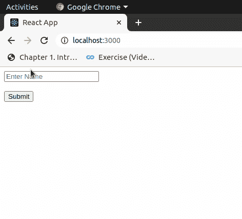

# 如何在 ReactJS 中将数据从子组件传递到其父组件？

> 原文:[https://www . geeksforgeeks . org/如何将数据从子组件传递到其父组件 in-reactjs/](https://www.geeksforgeeks.org/how-to-pass-data-from-child-component-to-its-parent-in-reactjs/)

以下是将数据从子组件传递到父组件的步骤:

*   在父组件中，创建一个回调函数。这个回调函数将从子组件中检索数据。
*   将回调函数作为父组件的道具传递给子组件。
*   子组件使用道具调用父回调函数，并将数据传递给父组件。

**创建反应应用程序:**

**步骤 1:** 使用以下命令创建一个反应应用程序:

```
npx create-react-app foldername
```

**步骤 2:** 创建项目文件夹(即文件夹名)后，使用以下命令移动到该文件夹:

```
cd foldername
```

**项目结构:**如下图。
T3】

**文件路径- src/App.js:**

## java 描述语言

```
import React from 'react';
import Child from './Child'
class App extends React.Component{

       state = {
        name: "",
       }

    handleCallback = (childData) =>{
        this.setState({name: childData})
    }

    render(){
        const {name} = this.state;
        return(
            <div>
                <Child parentCallback = {this.handleCallback}/>
                {name}
            </div>
        )
    }
}
export default App
```

**文件路径-src/组件/子组件**

## java 描述语言

```
import React from 'react'
class Child extends React.Component{

    onTrigger = (event) => {
        this.props.parentCallback(event.target.myname.value);
        event.preventDefault();
    }

    render(){
        return(
        <div>
            <form onSubmit = {this.onTrigger}>
                <input type = "text" 
                name = "myname" placeholder = "Enter Name"/>
                <br></br><br></br>
                <input type = "submit" value = "Submit"/>
                <br></br><br></br>
            </form>
        </div>
        )
    }
}
export default Child
```

**输出:**

