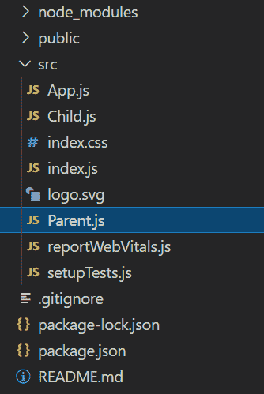
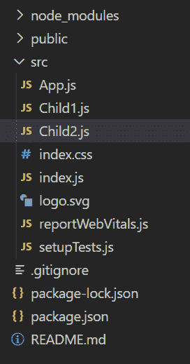

# 如何在 ReactJS 中将数据从一个组件传递到另一个组件？

> 原文:[https://www . geeksforgeeks . org/如何将数据从一个组件传递到另一个组件 in-reactjs/](https://www.geeksforgeeks.org/how-to-pass-data-from-one-component-to-other-component-in-reactjs/)

在本文中，我们将看到如何将数据从一个组件传递到另一个组件。我们有多种方式在组件之间传递数据。我们可以将数据从父母传递给孩子，从孩子传递给父母，以及在兄弟姐妹之间传递。所以现在让我们看看我们如何做到这一点。

**创建反应应用程序:**

*   **步骤 1:** 使用以下命令创建一个反应应用程序。

    ```jsx
    npx create-react-app myapp
    ```

*   **步骤 2:** 创建项目文件夹(即 myapp)后，使用以下命令移动到该文件夹。

    ```jsx
    cd myapp
    ```

**项目结构:**如下图。我们创建了两个名为**子. js** 和**父. js** 的组件，如下所示。



我们创建了两个名为**子. js** 和**父. js** 的组件，如上图所示。

### 将数据从父代传递给子代:

为了将数据从父组件传递给子组件，我们使用了道具。道具数据由父组件发送，不能由子组件更改，因为它们是只读的。

**示例:**以下示例介绍了如何在 ReactJS 中将数据从父组件传递到子组件。

## Parent.js

```jsx
import React from 'react'
import Child from './Child';

const Parent = () => {
const data = "Hello Everyone";
    return(
        <div>
          <Child data={data}/>
        </div>
    );
}

export default Parent;
```

## Child.js

```jsx
import React from 'react';

const Child = (props) => {
    return(
      <h2> {props.data} </h2>
    );
}

export default Child;
```

## App.js

```jsx
import React from 'react';
import "./index.css";
import Parent from './Parent'

const App = () => {
  return (
    <div className="App">
      <Parent/>
    </div>
  );
}

export default App;
```

**运行应用程序的步骤:**从项目的根目录使用以下命令运行应用程序:

```jsx
npm start
```

**输出:**


**将数据从子组件传递到父组件:**

为了将数据从子组件传递到父组件，我们必须在父组件中创建一个回调函数，然后将回调函数作为一个道具传递给子组件。这个回调函数将从子组件中检索数据。子组件使用道具调用父回调函数，并将数据传递给父组件。

**示例:**以下示例介绍了如何在 ReactJS 中将数据从子组件传递到父组件。

## Parent.js

```jsx
import React from 'react';
import Child from './Child'

class Parent extends React.Component{    
    state = {
        msg: "",
    }

    handleCallback = (childData) =>{
        this.setState({msg: childData})
    }

    render() {
        const {msg} = this.state;
        return(
           <div>
             <h1> {msg}</h1>
             <Child parentCallback = {this.handleCallback}/>    
           </div>
        );
    }
}

export default Parent;
```

## Child.js

```jsx
import React from "react";

class Child extends React.Component {
    onTrigger = () => {
      this.props.parentCallback("Welcome to GFG");
    };

    render() {
      return (
        <div>
          <br></br> <br></br>
          <button onClick={this.onTrigger}>Click me</button>
        </div>
      );
    }
}

export default Child;
```

## App.js

```jsx
import React from 'react';
import "./index.css";
import Parent from './Parent';

const App =() => {
  return (
    <div className="App">
      <Parent/>
    </div>
  );
}

export default App;
```

**输出:**


### **在兄弟姐妹之间传递数据:**

为了在兄弟之间传递数据，我们可以选择多种方法，如下所示:

1.  以上两种方法的组合(回调和使用道具)。
2.  使用 Redux。
3.  ContextAPI

**示例:**在本例中，我们使用 ContextAPI 在兄弟之间传递数据。因此，我们有一个不同的项目。

**项目结构:**如下图。我们创建了两个名为**儿童 1.js** 和**儿童 2.js** 的组件，如下所示。



## Child1.js

```jsx
import React, {createContext} from "react";
import Child2 from './Child2';

const Name = createContext();

const Child1 = () => {
    return (
      <>
        <Name.Provider value={'Archna'}>
        <Child2/>
        </Name.Provider>
      </>
    );
}

export default Child1;
export {Name};
```

## Child2.js

```jsx
import React from "react";
import { Name } from "./Child1";

const Child2 = () => {
    return (
      <>
        <Name.Consumer>
          {(fname) => {
            return <h1>My Name is {fname}</h1>;
          }}
        </Name.Consumer>
      </>
    );
};

export default Child2;
```

## App.js

```jsx
import React from 'react';
import "./index.css";
import Child1 from './Child1';

const App =() => {
  return (
    <div className="App">
      <Child1/>
    </div>
  );
}

export default App;
```

**输出:**

