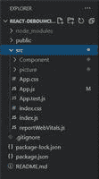
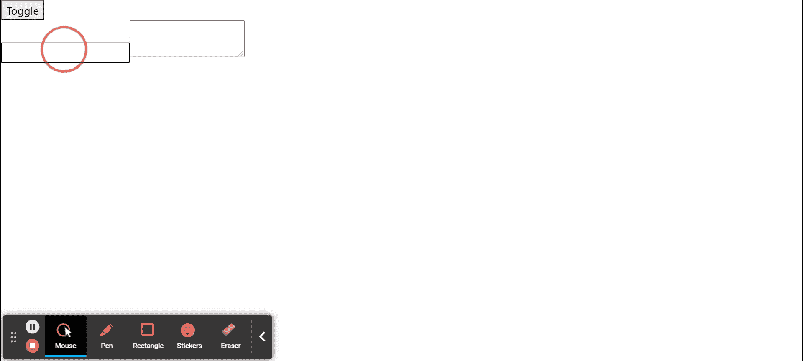

# 如何在 ReactJS 中执行去抖？

> 原文:[https://www . geesforgeks . org/how-to-performance-de bouncing-in-reactjs/](https://www.geeksforgeeks.org/how-to-perform-debouncing-in-reactjs/)

ReactJS 中的**去抖**事件将允许您调用一个函数，以确保耗时的任务不会经常触发。这是一个函数，它将一个函数作为参数，并将该函数包装在闭包中并返回，因此这个新函数显示“等待一点”行为。

**创建反应应用程序并安装模块:**

**步骤 1:** 使用以下命令创建一个反应应用程序:

```
npx create-react-app react-debouncing    
```

**第 2 步:**创建项目文件夹后，即反应-去抖**，**使用以下命令移动到它:

```
cd react-debouncing
```

**步骤 3:** 创建 ReactJS 应用程序后，使用以下命令安装所需的****模块:****

```
**npm install lodash**
```

******项目结构:**如下图。****

****

项目目录**** 

******示例:**现在在 **App.js** 文件中写下以下代码。在这里，App 是我们编写代码的默认组件。****

## ****App.js****

```
**import React, { Component } from "react";
import { debounce } from "lodash";

class WidgetText extends Component {

  state = { text: "" };

  handleChange = (e) => {
    this.setState({ text: e.target.value });
  };

  render() {
    return (
      <div>
        <input onChange={this.handleChange} />
        <textarea value={this.state.text} />
      </div>
    );
  }
}

class App extends Component {

  state = { show: true };

  handleToggle = debounce(() => {
    this.setState(prevState => ({ show: !prevState.show }));
  }, 500);

  render() {
    return (
      <div>
        <button onClick={this.handleToggle}>Toggle</button>
        {this.state.show ? <WidgetText /> : null}
      </div>
    );
  }
}

export default App;**
```

******说明:******

*   ****有一个简单的页面，带有一个切换按钮，如果我们点击它，输入字段消失，再次点击它，以获得输入字段回来，如果我们在输入框中输入文本将立即反映在下面的文本区域。****
*   ****我们有一个 React WidgetText 组件，它基本上只有输入和文本区域，然后应用程序组件本身有切换按钮。****
*   ****有条件地，如果我们点击切换按钮，它将进入处理程序抓取，前一个状态看它显示 bool off 的状态，翻转它，所以如果它是真的，那么它将呈现 WidgetText，如果它是假的，我们不呈现 WidgetText。****

******运行应用程序的步骤:**从项目的根目录使用以下命令运行应用程序:****

```
**npm start**
```

******输出:**现在打开浏览器，转到***http://localhost:3000/***，会看到如下输出:****

********