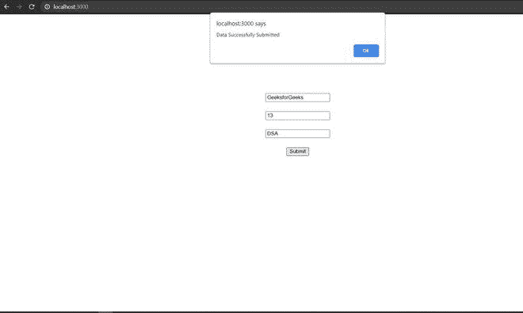
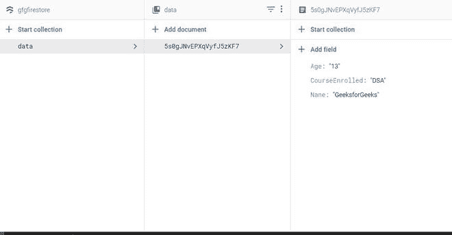
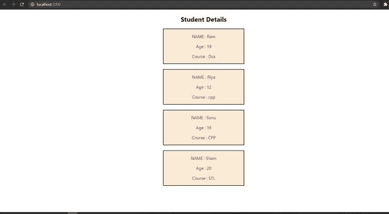

# 如何使用 ReactJS 用 Firestore 执行取送？

> 原文:[https://www . geeksforgeeks . org/如何使用 firestore-use-reactjs 执行提取和发送操作/](https://www.geeksforgeeks.org/how-to-perform-fetch-and-send-with-firestore-using-reactjs/)

在本文中，我们将学习如何从 Firestore 获取数据，并在 React 应用程序中显示它。Firestore 是由谷歌开发的 NoSQL 数据库，作为 firebase 数据库的替代。它旨在提供更好的开发人员体验并简化开发过程。以下步骤演示了创建应用程序的过程。

**步骤 1:** 创建一个新的 React 应用程序。我们使用创建-反应-应用程序来创建我们的应用程序。

```jsx
npx create-react-app gfgfirestore
```

**步骤 2:** 使用 npm 在项目中安装 firebase 包。

```jsx
npm install firebase@8.3.1 --save
```

**步骤 3:** 通过填写必要的详细信息并检查存储在 Firestore 中的数据格式，从 Firebase 仪表板创建一个新项目。在本例中，我们有一个对象，其中*名称*、*年龄*和*课程注册*是存储数据的字段。


**第 4 步:**通过从 Firebase 仪表盘复制相关凭证，初始化项目中的 Firebase。

## java 描述语言

```jsx
import firebase from 'firebase';

var firebaseConfig = {
    // Firebase credentials
  };

// Initialize Firebase
firebase.initializeApp(firebaseConfig);
var db = firebase.firestore();

export default db;
```

**步骤 5:** 创建一个基本的用户界面，用于向商店添加数据。

## java 描述语言

```jsx
import db from './firbase';
import {useState} from 'react';

const Firestore = () => {
    const [name  , Setname] = useState("");
    const [age , Setage] = useState("");
    const [course , Setcourse] = useState("");
    const sub = (e) => {
        e.preventDefault();

        // Add data to the store
        db.collection("data").add({
            Nane: name,
            Age: age,
            CourseEnrolled: course
        })
        .then((docRef) => {
            alert("Data Successfully Submitted");
        })
        .catch((error) => {
            console.error("Error adding document: ", error);
        });
    }

    return (
        <div>
            <center>
                <form style={{marginTop:"200px" }}
                  onSubmit={(event) => {sub(event)}}>
                    <input type="text" placeholder="your name"
                      onChange={(e)=>{Setname(e.target.value)}} />
                      <br/><br/>
                    <input type="number" placeholder="your age"
                      onChange={(e)=>{Setage(e.target.value)}}/>
                      <br/><br/>
                    <input type="text" placeholder="Course Enrolled"
                      onChange={(e)=>{Setcourse(e.target.value)}}/>
                      <br/><br/>
                    <button type="submit">Submit</button>
                </form>
            </center>
        </div>
    );
}

export default Firestore;
```

**输出:**

*   填写详细信息后提交表格



*   添加到存储中的数据视图



**步骤 6:** 创建一个基本的用户界面，用于显示商店数据。我们将使用 **get()** 方法从商店获取数据。数据然后循环通过并在

## java 描述语言

```jsx
// Import Firestore database
import db from './firbase';
import { useState } from 'react';
import './read.css';

const Read = () => {

    const [info , setInfo] = useState([]);

    // Start the fetch operation as soon as
    // the page loads
    window.addEventListener('load', () => {
        Fetchdata();
      });

    // Fetch the required data using the get() method
    const Fetchdata = ()=>{
        db.collection("data").get().then((querySnapshot) => {

            // Loop through the data and store
            // it in array to display
            querySnapshot.forEach(element => {
                var data = element.data();
                setInfo(arr => [...arr , data]);

            });
        })
    }

    // Display the result on the page
    return (
        <div>
            <center>
            <h2>Student Details</h2>
            </center>

        {
            info.map((data) => (
            <Frame course={data.CourseEnrolled} 
                   name={data.Nane} 
                   age={data.Age}/>
            ))
        }
        </div>

    );
}

// Define how each display entry will be structured
const Frame = ({course , name , age}) => {
    console.log(course + " " + name + " " + age);
    return (
        <center>
            <div className="div">

<p>NAME : {name}</p>

<p>Age : {age}</p>

<p>Course : {course}</p>

            </div>
        </center>
    );
}

export default Read;
```

**输出:**在本例中，数据库中存在的四条记录显示在我们的应用程序中。

