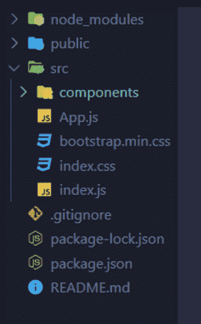
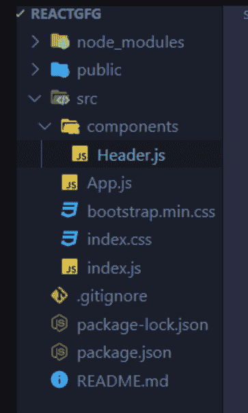
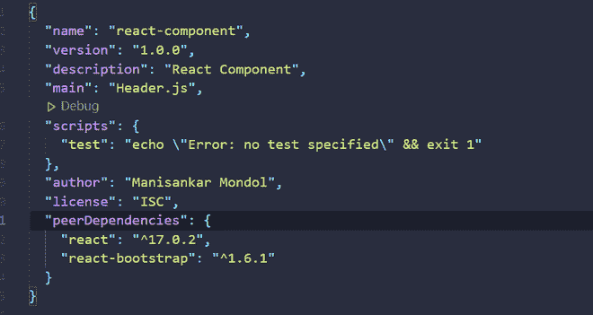
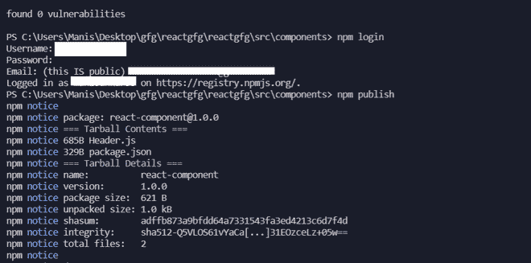
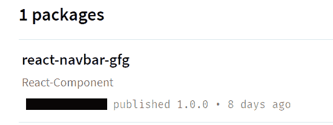

# 如何向 NPM 发布 ReactJS 组件？

> 原文:[https://www . geesforgeks . org/how-to-publish-a-reactjs-component-to-NPM/](https://www.geeksforgeeks.org/how-to-publish-a-reactjs-component-to-npm/)

按照这些简单的步骤将您自己的 ReactJS 组件发布到 NPM。

**第 1 步:初始设置**

为了将任何 ReactJS 组件发布到 npm(节点包管理器)，首先我们必须在 React 应用程序中创建一个 React 组件。以下是创建任何 react 应用程序的说明。

*   使用以下命令创建一个反应应用程序:

```
npx create-react-app foldername
```

*   创建项目文件夹后，即文件夹名称**，**使用以下命令移动到该文件夹:

```
cd foldername
```

**步骤 2:创建组件**

在代码编辑器中打开你的项目文件夹，你会看到很多文件夹，根据你的选择，创建一个名为 *components，*的文件夹，就像在我们的例子中我们在 *src* 文件夹中创建的文件夹一样，如下所示。



然后转到您创建的文件夹，创建您的 ReactJs 组件，就像在您的案例中，我们使用名为 *Header.js* 的 react-bootstrap 创建了一个 Navbar 组件。



## Header.js

```
import React from "react";
import {
    Nav,
    Navbar,
    NavDropdown,
    Form,
    FormControl,
    Button,
} from "react-bootstrap";

const Header = () => {
    return (
        <>
            <Navbar bg="light" expand="lg">
                <Navbar.Brand href="#home">
                    ReactNavbarComponent
                </Navbar.Brand>
                <Navbar.Toggle aria-controls="basic-navbar-nav" />
                <Navbar.Collapse id="basic-navbar-nav">
                    <Nav className="ml-auto">
                        <Nav.Link href="#home">Home</Nav.Link>
                        <Nav.Link href="#link">Link</Nav.Link>
                        <NavDropdown title="Dropdown" 
                                id="basic-nav-dropdown">
                            <NavDropdown.Item href="#action/3.1">
                                Action
                            </NavDropdown.Item>
                            <NavDropdown.Item href="#action/3.2">
                                Another action
                            </NavDropdown.Item>
                            <NavDropdown.Item href="#action/3.3">
                                Something
                            </NavDropdown.Item>
                            <NavDropdown.Divider />
                            <NavDropdown.Item href="#action/3.4">
                                Separated link
                            </NavDropdown.Item>
                        </NavDropdown>
                    </Nav>
                    <Form inline>
                        <FormControl type="text"
                            placeholder="Search"
                            className="mr-sm-2" />
                        <Button variant="outline-success">
                            Search
                        </Button>
                    </Form>
                </Navbar.Collapse>
            </Navbar>
        </>
    );
};

export default Header;
```

**第三步:发布环境设置**

使用终端&进入*组件*文件夹，输入 **npm init** 。您将在命令行中看到以下内容。

```
Use `npm install <pkg>` afterward to install a package and
save it as a dependency in the package.json file.

Press ^C at any time to quit.
package name: (components) react-navbar
version: (1.0.0)
description: React-navbar
entry point: (Header.js)                      # Entry Point publishing
test command:
git repository:
keywords:
author: <Name>
license: (ISC)
About to write to C:\Users\Desktop\Tcw\app\src\components\package.json:
{
  "name": "react-navbar",
  "version": "1.0.0",
  "description": "React-navbar",
  "main": "Header.js",
  "scripts": {
    "test": "echo \"Error: no test specified\" && exit 1"
  },
  "author": "<Name>",
  "license": "ISC"
}

Is this OK? (yes)
```

将组件所需的所有依赖项作为对等依赖项安装。首先，您必须转到您的终端并键入以下命令:

```
npm install (your dependences name)
```

对于我们的示例，我们必须使用以下命令为组件安装这两个依赖项:

```
npm install react
npm install react-bootstrap
```

现在转到 *package.json* 文件&将依赖项更改为对等依赖项，并从*组件*文件夹中删除*节点 _ 模块*文件夹。



现在，如果您编写 npm 安装您的终端，您将看到以下说明:

> npm WARN react-navbar@1.0.0 需要 react@^17.0.2 对等机，但没有安装。您必须自己安装对等依赖项。
> npm WARN react-navbar@1.0.0 需要 react-bootstrap@^1.6.0 对等机，但没有安装。您必须自己安装对等依赖项。
> npm WARN react-navbar@1.0.0 无存储库字段。
> 
> 3.59 秒
> 最新发现 0 个漏洞

**第四步:发布到 npm**

转到 npm 网站，使用您的邮件 ID 和密码创建一个帐户。确保您位于当前目录(即组件目录)中，并键入以下命令:

```
npm login 
# Use your username and password what you have created in the npm website
# Then run this command
npm publish
```



现在，您的 ReactJs 组件已成功发布到 npm 中。转到您的 npm 帐户，在那里您可以看到您的包，如下所示。

