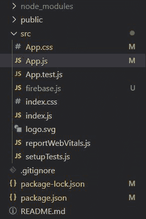
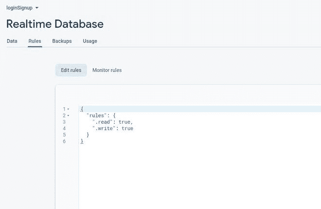
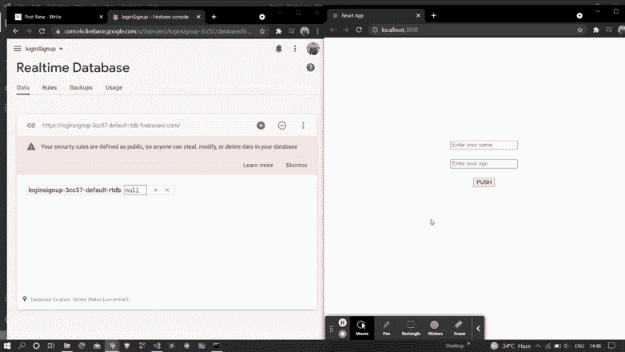

# 如何使用 ReactJS 将数据推送至 firebase 实时数据库？

> 原文:[https://www . geeksforgeeks . org/how-to-push-data-in-firebase-react js-react js/](https://www.geeksforgeeks.org/how-to-push-data-into-firebase-realtime-database-using-reactjs/)

下面的方法介绍了如何使用 react 将数据推入 firebase 的实时数据库。我们使用了 firebase 模块来实现这一点。

**创建反应应用程序并安装模块:**

**步骤 1:** 使用以下命令创建一个反应应用程序:

```jsx
npx create-react-app myapp
```

**步骤 2:** 创建项目文件夹(即 myapp)后，使用以下命令移动到该文件夹:

```jsx
cd myapp
```

**项目结构:**我们的项目结构会是这样的。



**步骤 3:** 创建 ReactJS 应用程序后，使用以下命令安装 firebase 模块:

```jsx
npm install firebase@8.3.1 --save
```

**第 4 步:**转到你的 firebase 仪表盘，创建一个新项目并复制你的凭证。

```jsx
const firebaseConfig = {
      apiKey: "your api key",
      authDomain: "your credentials",
      projectId: "your credentials",
      storageBucket: "your credentials",
      messagingSenderId: "your credentials",
      appId: "your credentials"
};
```

**第 5 步:**通过用下面的代码创建 *firebase.js* 文件，将 Firebase 初始化到您的项目中。

## 火库. js

```jsx
import firebase from 'firebase';

const firebaseConfig = {
    // Your Credentials
};

firebase.initializeApp(firebaseConfig);
var database = firebase.database();

export default database;
```

**步骤 6:** 现在转到 firebase 项目中的实时数据库部分，更新您的安全规则。这里我们处于测试模式，所以我们允许真实的读写。更新下面显示的代码后，单击发布。



**第七步:**现在实现主体部分。这里，我们将使用一个名为 set 的方法，它将数据推送到我们的实时数据库。

## App.js

```jsx
import {useState} from 'react';
import database from './firebase';

function App() {
  const [name , setName] = useState();
  const [age , setAge] = useState();

  // Push Function
  const Push = () => {
    database.ref("user").set({
      name : name,
      age : age,
    }).catch(alert);
  }

  return (
    <div className="App" style={{marginTop : 250}}>
      <center>
      <input placeholder="Enter your name" value={name} 
      onChange={(e) => setName(e.target.value)}/>
      <br/><br/>
      <input placeholder="Enter your age" value={age} 
      onChange={(e) => setAge(e.target.value)}/>
      <br/><br/> 
      <button onClick={Push}>PUSH</button>
      </center>
    </div>
  );
}

export default App;
```

**运行应用程序的步骤:**从项目的根目录使用以下命令运行应用程序:

```jsx
npm start
```

**输出:**现在打开浏览器，转到***http://localhost:3000/***，会看到如下输出:

