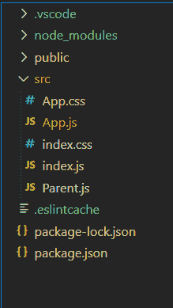

# 如何在带有 React Routing 的 ReactJS 中将一张图片作为背景放在多个组件下？

> 原文:[https://www . geeksforgeeks . org/如何将图像作为多组件下的背景-in-reactjs/](https://www.geeksforgeeks.org/how-to-put-an-image-as-background-under-multiple-components-in-reactjs/)

我们可以创建一个父组件，并使用该父组件来包装子组件，这样父组件就会以图像的形式覆盖在子组件上。

**语法:**

```
<div style={{  
  backgroundImage: `url(${'/background.jpg'})`}}>
  {props.children}
</div>
```

**创建反应应用程序:**

**步骤 1:** 使用以下命令创建一个反应应用程序:

```
npx create-react-app foldername
```

**步骤 2:** 创建项目文件夹(即文件夹名称)后，使用以下命令移动到该文件夹:

```
cd foldername
```

**项目结构:**如下图。



**文件名-App.js:**

## java 描述语言

```
import { React, Component } from 'react'
import Parent from './Parent'
class App extends Component {

  render() {
    return (
      <Parent>
        <div>
          <h4 style={{
            color: 'black',
            height: 200,
            width: 200,
            padding: 50
          }}>
            This component has a background image
          </h4>
        </div>
      </Parent>
    )
  }
}

export default App
```

**文件名-Parent.js:**

## java 描述语言

```
import React ,{Fragment} from 'react'
import { withRouter } from 'react-router-dom';

const Parent = (props) => {
    const URL =
'https://write.geeksforgeeks.org/static/media/Group%20210.08204759.svg'
    return (
    <Fragment>
        <div style={{
            backgroundImage: `url(${URL})`,
            backgroundRepeat:'no-repeat',
            backgroundColor: 'lightblue',
        }}>
            {props.children}
        </div>
        </Fragment>
    )
}

export default withRouter(Parent);
```

**步骤:将该组件作为样品包装在路由交换机组件上**

<parent></parent>

**运行应用程序的步骤:**从项目的根目录使用以下命令运行应用程序:

```
npm start
```

**输出:**现在打开浏览器，转到***http://localhost:3000/***，会看到如下输出:

