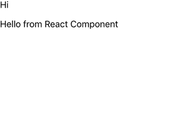

# 如何把 ReactJS 组件放在 HTML 字符串里面？

> 原文:[https://www . geeksforgeeks . org/how-put-reactjs-component-inside-html-string/](https://www.geeksforgeeks.org/how-to-put-reactjs-component-inside-html-string/)

下面的方法介绍了如何通过使用 **html-to-react** 模块将 HTML 字符串解析成 DOM，从而将 React Component 放入 HTML 字符串。

> https://www.npmjs.com/package/html-to-react

它是一个轻量级库，负责将原始 HTML 转换为 React DOM 结构。该库将字符串转换为 DOM 元素的节点树，然后使用您定义的一组指令将每个节点转换为 React 元素。

例如，如果我们有一个名为 **ReactComponent** 的组件和一个 HTML 字符串“*<【div】>Hi<MyReactComponent/></div>”*，现在我们可以使用上面的库来转换它。

**创建反应应用程序并安装模块:**

*   **步骤 1:** 使用以下命令创建一个 React 应用程序。

    ```
    npx create-react-app foldername
    ```

*   **第二步**:创建项目文件夹即 foldername 后，使用以下命令移动到该文件夹。

    ```
    cd foldername
    ```

*   **步骤 3** :创建 ReactJS 应用程序后，使用以下命令安装 ***html-to-react*** 模块。

    ```
    npm i html-to-react
    ```

**项目结构:**如下图。


**示例:**

创建一个名为 **ReactComponent.js** 的反应组件，并在其中编写以下代码。

## reaction component . js

```
export default function ReactComponent() {
    return(
        <div>
            <p>
                Hello from React Component
            </p>

        </div>
    )
}
```

现在在 App.js 文件中写下以下代码。在这里，App 是我们编写代码的默认组件。

## App.js

```
import { Parser, ProcessNodeDefinitions } from "html-to-react";
import ReactComponent from "./ReactComponent";
import React, { Component } from 'react';

const customElements = {
  "my-react-component": ReactComponent
};

// Boilerplate stuff
const htmlParser = new Parser(React);
const processNodeDefinitions = new ProcessNodeDefinitions(React);
function isValidNode() {
  return true;
}

// Custom instructions for processing nodes
const processingInstructions = [
  // Create instruction for custom elements
  {
    shouldProcessNode: (node) => {
      // Process the node if it matches a custom element
      return (node.name && customElements[node.name]);
    },
    processNode: (node) => {
      let CustomElement = customElements[node.name];
      return <CustomElement />;
    }
  },
  // Default processing
  {
    shouldProcessNode: () => true,
    processNode: processNodeDefinitions.processDefaultNode
  }
];

export default class MyParentComponent extends Component {
  render() {
    let htmlString = "<div>Hi<my-react-component></my-react-component></div>";
    return htmlParser.parseWithInstructions(htmlString, 
      isValidNode, processingInstructions);
  }
}
```

**说明:**此处必不可少的是*加工说明*。DOM 树中的每个节点从顶部开始对照数组中的每个指令进行检查，直到 *shouldProcessNode* 返回 true，并且该节点通过相应的 *processNode* 函数转换为 React 元素。这允许相当复杂的处理规则，但是如果您想要处理嵌套的自定义元素，它会很快变得有点混乱。该示例的结果相当于 JSX 语法中的以下代码。

```
<div>
    Hi
    <ReactComponent/>
</div>
```

**运行应用程序的步骤**:从项目根目录使用以下命令运行应用程序。

```
npm start
```

**输出:**现在打开浏览器，转到***http://localhost:3000/***，会看到如下输出。



输出