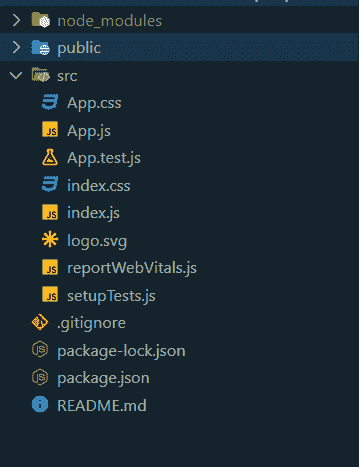
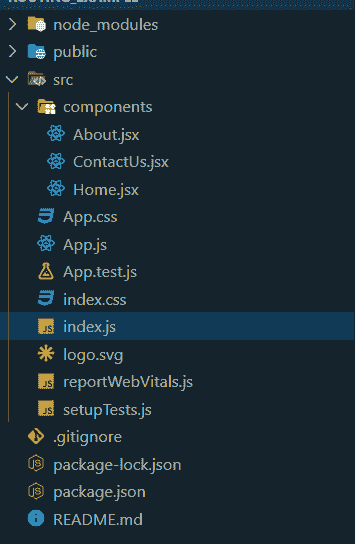
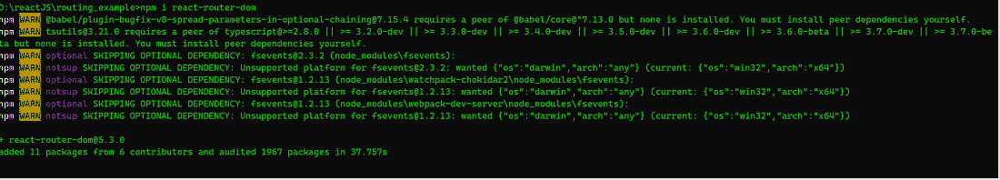
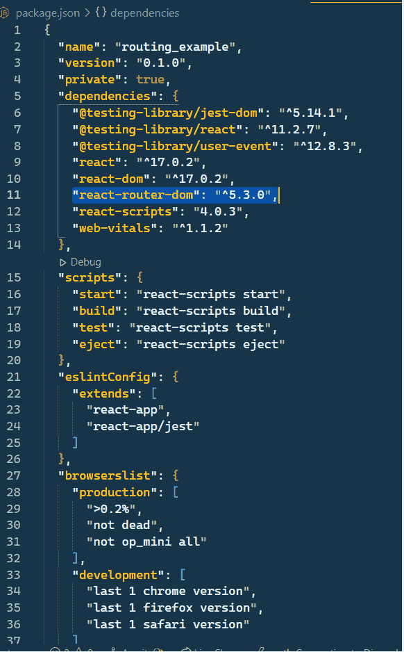
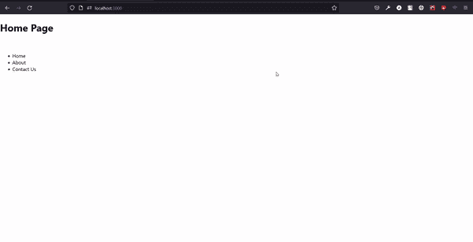

# 如何在 ReactJS 中重定向到另一个页面？

> 原文:[https://www . geeksforgeeks . org/如何重定向到另一页 in-reactjs/](https://www.geeksforgeeks.org/how-to-redirect-to-another-page-in-reactjs/)

在本文中，我们将学习如何使用**react js-router-DOM**包重定向到另一个页面。ReactJS 是一个免费的开源前端库，用于构建单页应用程序。

**react-router-DOM:**react-router-DOM 是一个 reactJS 包，它可以让你在网页中实现动态路由。

**进场:**

*   创建基本的 react app。
*   制作不同的路由页面。
*   安装 react-路由器-dom 包。
*   使用 react-router-dom 包实现路由。

**第一步:**在终端使用以下命令创建一个基本的 react app。

```
npx create-react-app <project_name>
```

**项目结构:**创建基本的 react app 后，文件夹结构如下图:



react-app 的文件夹结构

**第二步:**制作不同的页面进行路由。在这里，我们将为我们的 react-app 创建不同的组件。所以我们绕过它们进行演示。

```
Components: Home Page, About Page, ContactUs Page. 
```

创建组件后，文件夹结构如下所示:



制作组件后的文件夹结构

## 主页. jsx

```
import React from "react";

const Home = () => {
  return (
    <div>
      <h1>Home Page</h1>
    </div>
  );
};

export default Home;
```

## About.jsx

```
import React from "react";

const About = () => {
  return (
    <div>
      <h1>About Page</h1>
    </div>
  );
};

export default About;
```

## 联系人. jsx

```
import React from "react";

const ContactUs = () => {
  return (
    <div>
      <h1>Contact Us Page</h1>
    </div>
  );
};

export default ContactUs;
```

**第三步:**安装 react-router-dom 包。

在这里，我们将使用以下命令在我们的 react-app 中安装 react-router-dom 包。

```
npm i react-router-dom
```



安装 react-router-dom

安装 react-router-DOM package package . JSON 文件后看起来是这样的，



Package.json

**步骤 3:** 使用 react-router-dom 包实现路由。在这里，我们将在我们的反应应用程序中实现反应路由器 dom 包。为了实现这一点，我们必须从 react-router-dom 包中导入一些组件，即浏览器、交换机、路由和重定向。

```
import { BrowserRouter as Router, Switch, 
    Route, Redirect,} from "react-router-dom";
```

**注意:**我们把 BrowserRouter 做一个别名为 Router，只是把事情简单化。

让我们逐一查看所有导入的组件:

*   **浏览器浏览器:**它使用 HTML5 历史 API 来保持 UI 与 URL 同步。
*   **路由**:其职责是渲染 UI，当其路径与当前 URL 匹配时。
*   **切换**:渲染与位置匹配的第一个子路由或重定向。
*   **重定向**:不考虑历史堆栈中的当前位置，渲染新位置。

这是 **App.js** 文件的代码，我们将在这里实现 react-router-dom 包。

## App.js

```
import "./App.css";
// importing components from react-router-dom package
import {
  BrowserRouter as Router,
  Switch,
  Route,
  Redirect,
} from "react-router-dom";

// import Home component
import Home from "./components/Home";
// import About component
import About from "./components/About";
// import ContactUs component
import ContactUs from "./components/ContactUs";

function App() {
  return (
    <>
      {/* This is the alias of BrowserRouter i.e. Router */}
      <Router>
        <Switch>
          {/* This route is for home component 
          with exact path "/", in component props 
          we passes the imported component*/}
          <Route exact path="/" component={Home} />

          {/* This route is for about component 
          with exact path "/about", in component 
          props we passes the imported component*/}
          <Route path="/about" component={About} />

          {/* This route is for contactus component
          with exact path "/contactus", in 
          component props we passes the imported component*/}
          <Route path="/contactus" component={ContactUs} />

          {/* If any route mismatches the upper 
          route endpoints then, redirect triggers 
          and redirects app to home component with to="/" */}
          <Redirect to="/" />
        </Switch>
      </Router>
    </>
  );
}

export default App;
```

**第四步:**在 App.js 文件中实现路由后，我们要给出用户端的路由端点。因此，我们将给出 Home.jsx 文件中的路由端点。

以下是更新后的 **Home.jsx** 文件。

## 主页. jsx

```
import React from "react";
// importing Link from react-router-dom to navigate to 
// different end points.
import { Link } from "react-router-dom";

const Home = () => {
  return (
    <div>
      <h1>Home Page</h1>
      <br />
      <ul>
        <li>
          {/* Endpoint to route to Home component */}
          <Link to="/">Home</Link>
        </li>
        <li>
          {/* Endpoint to route to About component */}
          <Link to="/about">About</Link>
        </li>
        <li>
          {/* Endpoint to route to Contact Us component */}
          <Link to="/contactus">Contact Us</Link>
        </li>
      </ul>
    </div>
  );
};

export default Home;
```

**运行应用程序的步骤:**打开终端，运行以下命令。

> npm 启动

**输出:**



React-app 输出