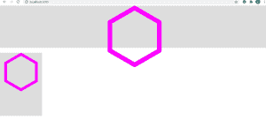
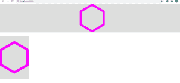

# 如何在 ReactJS 中调整 SVG 的大小以填充其容器？

> 原文:[https://www . geeksforgeeks . org/如何调整大小-SVG-填充其容器-in-reactjs/](https://www.geeksforgeeks.org/how-to-resize-svg-to-fill-its-container-in-reactjs/)

我们可以使用类型道具来调整 SVG 的大小，以填充它在 ReactJS 中的容器。我们可以向 SVG 添加以下样式

**CSS 语法:**

```jsx
svg {
 width: inherit;
 height: inherit;
}
```

**反应语法:**

```jsx
<svg style = {{ width: "inherit", height:"inherit"}}
// Child elements
</svg>
```

**创建反应应用程序:**

**步骤 1:** 使用以下命令创建一个反应应用程序:

```jsx
npx create-react-app foldername
```

**步骤 2:** 创建项目文件夹(即文件夹名)后，使用以下命令移动到该文件夹:

```jsx
cd foldername
```

**项目结构:**如下图。


项目结构

**App.js:** 现在在 App.js 文件中写下以下代码。在这里，App 是我们编写代码的默认组件。

## java 描述语言

```jsx
import { React, Component } from "react";

class App extends Component {

  render() {
    return (
      <>
        <div style={{ backgroundColor: "#ddd", height: 200 }}>
          <MySvg width="20%" />
        </div>
        <br />
        <div style={{ backgroundColor: "#ddd", height: 300, width: 200 }}>
          <MySvg width="80%" />
        </div>
      </>
    );
  }

}

const MySvg = (props) => {
  return (
    // With Styling
    <svg style={{ width: "inherit", height: "inherit" }}
      version="1.1"
      viewBox="0 0 31.921 36.45"
      xmlns="http://www.w3.org/2000/svg"
      {...props}
    >
      <g transform="translate(-20.655 -17.456)">
        <path
          d="m51.254 44.131-14.638 8.451-14.638-8.451v-16.902l14.638-8.451 
            14.638 8.451z"
          fill="none"
          stroke="#fb00ff"
          stroke-linejoin="round"
          stroke-width="2.6458"
        />
      </g>
    </svg>
  );
}

export default App
```

**运行应用程序的步骤:**从项目的根目录使用以下命令运行应用程序:

```jsx
npm start
```

**输出:**

*   在应用风格道具之前，输出如下:
*   应用风格道具后，输出如下: